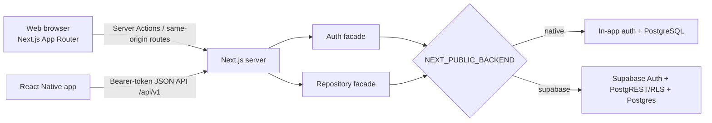

# VSIS Timesheet — AI Architecture Context

> **Purpose:** compact, code-grounded context for an AI assistant making safe changes in this repository. Treat the code and migrations as the source of truth; this guide identifies the intended boundaries and the places a change must usually touch.

## System in one view

VSIS Timesheet is a TypeScript monorepo containing:

- a **Next.js 16 / React 19 web application** for time tracking and administration;
- a **React Native 0.84 mobile application** in `mobile/` (Android, iOS, Windows);
- one versioned mobile HTTP API (`/api/v1`); and
- two interchangeable server backends selected at **build time**.



The core rule is: **application code must use the `auth` and `repo` facades, never a database client or backend adapter directly.** Both backend implementations must preserve the behavior of the shared repository contract.

## Repository map

| Area | Responsibility | Important paths |
| --- | --- | --- |
| Web pages and UI | App Router pages, dashboard panels, design primitives | `app/page.tsx`, `app/dashboard/`, `app/reports/`, `app/components/` |
| Web mutations | Server Actions: validation, actor gate, rate limiting, audit logging, repository call | `app/actions.ts`, `app/actions/` |
| Browser data/auth | Client-safe auth and data adapters selected by backend mode | `lib/auth/client.ts`, `lib/data/client.ts`, `lib/backend/client.ts` |
| Web REST API | Cookie-session endpoints retained for web/native flows | `app/api/auth/`, `app/api/data/`, `app/api/_http.ts` |
| Mobile API | Stable `/api/v1` bearer-token API; routes stay thin | `app/api/v1/`, `lib/api/v1/contracts.ts`, `lib/api/v1/services/` |
| Server auth | Backend-neutral actor resolution, native cookie/JWT, Supabase auth, mobile token/session management | `lib/auth/` |
| Persistence | `Repository` contract plus native SQL and Supabase PostgREST/RPC implementations | `lib/db/repository.ts`, `lib/db/index.ts`, `lib/db/native.ts`, `lib/db/supabase.ts` |
| Shared domain utilities | Validation, roles, dates, reports, rate limits, exports, logging | `lib/` |
| Native schema | Incremental PostgreSQL migrations, runner, idempotent seed | `db/migrations/`, `db/migrate-runner.mjs`, `db/seed.mjs` |
| Supabase schema | Corresponding schema, RLS policies, functions, RPCs | `supabase/migrations/` |
| Mobile client | App state, screens, API client, secure token storage, offline queue | `mobile/App.tsx`, `mobile/src/` |
| Quality and deployment | Unit/E2E/a11y tests, CI, container and Kubernetes/OpenShift manifests | `tests/`, `e2e/`, `.github/workflows/ci.yml`, `Dockerfile`, `deploy/` |

## Runtime and request flows

### Web UI

Most web pages are client components. They invoke Server Actions from `app/actions.ts`, which is a required barrel re-export. Each action is expected to:

1. obtain and gate the current actor with `requireActiveActor`, `requireActor`, or `requireSuperAdmin` from `app/actions/_shared.ts`;
2. validate external input with the existing validation helpers/schemas;
3. check and consume the per-user write rate limit for mutations;
4. call `repo` from `lib/db`; and
5. return an `{ error }`-style result rather than throwing an expected error to the client. Sensitive/destructive mutations also write best-effort audit records through `safeAudit`.

The browser-facing authentication and data clients select the same backend mode as the server. Server-only code is protected with `server-only`; client components must not import `lib/db/*`, server auth modules, or server actions' private helpers.

The older same-origin route handlers under `app/api/auth` and `app/api/data` support web/native REST flows. Mutating routes use `originCheck` from `app/api/_http.ts` to defend cookie-authenticated requests against cross-origin CSRF.

### Mobile API and app

`/api/v1` is the mobile contract. Its routes have `runtime = 'nodejs'`, parse input, call `requireMobileActor`, then delegate business logic to `lib/api/v1/services/`. Every successful/error response has the envelope:

```ts
{ data: T, error: null }
// or
{ data: null, error: { code, message, fieldErrors? } }
```

`lib/api/v1/contracts.ts` contains mobile DTOs, mappers, and input schemas. It is the compatibility boundary between the server domain model and `mobile/src/api/contracts.ts`.

The mobile app is intentionally standalone: `mobile/App.tsx` composes `SessionProvider`, navigation, and screens. `SessionProvider` owns server selection, session state, API calls, dashboard/reference caches, and queue syncing. `ApiClient` retries a request once after a coordinated access-token refresh.

Mobile authentication is separate from browser sessions:

- Login verifies credentials, creates a `mobile_sessions` record, returns a signed short-lived access token and an opaque refresh token.
- Access tokens are bearer JWTs validated by `requireMobileActor`; the current session row, session family, expiry, revocation, and actor active status are all checked on each protected request.
- Refresh-token rotation creates a replacement session record. Reuse of a rotated token revokes its entire family.
- Refresh sessions have a 30-day idle limit and a 90-day absolute limit. `/api/v1/cron/cleanup` removes expired/revoked sessions; protect it with `CRON_SECRET` outside local development.
- The mobile client persists only its refresh token and session ID through the platform secure-token store. It supports a pending-approval state for inactive accounts.

Offline mutations for timesheets, leaves, and reminders are stored per server URL and actor ID, then replayed sequentially by `mobile/src/sync/sync-engine.ts`. The server remains authoritative; a replay can fail due to authorization, validation, backfill, or daily-hour rules.

## Backend modes

`NEXT_PUBLIC_BACKEND` is the single mode selector. It defaults to `supabase` and is intentionally public so server and browser choose identically; it is baked into the production build.

| Mode | Auth | Data implementation | Security model | Typical deployment |
| --- | --- | --- | --- | --- |
| `supabase` | Supabase Auth | `supabaseRepository` using typed Supabase clients/PostgREST and selected RPCs | Supabase RLS plus action/route actor checks | Vercel + Supabase |
| `native` | Local email/password using versioned scrypt hashes; signed HTTP-only session cookie | `nativeRepository` using parameterized PostgreSQL queries and transactions | Application/SQL scope checks; no Supabase dependency | Docker, OpenShift, Rancher, local PostgreSQL |

`lib/db/index.ts` exports `repo`, selected synchronously at module import time. `lib/auth/index.ts` exposes the analogous `auth` facade. Native pooling and automatic one-time migration execution are in `lib/db/pool.ts`; the shared migration runner is `db/migrate-runner.mjs`.

Do not add backend-specific calls in pages, actions, or API routes. Add or extend a `Repository` method and implement it in **both** `native.ts` and `supabase.ts`. For database changes, add an immutable new migration to both `db/migrations/` and `supabase/migrations/`; never rewrite an already-applied migration.

## Domain model and authorization

Principal persistence tables are:

- `profiles` — identity metadata, active state, reporting line, layouts, and roles; native mode additionally stores password credentials.
- `projects`, `activity_types`, `timesheets` — work logging. Multiple entries per user/day are allowed, but their aggregate cannot exceed 24 hours.
- `leaves`, `reminders`, `global_reminders`, `global_reminder_dismissals` — personal and shared scheduling features.
- `app_settings`, `titles`, `whitelisted_domains`, `audit_logs` — system configuration and administration.
- `mobile_sessions` — hashed refresh-token/session-family state.

`profiles` uses two independent authorization axes:

| Axis | Values | Meaning |
| --- | --- | --- |
| `permission_role` | `admin`, `pm`, `co`, `user` | Functional authority: administration, project management, organization-wide visibility, or normal user permissions |
| `hierarchy_role` | `manager`, `team_lead`, `user` | Position in the reporting tree and team visibility |

The legacy `role` column remains for compatibility and is synchronized by a database trigger. New authorization code must use the two-axis fields and helpers in `lib/roles.ts`. Active-account enforcement is mandatory. Super-admin is not a database role: it is an active `admin` whose email equals `SUPER_ADMIN_EMAIL`, and it gates destructive lifecycle operations.

Scope/security requirements:

- Native repository queries must enforce ownership, roles, and reporting-tree scope in their parameterized SQL.
- Supabase queries must retain equivalent behavior through RLS and explicitly scoped RPCs. Reporting/grouping RPCs must remain `SECURITY INVOKER` and be granted only to their intended roles.
- The database trigger enforces the 24-hour daily cap, including concurrent inserts. UI/server validation is helpful but not the final integrity boundary.
- `app_settings.backfill_window_days` limits regular users' older edits; admins may edit regardless of that window.

## Feature ownership

| Feature | Primary server boundary |
| --- | --- |
| Timesheet create/edit/delete, duplicate, bulk edit, import | `app/actions/timesheets.ts`, `lib/api/v1/services/timesheets.ts`, repository timesheet methods |
| Projects | `app/actions/projects.ts`, repository project methods |
| Activity types, reminders, layouts, settings | `app/actions/settings.ts`, repository settings/reminder methods |
| Users, roles, reporting hierarchy, domain allowlist | `app/actions/users.ts`, `lib/roles.ts`, repository profile methods |
| Backup/restore and CSV import/export | `app/actions/import-backup.ts`, `lib/backup.ts`, `lib/csv.ts` |
| Super-admin reset/delete/default layouts | `app/actions/superadmin.ts`, `requireSuperAdmin` |
| Mobile dashboard, reports, reference data, people | `lib/api/v1/services/` and `/api/v1` routes |

## Configuration, deployment, and operational boundaries

The canonical variable template is `.env.example`. Key secrets are server-only: `DATABASE_URL`, `AUTH_SECRET`, `MOBILE_AUTH_SECRET`, `SUPABASE_SERVICE_ROLE_KEY`, `SUPER_ADMIN_*`, and `CRON_SECRET`. Never expose any of these through `NEXT_PUBLIC_*` variables or mobile API DTOs.

- `next.config.ts` sets security headers/CSP and produces standalone output outside Vercel.
- `Dockerfile` builds the native standalone service; `docker-compose.yml` starts app plus PostgreSQL for local containers.
- `deploy/` contains Kubernetes/OpenShift/Rancher manifests and deployment documentation.
- `/api/health` is the service probe and can expose build metadata supplied by `GIT_COMMIT`.

## Change checklist for an AI assistant

1. Start with `git status --short`; preserve unrelated user changes (the working tree may already be dirty).
2. For any Next.js code change, read the relevant current Next 16 documentation under `node_modules/next/dist/docs/` first.
3. Locate the existing feature boundary before editing. Reuse the actions, validation schemas, DTOs, service functions, and repository methods rather than creating a parallel path.
4. For a data/auth behavior change, update the shared contract and both backend adapters, then add paired native and Supabase migrations if schema/RLS changes are needed.
5. For a mobile API change, update the route, service, server DTO/schema, mobile API contracts/client, and relevant mobile screen/provider usage together. Preserve the response envelope and authorization checks.
6. Add happy-path and failure-path tests. Use existing route/repository/mobile tests as patterns; do not weaken authorization or integrity checks to make a test pass.
7. Run the smallest focused test first (`npx vitest run tests/<file>`), then the proportional checks: `npm run typecheck`, `npm run lint`, `npm test`; mobile changes also use the commands in `mobile/package.json`.
8. Before finishing, inspect `git status --short` and the diff. CI additionally builds both backend modes, runs native PostgreSQL Playwright E2E, and builds the container.

## Non-negotiable invariants

- Keep `app/actions.ts` as the stable Server Action barrel and preserve public action signatures unless a deliberate contract migration includes all callers.
- Never bypass `Repository` from application code or open a `pg` client outside `lib/db/`.
- Never leak service-role keys, native auth secrets, or mobile refresh tokens.
- Preserve Supabase/native behavioral parity and the two-axis authorization model.
- Return expected validation/authorization failures as structured results; reserve exceptions for unexpected server failures.
- Treat client-side checks, caches, offline queues, and UI role visibility as convenience only; the server/database must enforce the real rule.

## Verification surface

| Scope | Primary checks |
| --- | --- |
| Web/server logic | `npx vitest run tests/<focused-file>.test.ts`, `npm run typecheck`, `npm run lint` |
| Repository or migrations | Relevant `tests/native-repository.test.ts`, `tests/supabase-migrations.test.ts`, `tests/db-migrations.test.ts`; concurrency test needs `TEST_DATABASE_URL` |
| Mobile API | Matching `tests/mobile-*-route.test.ts` and `tests/mobile-contract-parity.test.ts` |
| React Native app | From `mobile/`: `npm test`, `npm run typecheck`, `npm run lint` |
| Full confidence | `npm test`, both backend production builds, then `npm run e2e` with a migrated/seeded native PostgreSQL database |

