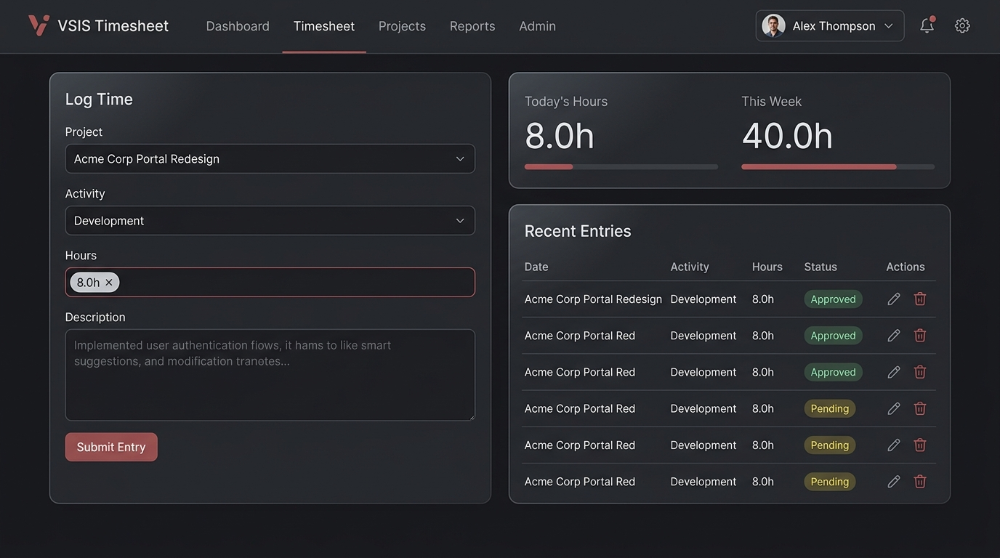
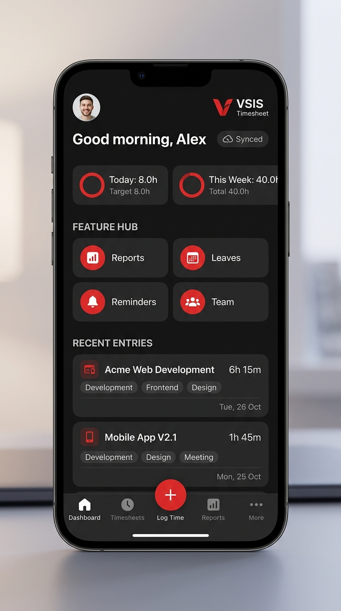
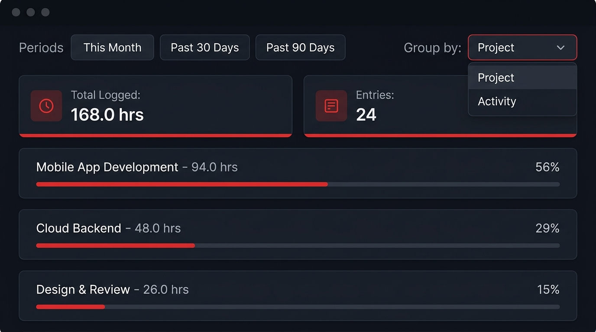
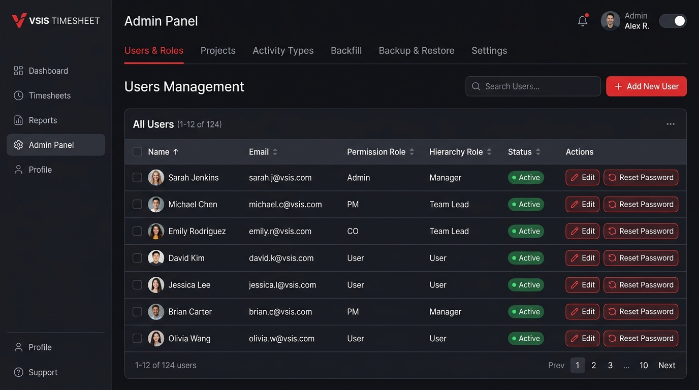

# VSIS Timesheet System — User Guide

A comprehensive, illustrated guide to using the VSIS Timesheet System across **Web**, **Android**, and **Windows Desktop**: logging work, managing entries, tracking leaves & reminders, generating reports, operating offline, and administrative management.

---

## Table of Contents

1. [Roles and Permissions](#1-roles-and-permissions)
2. [Signing In & Getting Started](#2-signing-in--getting-started)
3. [Web Application Guide](#3-web-application-guide)
   - [Dashboard Overview](#dashboard-overview)
   - [Logging Time with Smart Helpers](#logging-time-with-smart-helpers)
   - [Managing Recent Entries & Bulk Actions](#managing-recent-entries--bulk-actions)
   - [Keyboard Shortcuts](#keyboard-shortcuts)
4. [Mobile Application Guide (Android & Windows)](#4-mobile-application-guide-android--windows)
   - [Connecting to Your Workspace](#connecting-to-your-workspace)
   - [Mobile Dashboard & Feature Hub](#mobile-dashboard--feature-hub)
   - [Offline Mode & Background Synchronization](#offline-mode--background-synchronization)
5. [Reports & Analytics](#5-reports--analytics)
6. [Leave Management](#6-leave-management)
7. [Reminders & Broadcasts](#7-reminders--broadcasts)
8. [Team Directory & Hierarchy](#8-team-directory--hierarchy)
9. [Telegram Bot Integration](#9-telegram-bot-integration)
10. [Administrator Guide](#10-administrator-guide)
11. [Troubleshooting & FAQ](#11-troubleshooting--faq)

---

## 1. Roles and Permissions

Every account has **two independent roles**: a **permission role** (what actions you can perform) and a **hierarchy role** (where you sit in the organizational tree). Both are assigned by an administrator.

### Permission Roles (Action Capabilities)

| Role | Access Level & Capabilities |
| :--- | :--- |
| **User** | Log, edit, and delete own timesheet entries; mark leaves; create personal reminders; update profile and password. |
| **PM** *(Project Manager)* | Everything a User can do, plus create and manage projects. |
| **CO** *(Coordinator)* | Everything a User can do, plus view all employee timesheets, team profiles, and generate company-wide reports. |
| **Admin** | Full system control: manage users, assign roles, configure activity types, execute backfill corrections, manage global reminders, CSV imports, and JSON backup/restore. |
| **Super Admin** | Configured via system environment (`SUPER_ADMIN_EMAIL`): full admin rights plus destructive operations (database wipe, user deletion, activity deletion) and default panel ordering. |

### Hierarchy Roles (Reporting Structure)

| Role | Meaning in Organization |
| :--- | :--- |
| **User** | Individual contributor; reports to a designated Team Lead or Manager. |
| **Team Lead** | Direct report target; can review, filter, and monitor timesheets for their team members. |
| **Manager** | Departmental / unit head; can review and approve timesheets across all reporting teams. |

> [!NOTE]
> Roles are independent axes on your profile. For example, a user can be a **PM** by permission while functioning as a **Team Lead** in hierarchy. Your direct supervisor is defined under **Profile ➔ Report To**.

---

## 2. Signing In & Getting Started

- **Account Activation**: Accounts are provisioned by an administrator and start in an **Inactive / Pending Approval** state until activated by an Admin.
- **Initial Password**: Use the initial credentials provided by your administrator to sign in, then immediately navigate to **Profile ➔ Change Password** to set your private password.
- **Password Requirements**: Must be at least 8 characters long.

---

## 3. Web Application Guide

### Dashboard Overview

The web dashboard is your primary command center, providing immediate visibility into your daily and weekly progress, quick-entry forms, and recent work history.

### Logging Time with Smart Helpers

To log time, use the **Log Time** tile on the dashboard:

1. **Project Picker**: Type to quickly search and select active projects.
2. **Activity Type**: Select the task category (e.g., *Development*, *Testing*, *Design*, *Meeting*, *Support*).
3. **Hours Logged**: Enter time in decimal format (e.g., `8`, `4.5`, `1.25`).
   - **Smart Hours Quick-Fill**: The system analyzes your historical patterns. When a recurring pattern is detected, a clickable pill (e.g., `8.0h`) appears next to the input to autofill with one click.
4. **Work Done Description**: Describe tasks performed.
   - **Recent-Work Suggestions**: As you type, previous descriptions appear in a dropdown; use <kbd>↑</kbd>/<kbd>↓</kbd> and <kbd>Enter</kbd> to autofill.
5. **Copy from Last Entry**: One-click autofill that pulls the project, activity type, and description from your previous entry.
6. **Telegram Command**: Check *Copy Telegram command* to automatically copy a formatted `/log` command to your clipboard upon submission.
7. Click **Submit Entry**.

> [!IMPORTANT]
> **Daily 24-Hour Cap**: The sum of all hours logged on a single calendar date cannot exceed 24.0 hours.
> **Backfill Window**: Standard users can log or edit entries within the configured backfill window (default: today + yesterday). Older entries become read-only.

---

### Managing Recent Entries & Bulk Actions

The **Recent Entries** table displays your logged time grouped chronologically by date.

- **Inline Edit**: Click the **Edit (✎)** icon on any row to adjust project, activity, hours, or description.
- **Duplicate**: Click **Duplicate** to clone the entry to today.
- **Delete**: Click the **Delete (🗑)** icon to remove an entry (requires confirmation).
- **Pagination**: Use **Previous / Next** and the page-size selector (`25`, `50`, `100`) to navigate extensive work history.
- **Multi-Select & Bulk Actions**:
  - Tick the checkboxes on rows (or the header checkbox to select all).
  - **Bulk Edit**: Change the project or activity type for all selected entries in a single batch.
  - **Bulk Duplicate**: Duplicate all selected rows at once.
  - **Bulk Delete**: Remove selected entries simultaneously.
  - **Copy Commands**: Copy Telegram bot commands for all selected items.

---

### Keyboard Shortcuts

Speed up daily logging on desktop using global keyboard shortcuts:

| Key | Action |
| :---: | :--- |
| <kbd>N</kbd> | Focus the Log Time entry form |
| <kbd>/</kbd> | Open and focus the Project picker |
| <kbd>E</kbd> | Edit your most recent entry |
| <kbd>U</kbd> | Undo / delete your last logged entry |
| <kbd>D</kbd> | Duplicate selected entries |
| <kbd>?</kbd> | Open the keyboard shortcuts cheat sheet |
| <kbd>Esc</kbd> | Close active modals, dialogs, or dropdowns |

> [!TIP]
> Shortcuts are automatically paused when your cursor is inside any text input or textarea, preventing accidental triggers while typing.

---

## 4. Mobile Application Guide (Android & Windows)

The VSIS Timesheet Mobile App is built with **React Native 0.84** for Android and Windows Native Desktop (MSIX), delivering identical business logic, offline data caching, and touch-optimized navigation.

### Connecting to Your Workspace

1. Launch the app and tap **Connect Workspace**.
2. Enter the public URL or local IP of your VSIS server:
   - Cloud / Production: `https://timesheet.vsis.lk`
   - Local / Intranet: `http://192.168.1.50:3000`
3. Tap **Check Server** to verify compatibility.
4. Sign in with your registered email and password.

---

### Mobile Dashboard & Feature Hub

- **Metrics Cards**: Instant visual rings displaying *Today's Hours* and *This Week's Total*.
- **Feature Hub**: Quick one-tap access to **Reports**, **Leaves**, **Reminders**, and **Team Directory**.
- **Adaptive Bottom Bar / Side Rail**:
  - On phones: Bottom navigation bar with floating red **(+) Log Time** action button.
  - On tablets and Windows Desktop: Responsive left side-rail layout.
- **Pull to Refresh**: Swipe down on any list to fetch fresh data from the server.
- **Hardware Back Button**: Seamless Android back navigation across screens and sheets.

---

### Offline Mode & Background Synchronization

Work uninterrupted without an active internet connection:

1. **Local Caching**: Recent entries, project catalogs, and dashboard statistics are stored locally on device.
2. **Offline Mutation Queue**: Any time entries, leaves, or reminders created while offline are queued securely on the device.
3. **Offline Banner**: An indicator displays pending mutation counts (e.g., `3 changes queued offline`).
4. **Auto-Sync Engine**: When connectivity is restored, the sync engine automatically flushes the queue in FIFO order with automatic retry and conflict resolution.

---

## 5. Reports & Analytics

Access detailed time distribution and project analytics via the **Reports** navigation item.

- **Date Presets**: Instantly filter by **This Month**, **Past 30 Days**, **Past 90 Days**, or custom date ranges.
- **Grouping Modes**:
  - **Group by Project**: View total hours, entry count, and percentage distribution per project.
  - **Group by Activity**: Analyze time spent on development vs. meetings, testing, or customer support.
- **Progress Bars**: High-contrast visual distribution bars showing percentage contributions.
- **Export (Admin / CO)**: Download complete reporting datasets as CSV spreadsheets for payroll and client billing.

---

## 6. Leave Management

Keep your team updated on your scheduled absences:

1. Navigate to **Leave** (Web tile or Mobile Feature Hub).
2. Select your leave start and end dates.
3. Choose the leave type (e.g., *Annual*, *Casual*, *Medical*).
4. Enter an optional reason/note and tap **Mark Leave**.
5. Logged leave dates appear highlighted on team calendars and dashboard views.

---

## 7. Reminders & Broadcasts

- **Personal Reminders**: Create personal task reminders with due dates. Mark them completed with one click.
- **Global Reminders (Admin)**: Broadcast notices published by administrators (e.g., *"Timesheets for month-end close due Friday by 5 PM"*) that appear at the top of all user dashboards.

---

## 8. Team Directory & Hierarchy

*(Available to Managers, Team Leads, COs, and Admins)*

- **Direct Reports View**: Managers and Team Leads can review all members who report directly to them.
- **Timesheet Review**: Inspect weekly submissions, verify hours, and spot missing days before month-end approvals.
- **Member Profiles**: Quick access to contact information, role assignments, and reporting trees.

---

## 9. Telegram Bot Integration

If your organization has enabled the VSIS Telegram Bot, you can log hours and query timesheets directly through chat:

| Command | Description | Example |
| :--- | :--- | :--- |
| `/log <project> <activity> <hours> <description>` | Log a new time entry | `/log "Project Alpha" dev 8 "Implemented API auth"` |
| `/today` | View all hours logged today | `/today` |
| `/week` | Summary of hours logged this week | `/week` |
| `/leave <date>` | Mark leave for a specific date | `/leave 2026-09-01` |
| `/help` | List all available bot commands | `/help` |

> [!TIP]
> Use the **Copy Telegram Command** option in the web entry table to copy pre-formatted bot commands for any existing entry.

---

## 10. Administrator Guide

Administrative features live under the **Admin Panel** (Web and Desktop).

### User & Role Management
- **Add User**: Provision accounts by entering email, temporary password, permission role, and hierarchy role.
- **Account Activation**: Toggle accounts between **Active** and **Inactive**.
- **Report To Assignment**: Link users to their supervising Team Lead or Manager.
- **Password Resets**: Set a new temporary password for users who have lost credentials.

### Project & Activity Management
- **Projects**: Create, rename, or archive client projects. Archived projects are hidden from daily log pickers but preserved in historical reports.
- **Activity Types**: Manage the catalog of available activity tags across the company.

### Backfill Corrections
- Administrators can create or adjust timesheet entries for any user regardless of backfill window restrictions.

### System Settings & Backup / Restore
- **Backfill Window Setting**: Configure how many days into the past regular users can edit their entries (e.g., `2` days for today + yesterday).
- **CSV Bulk Import**: Bulk-import historical entries from CSV spreadsheets (rate limited to 10 imports/day).
- **JSON Backup & Restore**: Create complete snapshots of database records and restore when needed.
- **Super Admin Operations**: Database reset and permanent deletions are strictly guarded under the Super Admin authentication scope.

---

## 11. Troubleshooting & FAQ

#### Q: I get an "Account Inactive" message when signing in.
**A**: Newly created accounts start in an inactive state. Contact your administrator to activate your account.

#### Q: Why is an entry locked from editing?
**A**: The entry's date is older than your organization's configured **Backfill Window** (typically today and yesterday). Ask your Team Lead or Administrator to apply a backfill update.

#### Q: I received a "Daily 24-Hour Cap Exceeded" error.
**A**: Total hours recorded across all entries for a single calendar day cannot exceed 24.0 hours. Check your existing entries for that date and adjust hours accordingly.

#### Q: Can I use the Mobile App on local office Wi-Fi without HTTPS?
**A**: Yes. The Android and Windows mobile builds support cleartext HTTP connections for intranet environments (e.g. `http://192.168.x.x:3000`).

#### Q: How do I sync entries created while offline?
**A**: As soon as your device connects to the internet or corporate network, open the mobile app. The sync engine automatically uploads all queued entries. You can also tap **Sync Now** on the top offline banner.

#### Q: Where are recent work suggestions stored?
**A**: Recent task descriptions are cached in secure local browser/device storage. They automatically update as you submit new entries.

---

*VSIS Timesheet System — Documentation maintained in accordance with [RELEASE_POLICY.md](../maintenance/RELEASE_POLICY.md).*