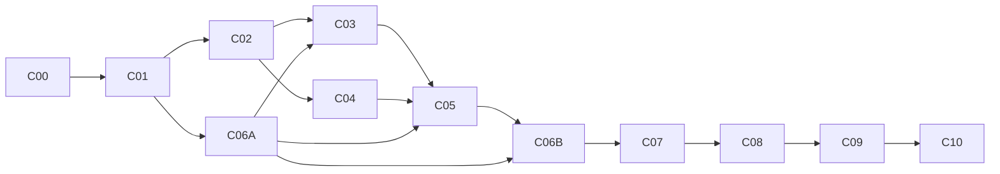

# Supabase and native PostgreSQL migration implementation plan

Status: planned; implementation has not started.  
Prepared: 2026-09-18.  
Repository baseline: `a2cead0d3ed6e6d8fe9a67b2e70e119ffec3e5fc`.  
Scope: repeatable application-data migration in either direction, with explicit checkpoints and a controlled production cutover.

## 1. Outcome and operating assumptions

Deliver an operator-run migration capability that moves the application's durable data from Supabase to native PostgreSQL, or from native PostgreSQL to Supabase, while preserving record identity, relationships, values, account permissions, and history. Retain the current runtime backends and their distinct authentication/security implementations.

The first release targets a planned maintenance window and an unused, isolated destination. It must establish complete-data equivalence before the destination becomes writable by users. Existing version-1 work-data backup/merge behavior remains available and backward-compatible.

This plan creates no production authorization. Building and testing the tool is separate from executing a migration against a named production source and destination. C09 requires explicit authorization for that concrete transfer and its rollback window; ordinary implementation and disposable test work do not need repeated approval.

### Decisions and assumptions

| Item | Baseline for implementation | Status / checkpoint |
|---|---|---|
| Direction | Implement and test both directions; record the first production direction separately | Architecture recommendation; C00 records operational choice |
| Downtime | Planned cutover with all source writers fenced | Assumption; C00 records an acceptable measured budget |
| Destination | Unused application dataset; only reviewed schema/bootstrap rows may exist | Chosen first-release constraint; C01 enforces it |
| Passwords | Destination password enrollment/reset, followed by fresh login | Proposed baseline; user confirmation is pending at plan creation. C00 records the answer before C02's identity implementation |
| UUIDs | Preserve source UUIDs, including profile/Auth IDs where supported | Prove on both actual providers in C02; no silent remapping |
| Existing destination conflicts | Abort; no automatic merge, overwrite, or email/name-based identity inference | Chosen first-release constraint |
| Database access | Direct PostgreSQL connection to each database for complete reads and transactional app-data import; Supabase Admin API for Auth provisioning | Execution prerequisite, not yet verified in a deployment |
| Rollback after target writes | Full reverse migration into a separate unused recovery destination running the original provider; never merge into the retained source | C00 reserves the recovery environment; C08 proves its time/data guarantees |
| Files outside PostgreSQL | Inventory first; separately transfer any required objects and validate URLs/ownership | Deployment-dependent; C00/C08 gate |
| Scale | Bounded-memory streaming and batched parameterized inserts in one app-data transaction | Benchmark against actual volume in C08 |

If existing passwords must continue working, replace the credential portion with a reviewed migration design and its tests before C02. Do not collect plaintext passwords or pretend that renaming a hash makes it compatible. If near-zero downtime, live synchronization, or merge into an occupied destination is required, revise the corresponding checkpoints before dependent work; these are material scope changes.

### Definition of done

- A supported source exports every declared durable record without silent truncation, normalization loss, deduplication, or omission.
- A supported destination rejects unknown schemas, unresolved identity references, incompatible data, and occupied-target conflicts before publication.
- Both native -> Supabase -> native and Supabase -> native -> Supabase tests preserve the contract's canonical durable state.
- Imported accounts authenticate through the destination mechanism and retain active-state, permission-role, hierarchy-role, and ownership behavior.
- Previous sessions, reset tokens, stale retries, and offline queues cannot create unauthorized access or duplicate committed work after cutover.
- A rehearsal proves the recorded downtime/recovery limits and rollback procedure.
- The tool, operator guide, tests, and execution evidence are complete. Production migration itself is complete only after C09 and C10's observation gate.

## 2. Evidence and boundaries to preserve

The architecture assessment inspected source and ran four focused backup suites: **38 tests passed**. This is evidence for the existing backup behavior, not a migration round-trip result. No production database, actual deployment migration history, or live identity transfer was inspected.

| Current evidence | Consequence |
|---|---|
| [BackupPayload](../../app/types.ts) contains version-1 projects, activity types, timesheets, leaves, reminders, and global reminders | Introduce a separate migration format; do not describe the existing backup as full-system export |
| [parseBackup](../../lib/backup.ts) rejects over 5,000 timesheets and deduplicates using business values | Do not reuse it for lossless migration validation |
| [Supabase operations](../../lib/db/supabase/operations.ts) cap several export queries at 1,000 rows | Migration export needs complete iteration independent of those UI backup queries |
| [Native operations](../../lib/db/native/operations.ts) match emails/names and skip conflicts; [Supabase restore SQL](../../supabase/migrations/20260928000000_fix_restore_backup_tx_telegram_cast.sql) has corresponding merge semantics | Do not route migration import through `restoreBackup()` or `restore_backup_tx` |
| [Native profiles](../../db/migrations/0001_initial_schema.sql) store `password_hash`; [Supabase profiles](../../supabase/migrations/20260810160000_initial_schema.sql) reference `auth.users` and are created by an Auth trigger | Provision destination identity before applying complete profile/business state |
| [Native password recovery](../../db/migrations/0023_password_recovery.sql) owns session versions and reset tokens | Use destination recovery behavior; do not copy session credentials |
| [Native idempotency migration](../../db/migrations/0031_idempotency_effects.sql) is deliberately a no-op; Supabase has provider-specific effect evidence | Do not bulk-copy internal idempotency state without a semantic mapping |
| [Application pool](../../lib/db/pool.ts) uses global `DATABASE_URL` and automatic migration guards | Migration connectors must be explicit and independent, especially for read-only source access |
| [Mobile queue](../../mobile/src/storage/offline-queue.ts) is scoped by server URL and actor ID; [sync engine](../../mobile/src/sync/sync-engine.ts) replays stable idempotency keys | Preserving users and URLs can preserve queued retries too; reauthentication alone is insufficient |

Keep ordinary feature work behind existing domain/repository boundaries. Direct SQL in the proposed migration modules is privileged operational infrastructure, not a new application data-access path. No migration module may be imported by browser/mobile bundles, shared client packages, or ordinary HTTP routes.

Preserve additive migration histories, RLS, grants, actor checks, both role axes, public action signatures, `/api/v1` contracts, existing backup semantics, and all current security tests. Do not modify an applied migration or the generated Next.js guidance block.

## 3. Target design

```text
Read-only source connector + account metadata reader
                         |
       Versioned manifest + ordered JSONL data files
                         |
       Offline validation + destination preflight
                         |
       Destination Auth provisioning / enrollment
                         |
       Transactional application-data import
                         |
       Canonical comparison + security smoke checks
                         |
       Controlled application deployment / cutover
```

### Implementation shape

Use an operator CLI in `scripts/`, with small Node-compatible modules in `lib/migration/`. Reuse installed `pg`, `@supabase/supabase-js`, `zod`, `tsx`, and Node standard-library capabilities. Do not introduce a service, queue, package publication process, generic ETL framework, or web upload endpoint.

Keep source and destination clients separate. The CLI takes explicit provider identifiers and environment-variable names for connections. It never falls back to `DATABASE_URL`, the global `repo`, the build-time backend selector, or `lib/db/pool.ts`. Source operations use read-only transactions and must fail on a mutation attempt. Destination schema migration is an explicit preparation step using established workflows, never an implicit side effect of export/import.

Bind the destination Supabase Auth URL/key to the same approved project as its PostgreSQL connection before any Auth mutation. Validate this with the deployment's non-secret project identity and a read-only provider/database consistency check. Swapped source/destination credentials or an Auth endpoint for a different project must fail preflight. A read-only source SQL transaction cannot protect the source from an accidentally misdirected Auth API request.

Separate pure migration-format validation from adapters with credentials. Avoid importing `server-only` runtime sentinels or Next.js request-bound modules into a standalone CLI; ordinary server modules retain their existing protection. Use explicit public function boundaries and a boundary test to prevent accidental migration-code imports from application/client code.

### Bundle and compatibility contract

Use a directory containing `manifest.json` and allowlisted per-entity JSONL files. No ZIP extraction is required in the first version.

The manifest has a distinct format discriminator, for example `vsis-data-migration`, and its own `formatVersion: 1`. It is not the existing `BackupPayload.version: 1`. Include:

- Run/bundle ID, application revision, source provider, supported schema fingerprint and applied migration identifiers, export timestamp and snapshot provenance.
- Entity file names, exact row/byte counts, checksum algorithm and digests, canonicalization version, dependency order, and explicitly excluded categories with reasons.
- Account metadata/enrollment policy and declared transformations. No connection strings, passwords, password hashes, tokens, signing keys, or provider secrets.

Use fixed allowlisted filenames, reject symlinks/path traversal and unknown entity files, bound manifest/row sizes, and reject truncated JSONL or count/hash mismatches. Hashes detect corruption; they do not authenticate the exporter. Restrict artifact access and bind imports to an operator-selected bundle digest and verified source provenance. Encrypt retained/transferred bundles through approved existing infrastructure and record retention/deletion dates without putting keys in the bundle.

Canonicalize values without loss: UUIDs, booleans, null versus empty string, date-only values, timestamps at supported database precision, decimal quantities, JSON settings, and stable ordering. Do not pass PostgreSQL decimals/bigints through lossy JavaScript numbers or truncate microseconds through `Date` serialization. Define text/JSON encoding and Unicode handling in the contract. Distinct rows with distinct IDs remain distinct even when their visible business fields match.

### Initial data classification

C00 must turn this candidate list into a verified field-level matrix. Inspect current migrations and live catalog metadata; source files alone do not establish deployed state. Unknown persistent tables or columns block a completeness claim until classified.

| Category | Candidate contents | Policy |
|---|---|---|
| Account metadata | Profile IDs/emails, names, department/title, both role axes, active state, manager links, preferences/layouts, required identity verification metadata | Preserve declared durable fields; enroll credentials separately; do not elevate email verification without evidence |
| Reference/workspace | Projects, activity types, titles, whitelisted domains, app settings, branding and default layouts | Preserve IDs and values; validate environment-dependent URLs and configuration |
| Work data | Timesheets, leaves, reminders, global reminders, user dismissal records | Exact record transfer with timestamps and FK preservation |
| History | Application audit events and actor references | Preserve according to agreed retention and deleted-actor rules |
| External objects | Deployment-specific logo/files/storage objects, if any | Separate inventory, transfer, ownership and checksum validation; record a blocker if tooling is required but unavailable |
| Auth credentials | Native password hashes; provider hashes, OAuth/MFA credentials; active sessions and recovery tokens | Excluded from first-version bundle; destination enrollment/fresh sessions required |
| Operational state | Idempotency records/effects, rate-limit buckets, maintenance state | C06A fixes the contract before full export/import; C06B proves replay safety before anything is cleared |
| Provider implementation | `auth`, `storage` internals, private RPC/trigger machinery, grants/RLS, migration ledgers | Recreate through destination/provider workflows; never copy wholesale |

### Import transaction and recovery model

1. Offline-validate the complete bundle and run destination catalog/emptiness checks before mutation.
2. Acquire a destination-wide migration lock and recheck its fingerprint/contents. Reject source=destination, concurrent imports, unsupported connection/proxy modes, or an unisolated target.
3. Provision Auth identities using supported APIs where required. Preserve UUIDs, preserve account verification facts, and account for triggers/whitelisted-domain rules. Record migration-created IDs in a protected journal. Keep the target inaccessible to users throughout.
4. Start one destination application-data transaction. Import in a verified FK order; handle self-referential hierarchy in two passes if the schema permits. Validate all final links before commit. Preserve role synchronization triggers; do not disable RLS, grants, or all triggers globally.
5. Compare canonical imported data, counts, IDs, and required invariants. Commit only if the application-data gate passes. Perform post-commit authentication/security checks while the destination remains isolated.
6. Record completion independently of terminal output. Retries must distinguish not-started, Auth-provisioned, data-committed, verified, publication-intent, and writable states. A lost response after commit must not start a duplicate import.

Supabase Auth provisioning and SQL import are not one transaction. If app-data import fails, roll back that transaction and either reuse verified journal-owned identities on retry or clean up only identities proven to have been created by this run. Never remove a pre-existing identity. Once app data is committed, deleting Auth users can cascade into that data: prohibit automatic identity cleanup at that point and require a whole-destination recovery decision.

Persist a non-secret import receipt atomically with app-data commit, bound to run ID, bundle digest, destination fingerprint and schema version. A small destination-local receipt table added through additive migrations in both tracks is justified only for this recovery guarantee; exclude that operational receipt from business-data equivalence. If an existing durable receipt facility safely provides the same semantics, reuse it instead. External progress journals alone cannot prove whether a database commit succeeded.

Extend the protected receipt/state mechanism to record publication intent durably **before** any gate admits destination business writes. Only the migration operator may change that state; ordinary application roles cannot. Once intent is recorded or publication is attempted, recovery assumes target writes may exist unless their absence is independently proven. A crash must never make a writable target look safe for immediate source resumption. Controlled validation mutations count too if they can persist; prefer read-only or rolled-back checks before this boundary. Record the observed first write for audit, but do not use an after-the-fact log entry as the safety boundary.

## 4. Checkpoint map and status

All implementation checkpoints start **NOT STARTED**. A checkpoint becomes PASS only when its stated evidence is recorded. Missing prerequisites are BLOCKED, not PASS or an unreported skip. C00's discovery can proceed while a policy answer is pending; only work that depends on that answer waits.



| Checkpoint | Deliverable | Depends on | Status |
|---|---|---|---|
| C00 | Verified scope, schema/data inventory, operational budgets | None | NOT STARTED |
| C01 | Format, validator, explicit connectors, CLI safety boundary | C00 | NOT STARTED |
| C02 | Small real migration in both directions, including account enrollment | C01; credential decision resolved | NOT STARTED |
| C03 | Complete and consistent exporter | C02, C06A | NOT STARTED |
| C04 | Complete identity/profile provisioning and recovery | C02 | NOT STARTED |
| C05 | Complete strict importer, reconciliation, durable receipts | C03, C04, C06A | NOT STARTED |
| C06A | Early retry, session and recovery policy/contract | C01; C00 operational decisions | NOT STARTED |
| C06B | Writer fencing, retry implementation and publication proof | C05, C06A | NOT STARTED |
| C07 | Adversarial integration/security matrix and CI | C05, C06B | NOT STARTED |
| C08 | Volume benchmark and full rehearsal | C07 | NOT STARTED |
| C09 | Authorized production cutover | C08; concrete migration authorization | NOT STARTED |
| C10 | Observation, handoff, delayed source retirement | C09 | NOT STARTED |

C06A is an early design gate despite its identifier; execute it after C01 and before finalizing C03/C05. C03 and C04 can run in parallel once their respective dependencies pass, with separate file ownership. C06B verifies the integrated migration and cannot pass before C05. Coordinate shared format/manifest changes centrally; do not let parallel agents silently change the contract. There are 12 pass/fail gates, with C06 deliberately divided into two dependent gates. Each checkpoint should be a small reviewable commit or PR; split a large checkpoint without weakening its gate.

## 5. Executable checkpoints

### C00 — Establish the migration contract's factual inputs

**Context:** existing work-data backups are incomplete and deployed migration versions are unknown. **Owner:** coordinator with a bounded schema/data scout and deployment operator. **Files:** execution notes, proposed operator runbook, field inventory; no runtime edits.

Tasks:

1. Record current HEAD, dirty tree, relevant versions, source/destination provider and non-secret instance identities. Preserve unrelated changes; never dump environment files, credentials, or sample personal records into reports.
2. Create `docs/plan/SUPABASE_NATIVE_MIGRATION_NOTES.md` with baseline, checkpoint ledger, evidence references, decisions, deviations, blockers, and final outcome sections.
3. Produce a column matrix: source representation, canonical representation, destination representation, required/default/generated status, constraints, and handling. Include all persistent public/custom schemas and explicitly classify provider schemas without exporting their secrets.
4. Inventory data volumes, duplicate normalized emails, orphan references, legacy role inconsistencies, historical constraint violations, deleted actors, non-ASCII text, decimal/date precision, and self-referential hierarchy. Report aggregates/identifiers securely; no silent cleanup.
5. Confirm password policy, allowed downtime, recovery time/data-loss limits, bundle retention, rollback observation window, destination access, external object scope, SMTP/enrollment readiness, and first migration direction. Reserve an isolated recovery destination for full reverse migration after target writes; measure its provisioning cost/time too. Record numeric budgets before performance acceptance.
6. Record the approved bootstrap rows allowed in an otherwise empty target. Do not treat arbitrary existing projects, accounts, or settings as disposable seed data.

**Verification:** run V0 and V1 below; inspect current catalog/migration history through read-only access when an execution environment is available. Compare catalogs with the explicit supported schema matrix, not matching migration filenames across providers.

**PASS:** every durable category is mapped or explicitly excluded with an accepted consequence; no unresolved policy blocks the next checkpoint; source/destination prerequisites and numeric operational budgets are recorded.

**Stop/rollback:** unknown deployed schema or policy blocks its dependent work. Discovery is read-only and requires no data rollback. Record unanswered inputs instead of guessing.

### C01 — Define the bundle and safe operator interface

**Context:** the UI backup contract must remain unchanged. The ordinary pool can automatically migrate a database. **Owner:** routine backend implementer; coordinator reviews the security boundary. **Files:** proposed `scripts/migrate-backend.ts`, `lib/migration/format.ts`, `validation.ts`, `connections.ts`, and focused tests; additive `package.json` script.

Tasks:

1. Implement schemas/canonicalization for the manifest and the first slice's entities. Unknown format versions/fields or unsupported schema fingerprints fail closed.
2. Implement explicit source/destination configuration with allowlisted provider names and protected environment inputs. No secret-valued command arguments, environment auto-selection, or global app pool imports.
3. Implement offline `validate` and database `inspect`/`preflight` commands. Dry-run must have zero database mutations, Auth provisioning, email sends, migrations, or secret-bearing output.
4. Verify distinct source/destination identity beyond a raw connection-string comparison: account for aliases/proxies and record a safe instance fingerprint. Bind target Auth API credentials to the target database/project. Reject uncertainty before import.
5. Implement run journals, exclusive artifact creation, digest verification, lock/error/time limits, redacted structured results, and unambiguous exit codes. Keep generated bundles/journals out of Git.
6. Add boundary coverage preventing ordinary app/client code from importing migration infrastructure. Reuse current dependencies; avoid a new framework.

**Verification:** V2 for format/CLI tests, V3 for type/lint/boundaries. Cases: malformed manifest, truncated data, duplicate IDs, precision round trip, unexpected files, symlink/path traversal, same target/source through aliases, mismatched Auth API/database projects, missing env, source write attempts, and dry-run attempts to call Auth or migration routines.

**PASS:** the CLI can validate a fixture and inspect supported disposable databases without changing either one; no existing backup/public contract changes.

**Rollback:** revert the additive tool files/script and restore any configuration from its pre-edit backup. No target data exists yet.

### C02 — Prove one complete slice across real boundaries

**Context:** prove account + data transfer before expanding table coverage. **Owner:** backend implementer with identity review. **Files:** proposed provider modules and minimal export/import/coordinator modules; `tests/migration-roundtrip.int.test.ts`.

Tasks:

1. Prepare disposable native and Supabase targets using their established schema workflows. Keep the test harness unable to select production databases accidentally.
2. Transfer one account/profile, a project, an optional activity type, and two distinct timesheet rows that share visible business values. Preserve UUIDs and full timestamps.
3. On Supabase, create the Auth identity through the supported Admin API with the intended ID, allow required triggers to run, and then apply trusted profile state. Check provider-version support rather than relying on SDK types alone.
4. On native, create a profile with no usable password credential and use the established reset/enrollment flow. Prove the flow works for an imported account; do not import the source password hash.
5. Keep accounts isolated until permissions and active state have been applied. Preserve unverified email state; do not equate a native profile email with evidence of inbox verification.
6. Import business data transactionally; prove a deliberately failing final insert leaves no partial app-data result. Track Auth identities separately so retries cannot duplicate or delete unrelated users.
7. Exercise both directions and fresh login to each destination. Record exact provider versions and fixture identity mapping.

**Verification:** V4 with a real database for each provider. Include success, inactive-account access denial, another-user access denial, an Auth-trigger failure, a UUID collision, and a late app-data failure. The current mocked restore suites are insufficient for this gate.

**PASS:** both directions preserve the slice's canonical data and permissions; new-password enrollment/fresh sessions work; no credentials or tokens are transferred. Preserve-ID support is proven or the plan is revised before expansion.

**Rollback:** discard only the dedicated test datasets/instances and journal-owned pre-commit identities. A failed production-like dry run cannot mutate the source.

### C03 — Export all declared durable state consistently

**Context:** current export has fixed limits and independent queries; migration needs a complete snapshot. **Owner:** export implementer. **Files:** proposed exporter, entity mappings/read adapters, export tests; does not own identity import files.

Tasks:

1. Add every C00-mapped entity and column. Use explicit column allowlists; never `SELECT *` from provider credential tables.
2. Export under a stable PostgreSQL snapshot using a dedicated read-only connection, stable primary-key ordering/keyset pagination, and bounded batches. Keep snapshot lifetime and statement limits visible in the result.
3. Read only approved Auth metadata such as ID, email verification state, and supported account status. Document how provider-side account changes are fenced during the final snapshot.
4. Stream files and compute counts/checksums. Finalize the manifest only after every entity is complete; incomplete exports must not look importable. Handle disk-full, interrupted connection, and snapshot failure.
5. Preserve source values and duplicates exactly under canonicalization. Do not reuse legacy parser trimming, sanitization, field truncation, fallback descriptions, or name-based deduplication.
6. Include a diagnostic report for unmapped/deployed schema drift and values incompatible with the destination. Do not silently rewrite source records to fit.

**Verification:** V2/V3 and export integration tests: over 1,000 rows in formerly capped categories, over 5,000 timesheets, special characters, decimal/timestamp boundaries, null values, duplicate-looking rows, concurrent changes outside the held snapshot, and interrupted output.

**PASS:** independent source counts and canonical digests match a completed bundle; memory stays bounded by batches; every failure leaves an explicitly incomplete artifact.

**Rollback:** remove only this run's incomplete artifacts using verified paths; the source remains unchanged.

### C04 — Finish identity and profile migration

**Context:** provider identities, profiles, roles, hierarchy, and account verification are related but different concerns. **Owner:** identity implementer. **Files:** proposed identity adapter module and tests; inspect current `lib/auth/identity.ts`, `lib/auth/password.ts`, `lib/db/password-recovery.ts`, and `lib/email/password-reset.ts`.

Tasks:

1. Expand C02 to all imported identities, including inactive users, administrators, unverified accounts, and profile references required by historical data. Define explicit handling for deleted actors; do not create login-enabled placeholders.
2. Detect normalized-email/UUID collisions before provisioning. An occupied target is an error; email matching is never permission to link accounts.
3. Preserve both role axes, active state, hierarchy and durable profile preferences. Apply manager links only after referenced profiles exist; validate cycles and role rules according to current semantics.
4. Prove domain-whitelist and Auth-trigger behavior, including profile creation and legacy-role synchronization. Keep application roles separate from Supabase's database/JWT `role`; never create user accounts as `service_role`.
5. Make identity creation retries bounded and journal-aware. Respect API rate limits and report partial provisioning without declaring migration complete.
6. Record email enrollment status separately from data import. Do not automatically send bulk email during preflight, rehearsal, or import; actual user communications require explicit authorization. Validate enrollment with controlled test accounts.
7. Treat unsupported OAuth/MFA/provider identities as an explicit blocker or agreed re-enrollment path. Do not downgrade authentication assurances silently.

**Verification:** V4/V5 identity cases plus role/hierarchy fixtures; lost API response after successful creation; expired/single-use recovery links; mail failure; exact preserved account state; no access before publication.

**PASS:** every account is accounted for as provisioned, intentionally non-login historical identity, or an explicit blocker; no privilege escalation and no fabricated verification state. Recovery from partial Auth provisioning is demonstrated.

**Rollback:** before app-data commit, clean only proven run-created identities or resume them. After commit, use whole-target recovery; never cascade-delete users automatically.

### C05 — Complete strict import, reconciliation, and durable recovery

**Context:** existing restore skips rows by design. This path must either preserve the declared dataset or fail before publication. **Owner:** import implementer. **Files:** proposed importer/reconciler/journal modules; additive receipt migration(s) if needed; failure/recovery tests.

Tasks:

1. Consume the validated C03 bundle and C04 identity results. Recheck destination isolation, schema fingerprint, allowed seed state, bundle digest, and import lock at the point of mutation.
2. Load every mapped entity in dependency order using parameterized batched writes and one app-data transaction. Support hierarchy two-pass loading without weakening final constraints.
3. Define safe handling of generated columns/defaults, role-sync triggers, schema bootstrap rows, imported audit history, sequence/identity counters, and expected provider-generated fields. Declare each permissible difference in the contract.
4. Reject row conflicts, foreign-key failures, capacity violations, unsupported values, unexpected target rows, or required schema drift. Report specific errors; no broad catch-and-continue or generic skip count.
5. Compare source/bundle/target entity counts, exact IDs, canonical values, relationships, and important aggregates such as per-user/per-day hours. Count equality alone is insufficient.
6. Commit app data and an import receipt atomically. Use the receipt after a connection loss to determine whether the transaction committed; never infer success from the local journal alone.
7. Make rerunning a verified run/digest a no-op with a clear result. A different digest/run against a populated target must fail. If a committed receipt disagrees with actual target data, stop for recovery.
8. Keep target publication separate from import success. Post-commit login/security failures leave the target isolated and recorded as unverified.

**Verification:** V4 with injected failures at first/middle/last category, before/after commit, process restart, concurrent import, corrupted file, conflicting bootstrap row, orphan/hierarchy failure, unexpected schema, and a repeated completed run.

**PASS:** all declared categories reconcile with zero unexplained differences; transaction rollback and uncertain-commit recovery work; existing application and backup tests still pass.

**Rollback:** pre-commit SQL rollback; post-commit restore/recreate only the isolated migration destination from the verified baseline. Reversing code or deleting receipt rows is not a data rollback.

### C06A — Fix the retry/session/recovery policy before full data mapping

**Context:** mobile queues retain stable IDs across logins, and native/Supabase idempotency internals differ. The chosen policy can add portable operational records to the bundle and therefore precedes C03/C05. **Owner:** architecture/security reviewer with mobile/operator input. **Dependency:** C01 and C00's operational decisions. **Files:** contract decisions, field matrix and runbook; no speculative client rewrite.

Tasks:

1. Enumerate writers and retry sources: web/server actions, APIs, direct Supabase requests, Admin clients, signup/profile triggers, jobs, integrations, and mobile sync. Describe how each will be fenced, including direct provider endpoints.
2. Select one concrete retry strategy supported by the actual client population: portable committed idempotency outcomes with a defined semantic mapping, or enforced queue reconciliation/client compatibility gating before replay. Specify the retry horizon, absolute expiry semantics, operations already committed with lost responses, and devices reconnecting beyond that horizon. Unknown late retries must not become fresh mutations automatically.
3. Update the format/entity matrix with every operational record needed by that strategy, or explicitly show why none are needed. Define source/destination actor, route, request-hash, result and effect mappings if outcomes are ported. Exclude credential/token-bearing responses. Do not treat provider-specific effect tables as interchangeable.
4. Define fresh-session requirements, old-token rejection, temporary target isolation, source authority, and the durable publication-intent/write-gate state machine. A password reset alone is not proof every old token is rejected.
5. Define rate-limit/maintenance state disposition and in-flight-operation handling. Preserve offline work requiring manual review rather than silently deleting it.
6. Fix the post-write return path: full current-authority export into a reserved unused recovery destination of the original provider, followed by verification and routing. Include new accounts, updates, deletions, external objects, retries and repeat enrollment. If current-authority data is unreadable, recover it first; the retained source cannot prove preservation of target writes.

**Verification:** review the state machine and field matrix against the identified writers/clients, then define the executable V6 cases and exact affected files. Account for an offline device outside the chosen horizon and a process crash at each publication transition.

**PASS:** one implementable strategy and its contract are selected; publication/rollback transitions are explicit; all C03/C05 inputs are stable. A drain-only runbook cannot pass if every relevant client/retry cannot be accounted for.

**Rollback:** revise the policy/contract before dependent implementation; no runtime or source data changes are necessary for this design gate.

### C06B — Implement and verify fencing, retry handling and publication

**Context:** C05 now provides complete import and durable receipts; C06A specifies the safety contract. **Owner:** operations/security implementer with mobile support. **Dependencies:** C05, C06A and any required client/guard changes owned by this checkpoint. **Files:** runbook plus only the identified guards, receipt-state/idempotency adapters or mobile compatibility changes.

Tasks:

1. Implement and exercise each C06A writer fence. A web maintenance page is insufficient. Keep the source authoritative and target unreachable to normal clients until all verification gates pass.
2. Implement the selected session/retry strategy, including late device reconnection and retained manual-review queues. Keep the old source endpoints fenced after routing changes.
3. Persist publication intent on the destination's protected durable receipt/state before any gate admits business writes. All gating mechanisms must obey that state and the recorded operator transition; ordinary users cannot set it. Record observed enablement/first write as supplementary audit evidence.
4. On restart after publication intent or an uncertain enablement, assume writes may exist and use the post-write recovery path unless their absence is independently established. Never infer safe source resumption from an absent final log line.
5. Use read-only or rolled-back validation before publication where possible. If controlled validation can retain business/account metadata mutations, move the conservative boundary ahead of those calls too.
6. Finalize operator procedures and exact gate/rollback commands. If runtime code changes, consult installed Next.js guidance and run the relevant regression/build checks.

**Verification:** V6 after complete migration. Attempt writes through every surface during freeze; replay committed and uncertain mutations after fresh login; test old tokens and late offline devices; inject crashes immediately before publication intent, before enablement, immediately after enablement, and after an acknowledged or lost-response write. Verify recovery never loses that write or resumes two writable authorities.

**PASS:** no unfenced writer, unauthorized old session or unsafe retry remains; publication and uncertain-transition recovery are durable; full reverse migration preserves post-cutover changes in the recovery fixture.

**Rollback:** keep the current authority fenced appropriately and the unverified destination isolated. Follow the recorded pre-publication or conservative post-publication recovery path; a failed fence test alone never justifies replacing source data.

### C07 — Establish the integration and security release gate

**Context:** unit tests do not prove Auth provisioning, RLS, transactional recovery, or cross-provider equivalence. **Owner:** test/security implementer. **Files:** migration suites and a scoped CI integration job; preserve existing required checks.

Tasks:

1. Build deterministic fixtures across all mapped categories, role combinations, active states, hierarchy relationships, audit/deleted-actor cases, field precision and provider bootstrap behavior.
2. Test both round trips and each direct migration using actual disposable native and Supabase services. Verify fresh login plus positive and negative authorization cases after import.
3. Include C01/C03/C05 corruption, capacity, conflict, snapshot and crash scenarios and C06B stale-retry/session/publication cases. Confirm absence of secrets in bundles, error output, journals and CI artifacts.
4. Add explicit test prerequisites so the migration CI job fails setup when its databases/keys are absent; it must not go green by skipping its real database suite. Never use production credentials in CI.
5. Run the existing native restore/recovery and live Supabase RLS/registration checks applicable to the changes. Retain all current CI checks and thresholds; no path-filter optimization in this work.

**Verification:** V1–V6 and both-backend build checks V7 as applicable. If mobile code changes, run mobile lint/typecheck/tests and the focused queue/sync cases.

**PASS:** all required matrix legs pass on a fresh schema installation and a supported deployed-schema upgrade path. Every fixture category survives both round trips and the security cases pass.

**Rollback:** remove only a faulty new CI/test change; do not lower thresholds or disable existing checks. Any uncovered application defect becomes a scoped fix with regression evidence before this gate passes.

### C08 — Benchmark and rehearse the complete operation

**Context:** a maintenance-window promise requires measured export, enrollment/provisioning, import, verification, build/deployment and recovery time. **Owner:** operator with performance/test support. **Files:** runbook and evidence ledger; implementation adjustments only for measured failures.

Tasks:

1. Run a full rehearsal against disposable environments using sanitized representative data at C00's expected volume and an agreed growth margin. Include high-row-count categories and largest allowed rows/settings.
2. Measure end-to-end downtime components, peak memory/disk, snapshot/transaction duration, Auth rate-limit retries, locks, and verification time. Do not benchmark only raw inserts.
3. Build target application artifacts before the production freeze where possible; test the exact target-backend build/configuration and web/mobile endpoints.
4. Complete separate object transfer and URL/ownership verification if C00 identified external storage. A database-only rehearsal cannot clear that gate.
5. Rehearse interruption/recovery and rollback on both sides of first target write. For the post-write case, add real target-only records/updates/deletions and an account, reverse-migrate the full current dataset into the reserved empty recovery destination, and prove they survive correctly. Include new enrollment and environment provisioning in recovery timing. Test operator commands from the runbook without relying on undocumented chat context.
6. If single-transaction import cannot meet the budget, revise the design for staging/publication and re-review crash consistency. Do not silently switch to partially committed batches.

**Verification:** V8; retain redacted timings, resource maxima, reconciliation digests, failures/retries, and rollback evidence.

**PASS:** all recorded numeric limits are met, the complete runbook is executable, and no unresolved correctness/security issue remains. A budget miss stays BLOCKED until the design or an explicitly accepted budget changes.

**Rollback:** dispose only of rehearsal targets/artifacts within their approved scope. No production connection is required for this checkpoint.

### C09 — Execute an authorized production cutover

**Context:** this is the first production mutation checkpoint. **Owner:** named migration operator with an available reviewer/support contact. **Dependency:** C08 PASS and authorization naming source, destination, dataset, credential policy, window and rollback conditions.

Tasks in order:

1. Verify code/build versions, source/destination fingerprints, schema states, prepared target isolation, backups, bundle storage, enrollment configuration, and operator access. Take and verify recoverable provider-appropriate backups; files/configuration are separate where necessary.
2. Activate the rehearsed write fence and confirm no active/in-flight writers remain. Reconcile pending retries/queues according to C06A/C06B. Abort before export if this cannot be established.
3. Export the final source snapshot; validate its manifest, counts, digests, account inventory and target compatibility. A pre-freeze rehearsal bundle is not the final production snapshot.
4. Provision identities, import app data, and inspect the durable receipt. Keep the target isolated if any step fails or commit status is uncertain.
5. Verify complete reconciliation, role/ownership behavior, critical reporting totals, recovery/enrollment, external objects and application health using controlled accounts. Prefer read-only/rolled-back business checks. Before any retained validation mutation, persist publication intent and apply the conservative recovery classification. Do not send bulk notifications without the separately authorized communication step.
6. Deploy the correct target-backend build/configuration behind the write gate. Keep the old source fenced. Confirm all gates pass and stale tokens/retries remain handled; persist publication intent durably before changing routing or enabling any destination business writer. If the process fails after that transition, treat destination writes as possible.
7. Enable writes through the recorded gate, record observed routing/first write and target authority for audit, and start observation. No missing post-enable log record can authorize immediate return to the retained source. Follow the concrete rollback triggers from C00/C08.

**PASS:** the intended destination is the sole writable authority; no unexplained data differences or security failures exist; checkpoints and operator evidence are recorded.

**Rollback:** before publication intent, and only with proven absence of retained target mutations, stop target access and safely resume the source. Once publication is attempted or writes may exist, freeze the current authority, export its complete state, and execute the rehearsed full reverse migration into the reserved empty recovery destination of the original provider. Reconcile, verify authentication/enrollment, then route traffic there. Keep the original source untouched; merging into it is outside this first release. If current-authority data is unavailable, restore its recoverability first instead of silently losing target writes.

### C10 — Observe, hand off, and retire deliberately

**Context:** source retention is the rollback mechanism, not proof the destination works. **Owner:** operator and repository maintainer. **Files:** runbook, execution notes, relevant architecture context.

Tasks:

1. Monitor the agreed observation window for authentication/enrollment failures, permission mismatches, missing records, duplicate writes, queue failures, reporting discrepancies and unexpected source traffic.
2. Perform scheduled reconciliation within that window using the defined authority/cutover timestamps; account for legitimate target writes rather than comparing blindly to the original source snapshot.
3. Confirm backup/restore of the new destination and revoke temporary migration credentials/access. Retain journals/bundles only for their approved period; delete them through verified exact paths when authorized.
4. Update `docs/ai-context/DATA_MODEL.md`, `AUTH_SECURITY.md`, `CONSTRAINTS.md`, `API_CONTRACTS.md` only where affected, and `ARCHITECTURE_DELTA.md` with actual implemented boundaries and evidence. Document supported version pairs and limitations.
5. Retire/delete the source only after the observation and retention windows and explicit authorization for that irreversible action. Completion of the transfer does not itself authorize source deletion.

**PASS:** observation and new-destination recovery checks pass; handoff is complete; source retirement is either authorized/completed or explicitly retained as a separate decision.

**Rollback:** use the rehearsed full reverse-migration path into an unused recovery destination. Once source deletion/retention expiry occurs, the immediate pre-cutover fallback is gone; recovery relies on the current authority and tested backups. Record that change in reversibility.

## 6. Proposed files and editing ownership

These are proposed implementation locations, not files created by this planning task. Consolidate small helpers when practical; do not turn this list into a requirement for unnecessary modules.

| Scope | Proposed/current paths | Ownership |
|---|---|---|
| CLI composition | `scripts/migrate-backend.ts`; additive `package.json` script | Coordinator/CLI implementer |
| Pure format and validation | `lib/migration/format.ts`, `validation.ts` | Contract owner |
| Explicit connections/provider access | `lib/migration/connections.ts`, `providers/native.ts`, `providers/supabase.ts` | Backend owner; reviewed source-read boundary |
| Export | `lib/migration/export.ts` | Export implementer |
| Identity provisioning | `lib/migration/identity.ts` | Identity implementer |
| Import/reconcile/recovery | `lib/migration/import.ts`, `reconcile.ts`, `journal.ts` | Import implementer |
| Receipt/guard schema, if needed | New additive files in `db/migrations/` and `supabase/migrations/` | Import/security owner; select unused sequence values at implementation time |
| Unit/integration tests | New `tests/migration-*.test.ts` and `tests/migration-*.int.test.ts` | Test owner |
| Boundary and workflow gates | `tests/boundary-enforcement.test.ts`, `vitest.config.mts`, `.github/workflows/ci.yml` only as required | Coordinator integrates shared edits |
| Operator documentation | New `docs/guides/BACKEND_MIGRATION.md`; execution notes beside this plan | Coordinator/operator |
| Conditional cutover/client changes | Relevant auth/HTTP/idempotency guards; `mobile/src/storage/offline-queue.ts`, `mobile/src/sync/sync-engine.ts` only if C06A proves necessary | Explicitly assigned owner before editing |

Use inexpensive scouts for bounded inventory and source-reference questions, routine implementation agents for established patterns, and an architecture/security review for identity, receipt atomicity, fencing and retry-policy decisions. Supply each agent its checkpoint, source paths, dependencies, acceptance criteria and file ownership; avoid repeated whole-repository discovery.

## 7. Verification commands and evidence rules

All commands run from the repository root unless indicated. Follow `RTK.md`; use normal RTK filtering when available. In the current sandbox, filtered `rtk git` failed because its home/config directory was unavailable, while `rtk proxy` succeeded. Proxy forms below preserve the required prefix and must preserve the underlying exit code.

### V0 — Baseline and task scope

```powershell
rtk proxy git rev-parse HEAD
rtk proxy git status --short
rtk proxy git diff --stat
rtk proxy git diff --check
```

Expected: recorded baseline; only intended edits; no introduced whitespace problems. Inspect untracked new files explicitly because ordinary Git diff omits them.

### V1 — Existing behavior baseline

```powershell
rtk proxy npm test -- tests/backup.test.ts tests/operations-domain.test.ts tests/supabase-restore.test.ts tests/backup-restore-route.test.ts
```

Expected: all selected tests pass. The architecture assessment observed 38 passes at the recorded revision; rerun at implementation start and attribute any existing failure separately.

### V2 — Proposed migration unit suites

Create these tests in their owning checkpoints before invoking them:

```powershell
rtk proxy npm test -- tests/migration-format.test.ts tests/migration-cli.test.ts tests/migration-export.test.ts tests/migration-import.test.ts tests/migration-identity.test.ts
```

Expected: relevant success/failure cases pass. Invoke only tests already introduced by the current checkpoint, then the full selection when all exist. A missing test file is not evidence of a passing checkpoint.

### V3 — Static checks and boundaries

```powershell
rtk proxy npm run typecheck
rtk proxy npm run lint
rtk proxy npm test -- tests/boundary-enforcement.test.ts tests/domain-adapter-contracts.test.ts
rtk proxy npm run test:coverage
```

Expected: no new type/lint/boundary violations; existing coverage thresholds remain intact, and migration modules receive meaningful coverage. Adapter export checks do not prove database behavior.

### V4 — Proposed migration database matrix

```powershell
rtk proxy npm test -- tests/migration-roundtrip.int.test.ts tests/migration-recovery.int.test.ts --no-file-parallelism
```

Expected: both directions run against dedicated real services with the entire mapped dataset. The harness must require its explicitly configured disposable connections and Supabase Auth credentials, verify allowlisted target identities, and fail rather than silently skip when this gate is requested. Do not use `TEST_DATABASE_URL` as an implicit migration source or destination.

### V5 — Existing database/auth regressions

```powershell
rtk proxy npm test -- tests/restore.int.test.ts tests/operations-restore.int.test.ts --no-file-parallelism
rtk proxy npm run db:password-recovery-test
rtk proxy npm run db:concurrency-test
rtk proxy npm test -- tests/supabase-live-rls.int.test.ts tests/supabase-live-registration.int.test.ts --no-file-parallelism
```

Run each selection in the environment its existing workflow defines: native tests need a migrated native `TEST_DATABASE_URL`; Supabase tests need the explicit local/live-test stack variables from CI. Never point native migration/bootstrap helpers at a Supabase source. Missing infrastructure is BLOCKED for the relevant gate; record skips honestly.

### V6 — Retry/session cutover proof

```powershell
rtk proxy npm test -- tests/migration-cutover.int.test.ts --no-file-parallelism
```

This is a proposed test specified in C06A and implemented in C06B. Include real token/access checks, persisted retry effects and publication crash windows, not only mocked gate responses. If mobile code changes, run its existing workflows from `mobile/`:

```powershell
rtk proxy npm run lint
rtk proxy npm run typecheck
rtk proxy npm test
```

### V7 — Builds and user-flow verification

Run `rtk proxy npm run build` once for each backend in separately configured native and Supabase test environments, following `.github/workflows/ci.yml` and the prebuild Auth configuration verifier. Restore environment configuration after each run; do not repurpose `HOME` or persist source credentials in the build.

Run the relevant existing Playwright production-build flow with migrated fixtures and seeded `E2E_EMAIL` / `E2E_PASSWORD`. If UI flows change, include the existing accessibility workflow. Exact fixture selection and commands go in the checkpoint notes; a build without runtime tests does not prove account enrollment or authorization.

### V8 — Rehearsal and operator interface

Add the proposed package script `migration` using the installed `tsx` runner. The following is the intended interface, **not an existing executable capability**:

```powershell
rtk proxy npm run migration -- inspect --source native --source-env MIGRATION_SOURCE_DATABASE_URL
rtk proxy npm run migration -- export --source native --source-env MIGRATION_SOURCE_DATABASE_URL --out <protected-bundle-directory>
rtk proxy npm run migration -- validate --bundle <protected-bundle-directory>
rtk proxy npm run migration -- preflight --target supabase --target-env MIGRATION_TARGET_DATABASE_URL --bundle <protected-bundle-directory>
rtk proxy npm run migration -- import --target supabase --target-env MIGRATION_TARGET_DATABASE_URL --bundle <protected-bundle-directory> --run-id <recorded-run-id>
rtk proxy npm run migration -- verify --target supabase --target-env MIGRATION_TARGET_DATABASE_URL --bundle <protected-bundle-directory>
```

Replace placeholders only with approved paths/identifiers; provider-specific Auth access uses separately named protected environment inputs. Reverse the provider identifiers for the reverse direction. Export/inspect/preflight/validate cannot change schemas or accounts. Import cannot enable user traffic, send bulk email, delete the source, or weaken guards. Logs identify the phase/provider and non-secret run IDs without credentials or record bodies.

## 8. Stop conditions and plan changes

Stop the affected checkpoint for any of these conditions, continue independent work where safe, and record the concrete evidence:

- Required password preservation, online synchronization, or occupied-destination merging contradicts the first-release scope.
- The source schema, provider version, category inventory, existing data constraints, or identity mapping cannot be represented without a declared transformation.
- Direct source read/destination transactional access or necessary Auth provisioning privileges are unavailable.
- UUID preservation cannot be proven. Propose a complete mapping design and its relationship/client consequences before changing the contract.
- The source cannot be fenced, old endpoints stay writable, or offline retry safety cannot be established.
- A bundle fails integrity checks, a destination has unexpected data, or an import's commit outcome cannot be proven by its receipt.
- The rehearsal exceeds the accepted downtime/recovery/resource budget.
- Finishing requires unrelated runtime changes, lowering security protections, exporting credentials, rewriting applied migrations, or deleting pre-existing data.

Ordinary implementation adjustments do not require reopening the architecture decision. Log each deviation as: planned behavior, source evidence, chosen adjustment, affected checkpoints, and additional verification. Contract/security/cutover changes require re-review of dependent gates. Do not mark a gate passed because its implementation exists or a weaker test passed.

## 9. Execution ledger template

The executor creates `docs/plan/SUPABASE_NATIVE_MIGRATION_NOTES.md` at C00 and updates it after every checkpoint:

| Field | Required content |
|---|---|
| Checkpoint/status | NOT STARTED, IN PROGRESS, PASS, BLOCKED or FAILED |
| Revision/change | Commit/PR or task-only diff; changed paths |
| Environment | Non-secret source/target identities, provider versions and migration fingerprints |
| Verification | Exact commands, exit codes, pass/fail/skip counts; redacted artifact locations |
| Data evidence | Run/bundle IDs, hashes, counts, canonical comparison and permitted differences |
| Security evidence | Login/roles/ownership, session and replay results |
| Recovery | Failure injection, receipt outcome, rollback evidence |
| Decisions/deviations | Inputs confirmed, changes made, and why |
| Remaining work | Named blockers and the next eligible checkpoint |

End the notes with a truthful outcome: tooling complete, rehearsal complete, production migrated/observing, blocked, or partial. Record source retention/deletion separately from successful cutover.

## 10. Plan review and validation

This plan follows the recommendation to retain the two backend implementations and add explicit data portability. It incorporates the verified backup limits, merge semantics, Auth differences, automatic native migration risk, and persistent mobile queues. All execution checkpoints remain unrun.

The adversarial review criteria were: complete durable-data coverage; distinct identity/SQL transaction recovery; source read-only enforcement; explicit target isolation; UUID/email collisions; generated fields and role triggers; idempotency replay after reauthentication; uncertain-commit receipts; and rollback after the first target write. Any new critical finding during implementation must be resolved or recorded as a blocking checkpoint.

### Adversarial review resolutions — 2026-09-18

| Finding | Resolution in this plan |
|---|---|
| Post-write rollback conflicted with empty-target-only import | Reserve an unused original-provider recovery destination; rehearse full reverse migration, including target-only updates/deletions/accounts, objects, retries and repeat enrollment |
| Retry-policy decisions could arrive after exporter/importer completion | Split C06A policy/contract from C06B implementation/proof; C03/C05 depend on C06A, C06B depends on C05, C07 depends on C06B |
| Writes could be enabled before the authority transition was recorded | Persist protected publication intent before any potentially retained validation/user mutation; crash recovery conservatively assumes target writes may exist |
| Auth API credentials could target a different project than SQL | Bind and verify destination Auth/database project identity before mutation and test mismatched credentials |

The first three were blocking findings from an independent read-only architecture review; the fourth was a coordinator self-review finding. Their design corrections are incorporated. A follow-up independent review confirmed that the three original blockers were resolved at the plan level and identified no remaining concrete blockers in the revised sections. Provider support, operational choices and runtime evidence remain explicit checkpoint requirements, not completed results.

Planning validation is limited to document consistency, source/path references, checkpoint dependencies, command provenance and changed-file scope. It does not certify a live database migration. No production database mutation, account provisioning, data export, notification, or deployment is performed by writing this plan.
