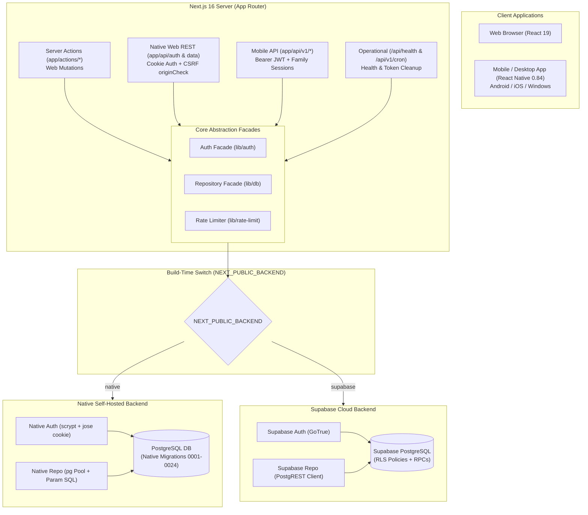
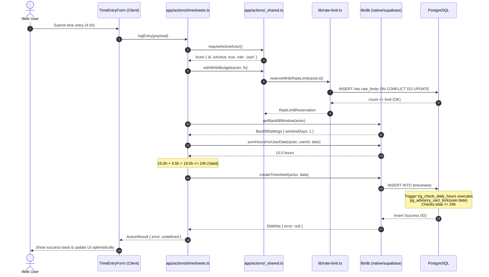
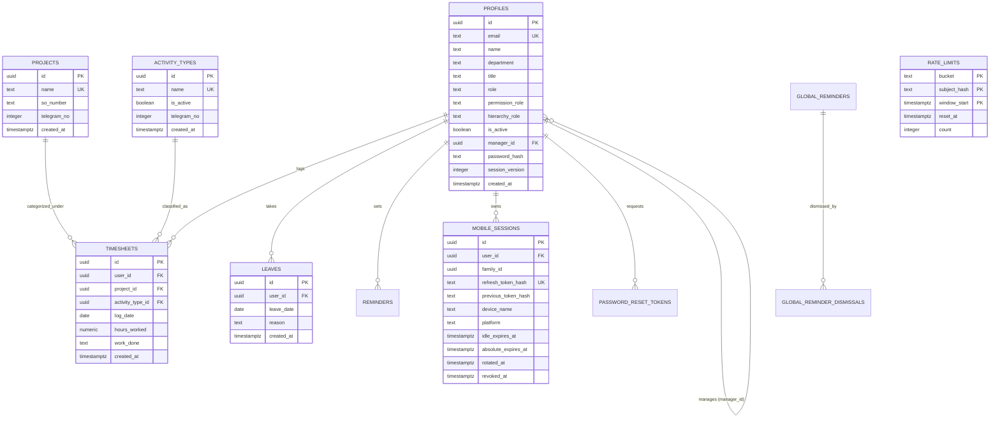

# Repository Technical Analysis: VSIS Timesheet


**Generated Document:** `CODEBASE_ANALYSIS_FOR_CHATGPT.md`\

**Target Audience:** ChatGPT / Advanced Reasoning LLM for deep-dive architecture, security, performance, maintainability, and reliability audits.\

**Repository:** `vsis-timesheet`\

**Analysis Method:** Multi-pass static code inspection, dependency tracing, schema analysis, and cross-layer verification.


---


# 1. Executive Summary


### System Purpose


VSIS Timesheet is an enterprise time tracking, project allocation, leave tracking, and compliance management platform built for VSIS (V-S Information Systems Pvt. Ltd.). It supports daily time logging, backfill window enforcement, leave tracking, managerial reporting hierarchies, team overview, administrative configuration, CSV reporting, and automated backup/restore.


### Overall Architecture


The codebase is structured as a **modular poly-client monolith with a dual-backend interchangeable data tier**:


1. **Frontend Web Client:** Next.js 16 (App Router) + React 19 Client Components, styled with Vanilla CSS tokens and TailwindCSS v4, self-hosted variable fonts, and client-side adapters.

2. **Mobile Application:** React Native 0.84 client (`mobile/`) targeting Android, iOS, and Windows (React Native Windows C++), featuring a custom pure TypeScript navigation reducer, an offline mutation sync engine, and native OS credential storage.

3. **Backend / API Tier:**

   - Next.js Server Actions (`app/actions.ts`, `app/actions/`) for web mutations.

   - Same-origin REST API (`app/api/auth/`, `app/api/data/`) for web session and data operations.

   - Stable versioned Bearer REST API (`app/api/v1/`) with DTO mapping (`lib/api/v1/contracts.ts`) for mobile clients.

4. **Interchangeable Dual-Backend:** Selected at build time via `NEXT_PUBLIC_BACKEND`:

   - **`supabase`****&#x20;mode (default):** Supabase Auth, PostgreSQL with Row Level Security (RLS), and PostgREST via `@supabase/ssr` / `@supabase/supabase-js`.

   - **`native`****&#x20;mode:** Self-contained containerized PostgreSQL with connection pooling (`pg`), application-level SQL security, in-app scrypt password hashing, and signed HTTP-only session cookies (`jose`).


### Major Technologies


- **Core Web:** Next.js 16.3.0, React 19.2.4, TypeScript 5.8.2, TailwindCSS 4.x

- **Database & Data Access:** PostgreSQL 13+, `pg` 8.23.0, Supabase JS 2.110.8, Supabase SSR 0.12.3

- **Authentication & Security:** `jose` 6.2.8, Node crypto (`scrypt`, `randomBytes`, `createHmac`), `zod` 4.4.3

- **Mobile Client:** React Native 0.84.1, React Native Windows 0.84.0, React 19.2.3

- **Testing & Tooling:** Vitest 4.1.10, Playwright 1.62.1, ESLint 9, k6


### Architectural Strengths


- **Clean Backend Decoupling:** The `Repository` interface (`lib/db/repository.ts`) and `Auth` facade (`lib/auth/index.ts`) abstract all database interactions.

- **Concurrency & Transactional Integrity:** PostgreSQL triggers using `pg_advisory_xact_lock` serialize concurrent timesheet writes to prevent race conditions exceeding the 24-hour daily limit.

- **Distributed Atomic Rate Limiter:** Replaced in-memory counters with single-query atomic reservation in `public.rate_limits` using HMAC-hashed subjects to prevent enumeration.

- **Security Protections:** Hardened against CSRF (`originCheck`), CSV Formula Injection (CWE-1236 leading apostrophe), timing attacks (`timingSafeEqual` in cron/passwords), and password hashing via parameterized scrypt.


### Major Risks & Vulnerabilities Identified


1. **Critical Production DoS in Rate Limiter IP Resolution:** In `lib/ip.ts`, if `TRUSTED_PROXY_HOPS` is unset in production, `getClientIp()` defaults to `'direct-client'`. All users share a single bucket, causing 10 failed attempts or signups to block the entire company for 1 hour.

2. **Session Hijacking Risk on Password Change:** `lib/auth/native.ts:changePassword()` fails to increment `session_version` and fails to revoke mobile sessions, leaving active sessions alive after a password change.

3. **Mobile Rollout Gate Bypass:** `MOBILE_BEARER_AUTH_ENABLED` is not enforced in `/api/v1/auth/login` or `requireMobileActor`, only exposed as informational metadata in `/api/v1/config`.

4. **CSP / Branding Feature Collision:** `next.config.ts` enforces `img-src 'self' data: blob:;`, which strictly blocks custom HTTPS workspace logo URLs configured in the database.

5. **Non-Transactional Backup Restore in Supabase Mode:** `supabaseRepository.restoreBackup()` runs unbatched sequential PostgREST inserts without a transaction, risking permanent partial restore corruption.

6. **Mobile State Loss on Native Devices:** `workspace-store.ts`, `theme-store.ts`, and `offline-queue.ts` rely on `globalThis.localStorage` or Node `fs`, which are absent in standard React Native on Android and iOS. Offline mutations are lost on app restart.

7. **Full-Table Scan on Timesheet Import:** `repo.getTimesheetDailyTotals()` scans and groups the entire timesheet table without date/user filters on every CSV import.

8. **Incomplete Client-Side Filtering in Reports:** `app/reports/page.tsx` fetches the top 1,000 entries and filters in memory, failing to display historical records unless paginated manually.


---


# 2. Repository Overview

```text

c:\dev\timesheet/

├── .github/

│   └── workflows/ci.yml                 # Matrix CI (lint, unit, coverage, build, native-e2e, container, mobile)

├── app/

│   ├── actions/                         # Server Action implementations

│   │   ├── _shared.ts                   # Actor gates, write budget reservation, audit logging

│   │   ├── timesheets.ts                # Timesheet mutations & validations

│   │   ├── projects.ts                  # Project management

│   │   ├── users.ts                     # User administration & hierarchy

│   │   ├── settings.ts                  # Layouts, branding, activity types, reminders

│   │   ├── import-backup.ts             # CSV import & full JSON backup/restore

│   │   └── superadmin.ts                # Super-admin operations & database resets

│   ├── actions.ts                       # Server Actions barrel re-export ('use server')

│   ├── api/

│   │   ├── _http.ts                     # Native REST helpers (originCheck, requireActive, json)

│   │   ├── auth/                        # Native web auth endpoints (login, signup, logout, reset)

│   │   ├── data/                        # Native web data endpoints (timesheets, projects, reports)

│   │   ├── health/                      # Container readiness & liveness probes (/api/health, /live)

│   │   └── v1/                          # Stable mobile API tier

│   │       ├── _http.ts                 # Mobile auth helpers (requireMobileActor, Bearer verification)

│   │       ├── admin/                   # Mobile admin endpoints (projects, users, branding, titles)

│   │       ├── auth/                    # Mobile auth (login, refresh, me, logout, logout-all)

│   │       ├── config/                  # Mobile bootstrap capabilities & branding

│   │       ├── cron/cleanup/            # Scheduled token & rate-limit cleanup

│   │       ├── dashboard/               # Mobile aggregated dashboard data

│   │       └── timesheets/              # Mobile timesheets CRUD & batch operations

│   ├── components/                      # Shared UI design system (ui.tsx, icons, dialog, toast)

│   ├── dashboard/                       # Web dashboard client panels & views

│   ├── reports/                         # Web reporting, aggregation & CSV export

│   ├── layout.tsx                       # RootLayout, SSR branding palette injection, fonts

│   ├── page.tsx                         # Web landing / sign-in / signup page

│   └── types.ts                         # Core TypeScript domain types & interfaces

├── db/

│   ├── migrations/                      # Native PostgreSQL migrations (0001_ to 0024_)

│   ├── migrate-runner.mjs               # Shared plain-ESM migration runner with advisory lock

│   ├── migrate.ts                       # Typed CLI wrapper for migrate-runner

│   └── seed.mjs                         # Idempotent first-admin bootstrap script

├── deploy/                              # Kubernetes & OpenShift manifests

│   ├── deployment.yaml                  # Pod spec, probes, securityContext

│   ├── configmap.yaml                   # TRUSTED_PROXY_HOPS, NEXT_PUBLIC_BACKEND

│   ├── cronjob.yaml                     # Scheduled session/rate-limit cleanup

│   ├── ingress.yaml / route.yaml        # Nginx ingress & OpenShift route with HSTS

│   └── secret.yaml                      # Required secret keys template

├── docs/                                # Architectural context, guides, security audits

├── lib/

│   ├── api/v1/                          # Mobile DTO contracts & business services

│   ├── auth/                            # Auth implementations (native, supabase, jwt, tokens, sessions)

│   ├── backend/                         # Dual-backend resolution (NEXT_PUBLIC_BACKEND)

│   ├── db/                              # Persistence tier: Repository interface, native.ts, supabase.ts

│   ├── email/                           # SMTP email service for password reset

│   ├── branding.ts                      # WCAG contrast calculation & palette derivation

│   ├── hierarchy.ts                     # User reporting tree & cycle detection

│   ├── ip.ts                            # Reverse-proxy aware IP resolver

│   ├── rate-limit.ts                    # Distributed atomic rate limiter

│   └── validation.ts                    # Business rules & backfill window validation

├── mobile/                              # Standalone React Native mobile application

│   ├── android/                         # Android native project + VsisSecureStorageModule.kt

│   ├── ios/                             # iOS native project + VsisSecureStorage.swift

│   ├── windows/                         # React Native Windows C++ project + VsisSecureStorage.h

│   ├── src/                             # Mobile JS/TS application source

│   │   ├── api/                         # ApiClient (HTTP, single-flight refresh, error unwrapping)

│   │   ├── auth/                        # SessionProvider & SessionController

│   │   ├── navigation/                  # Custom state navigation reducer & registry

│   │   ├── platform/                    # Native secure-storage adapters

│   │   ├── storage/                     # Workspace, theme, and offline queue storage

│   │   └── sync/                        # Offline mutation replay engine

│   └── App.tsx                          # Root mobile entry point

├── supabase/                            # Supabase migrations & demo seeds

│   └── migrations/                      # 45 Supabase migration files

├── tests/                               # 90 Vitest backend & unit test suites

├── e2e/                                 # Playwright end-to-end integration tests

├── Dockerfile                           # Multi-stage standalone Node 22 build

├── next.config.ts                       # Next.js 16 standalone config, CSP, headers

└── package.json                         # Root dependencies & scripts

```


---


# 3. Technology Inventory


| Category                       | Technology              |                Version | Evidence / Origin                                        |

| ------------------------------ | ----------------------- | ---------------------: | -------------------------------------------------------- |

| **Web Framework**              | Next.js                 |              `^16.3.0` | `package.json:30`                                        |

| **Frontend Runtime**           | React                   |               `19.2.4` | `package.json:33`                                        |

| **Frontend DOM**               | React DOM               |               `19.2.4` | `package.json:34`                                        |

| **Language**                   | TypeScript              |           `^5` (5.8.2) | `package.json:52`, `package-lock.json`                   |

| **Styling**                    | TailwindCSS             |           `^4` (4.2.1) | `package.json:50`, `postcss.config.mjs`                  |

| **Native DB Driver**           | `pg` (node-postgres)    |              `^8.23.0` | `package.json:32`                                        |

| **Cloud Backend**              | `@supabase/supabase-js` |             `^2.110.8` | `package.json:28`                                        |

| **Cloud SSR Auth**             | `@supabase/ssr`         |              `^0.12.3` | `package.json:27`                                        |

| **JWT / JOSE**                 | `jose`                  |               `^6.2.8` | `package.json:29`                                        |

| **Schema Validation**          | `zod`                   |               `^4.4.3` | `package.json:35`                                        |

| **Email Transport**            | `nodemailer`            |                `9.1.1` | `package.json:31`                                        |

| **Testing (Unit/Integration)** | `vitest`                |              `^4.1.10` | `package.json:53`                                        |

| **Coverage Tool**              | `@vitest/coverage-v8`   |              `^4.1.11` | `package.json:46`                                        |

| **Testing (E2E)**              | `@playwright/test`      |              `^1.62.1` | `package.json:39`                                        |

| **Accessibility Testing**      | `@axe-core/playwright`  |              `^4.13.0` | `package.json:38`                                        |

| **Performance / Load**         | `k6`                    |        External binary | `package.json:20`, `load/k6-timesheets.js`               |

| **Container Base**             | Node Alpine             |       `node:22-alpine` | `Dockerfile:2,16`                                        |

| **Database Engine**            | PostgreSQL              | `16-alpine` (CI) / 13+ | `.github/workflows/ci.yml:77`, `0001_initial_schema.sql` |

| **Mobile Framework**           | React Native            |               `0.84.1` | `mobile/package.json:28`                                 |

| **Mobile React**               | React                   |               `19.2.3` | `mobile/package.json:27`                                 |

| **Desktop Platform**           | `react-native-windows`  |               `0.84.0` | `mobile/package.json:30`                                 |

| **Mobile Testing**             | Jest                    |              `^29.6.3` | `mobile/package.json:55`                                 |

| **Mobile Test Preset**         | `@rnx-kit/jest-preset`  |               `^0.3.1` | `mobile/package.json:59`                                 |


---


# 4. Application Architecture




### Architecture Classification


The system is a **hybrid multi-client modular monolith**:


- Both web frontend and server routes live within a unified Next.js 16 project.

- The mobile codebase is co-located in `mobile/` with its own `package.json`, sharing DTO interfaces and testing against the parent backend.

- The data access layer completely isolates the application from PostgreSQL vs. Supabase particulars via the `Repository` pattern.


---


# 5. Component and Module Map


### 1. Web Frontend Layer (`app/`, `app/dashboard/`, `app/reports/`)


- `app/layout.tsx`: Root layout. Executes `repo.getBranding()`, calculates WCAG contrast, derives a 10-shade CSS variable palette (`--primary-50` to `--primary-900`), and injects self-hosted variable fonts.

- `app/page.tsx`: Welcome, Sign In, and Sign Up form. Supports automatic redirection to `/dashboard` upon session resolution.

- `app/dashboard/page.tsx`: Core dashboard orchestration component (689 lines). Manages state for projects, activity types, timesheets, user profile, layouts, and role-based permissions (`admin`, `pm`, `co`, `manager`, `team_lead`, `user`).

- `app/dashboard/entries-table.tsx`: Virtualized/paginated timesheet table with inline editing, duplicate, and deletion.

- `app/dashboard/time-entry-form.tsx`: Primary time logging form enforcing backfill constraints and daily hour budgets.

- `app/reports/page.tsx`: Reporting suite with presets, date range selection, comparison view, and CSV export.


### 2. Server Action Mutation Boundary (`app/actions/`)


- `_shared.ts`: Enforces actor authentication (`requireActiveActor`, `requireActor`, `requireSuperAdmin`), wraps operations in `withWriteBudget`, and triggers audit logging via `safeAudit`.

- `timesheets.ts`: Timesheet mutations (`logEntry`, `duplicateEntry`, `logYesterday`, `updateTimesheet`, `deleteTimesheet`, `bulkUpdateTimesheets`).

- `projects.ts`: Project management (`addProject`, `renameProject`, `setProjectSO`, `setProjectTelegramNo`, `deleteProject`).

- `users.ts`: User management (`addUser`, `toggleUserStatus`, `updateUserRoles`, `updateUserHierarchy`, `setUserManager`).

- `settings.ts`: Activity types, global reminders, backfill windows, layouts, and branding.

- `import-backup.ts`: CSV import and full database backup/restore operations.

- `superadmin.ts`: Super-admin specific operations (whitelisted domains, title reclassification, database reset).


### 3. Versioned Mobile API Layer (`app/api/v1/`, `lib/api/v1/`)


- `contracts.ts`: Canonical DTO definitions, Zod schemas, and mappers separating DB models from mobile payload formats.

- `services/`: Encapsulated mobile business services mirroring Server Action rules but returning `{ ok, data, error }`.

- `route.ts` handlers: REST endpoints under `/api/v1` consuming JSON, handling bearer JWTs, and returning uniform error envelopes.


### 4. Data Access Layer (`lib/db/`)


- `repository.ts`: Backend-agnostic interface declaring 40+ methods.

- `native.ts`: PostgreSQL adapter using `pg` pool, parameterized SQL, client transactions, and in-code authz checks.

- `supabase.ts`: Supabase adapter using PostgREST client, respecting RLS, and executing security-scoped RPCs.


### 5. Mobile Application (`mobile/src/`)


- `App.tsx`: App root wiring `SessionProvider`, `SafeAreaProvider`, and root navigation.

- `SessionProvider.tsx`: State container for auth status, tokens, actor profile, dashboard cache, and offline sync.

- `session-controller.ts`: State machine coordinating credential restoration, token refresh, and login/logout flows.

- `sync-engine.ts`: Replays queued offline mutations sequentially upon network reconnection.

- `platform/secure-storage/`: Platform-specific native modules for credential storage (Android Keystore, iOS Keychain, Windows PasswordVault).


---


# 6. Runtime/Data Flow


### Web Time Logging Flow




### Mobile Authentication & Refresh Flow

```mermaid

sequenceDiagram

    autonumber

    actor User as Mobile User

    participant App as Mobile App (SessionController)

    participant Storage as VsisSecureStorage (Native Vault)

    participant API as /api/v1/auth/login & refresh

    participant Store as mobile-session-store.ts

    participant DB as PostgreSQL


    User->>App: Enter email & password

    App->>API: POST /api/v1/auth/login

    API->>Store: verifyCredentials & create(session)

    Store->>DB: INSERT INTO mobile_sessions (refresh_token_hash, family_id)

    DB-->>Store: Saved

    API-->>App: { accessToken (15m JWT), refreshToken (30d opaque), sessionId }

    App->>Storage: write({ refreshToken, sessionId })

    Note over App: Access token kept in memory only


    Note over App: ... 15 minutes elapse; access token expires ...

    App->>API: GET /api/v1/dashboard (Expired Bearer)

    API-->>App: 401 ACCESS_TOKEN_EXPIRED

    App->>Storage: read() -> { refreshToken, sessionId }

    App->>API: POST /api/v1/auth/refresh { refreshToken }

    API->>Store: rotate({ presentedHash, replacementHash })

    Note over Store: Checks reuse detection.<br/>If presented was already rotated, revokes whole family!

    Store->>DB: UPDATE current (rotated_at) & INSERT replacement

    DB-->>Store: Rotated OK

    API-->>App: { newAccessToken, newRefreshToken }

    App->>Storage: write({ newRefreshToken, newSessionId })

    App->>API: GET /api/v1/dashboard (New Bearer)

    API-->>App: 200 OK (Dashboard Data)

```


---


# 7. Authentication Architecture


### Dual-Backend Web Authentication


1. **Supabase Mode:**

   - Client uses `@supabase/supabase-js` in the browser to execute `signInWithPassword()` against GoTrue.

   - Session tokens are stored in browser cookies via `@supabase/ssr`.

   - On the server, `lib/auth/supabase.ts` calls `supabase.auth.getUser()`, reading and parsing the cookie store.

2. **Native Mode:**

   - Password Hashing: Handled in `lib/auth/password.ts` using Node `crypto.scrypt` with a format string: `scrypt$N$r$p$salt$hash`. Upgrades legacy or weaker hashes transparently upon successful login.

   - Sign In: Handled in `app/api/auth/login/route.ts` calling `lib/auth/native.ts:signIn()`.

   - Cookie Management: Issues a signed JWT using `jose` (`SESSION_COOKIE = 'vsis_session'`, default 7-day expiry).

   - Invalidation: `profiles.session_version` is embedded in the JWT. If the database `session_version` increments, existing JWTs are rejected.


### Mobile Bearer Token Authentication


- **Access Tokens:** Signed HMAC-SHA256 JWTs (`lib/auth/mobile-tokens.ts`) using `MOBILE_AUTH_SECRET`.

  - Claims: `sub` (userId), `sid` (sessionId), `family` (familyId), `ver` (version 1), `iat`, `exp` (15 minutes).

  - Validated by `requireMobileActor()` in `app/api/v1/_http.ts`.

- **Refresh Tokens & Session Families:**

  - Raw tokens are 32 bytes of cryptographically secure random (`randomBytes(32).toString('base64url')`).

  - Only the SHA-256 digest is stored in `public.mobile_sessions.refresh_token_hash`.

  - Expiry: 30-day sliding idle expiry (`idle_expires_at`), 90-day absolute ceiling (`absolute_expires_at`).

  - Rotation: Every refresh call rotates the token. If an already-rotated token is presented (replay attack), the entire session family (`family_id`) is instantly revoked.


### Mobile Secure Storage Implementation


- **Android:** `mobile/android/.../VsisSecureStorageModule.kt` uses Android Keystore with AES-256-GCM. Ciphertext and IV are saved in private `SharedPreferences`. Overwrites are atomic (`commit()`).

- **iOS:** `mobile/ios/.../VsisSecureStorage.swift` uses iOS Keychain Services with `kSecClassGenericPassword` and `kSecAttrAccessibleAfterFirstUnlockThisDeviceOnly`.

- **Windows:** `mobile/windows/.../VsisSecureStorage.h` uses Windows Runtime `Windows.Security.Credentials.PasswordVault`.


---


# 8. Authorization Model


### Two-Axis Role Matrix (`lib/roles.ts`)


The application divides authorization into two orthogonal axes:

```text

┌─────────────────────────────────────────────────────────────┐

│                    PERMISSION ROLE AXIS                     │

│  admin       - Full administration, settings, all data      │

│  pm          - Project management, project assignments      │

│  co          - Company oversight, read-all reports          │

│  user        - Standard employee self-logging               │

└─────────────────────────────────────────────────────────────┘

                               ▲

                               │ Independent

                               ▼

┌─────────────────────────────────────────────────────────────┐

│                    HIERARCHY ROLE AXIS                      │

│  manager     - Department head; views entire reporting tree │

│  team_lead   - Team lead; views direct reports              │

│  engineer    - Technical contributor                        │

│  user        - Default employee                             │

└─────────────────────────────────────────────────────────────┘

```


- **Legacy Compatibility:** A PostgreSQL trigger (`trg_sync_profile_roles` in `0009_separate_roles.sql`) keeps the single legacy `role` column in sync with `permission_role` and `hierarchy_role`.

- **Super-Admin:** Not a database role. Defined dynamically via `process.env.SUPER_ADMIN_EMAIL`. Gates destructive actions: database reset, user deletion, activity type hard-delete, and domain whitelist modification.


### Scope Enforcement by Backend


- **Native Backend:** Scope rules are explicitly baked into SQL queries (`timesheetScope(actor)` in `lib/db/native.ts`):

  - `admin` and `co`: See all rows (`WHERE true`).

  - `manager` and `team_lead`: See rows where `user_id = ANY(team_ids($1))` using recursive CTEs.

  - `user`: See only own rows (`user_id = $1`).

- **Supabase Backend:** Relies on PostgreSQL Row Level Security (RLS) policies (`supabase/migrations/`):

  - `profiles`: Self-read/update; admin full access; manager read for team members.

  - `timesheets`: Self-read/insert/update/delete; admin full access; team visibility via RLS helper functions.


---


# 9. API Inventory


### Web / Native REST Routes (`app/api/`)


| Route                       | Method | Auth Required  | CSRF / Gate                               | Description                                                    |

| --------------------------- | ------ | -------------- | ----------------------------------------- | -------------------------------------------------------------- |

| `/api/health`               | GET    | None           | `Cache-Control: no-store`                 | Liveness & readiness probe; returns minimal `{ status: 'ok' }` |

| `/api/health/live`          | GET    | None           | None                                      | Minimal process liveness ping                                  |

| `/api/auth/login`           | POST   | None           | `originCheck`, RateLimit (`daily-login`)  | Native web sign in; sets `vsis_session` HTTP-only cookie       |

| `/api/auth/signup`          | POST   | None           | `originCheck`, RateLimit (`daily-signup`) | Native user registration with domain whitelist verification    |

| `/api/auth/logout`          | POST   | None           | `originCheck`                             | Clears `vsis_session` cookie                                   |

| `/api/auth/me`              | GET    | Session Cookie | None                                      | Resolves current signed-in user                                |

| `/api/auth/forgot-password` | POST   | None           | RateLimit (`password-reset-request`)      | Sends password reset email with token fragment URL             |

| `/api/auth/reset-password`  | POST   | None           | RateLimit (`password-reset-complete`)     | Consumes reset token, increments `session_version`             |

| `/api/auth/change-password` | POST   | Signed In      | `originCheck`, `requireSignedIn`          | Changes password for authenticated user                        |

| `/api/data/timesheets`      | GET    | Active Actor   | `requireActive`                           | Retrieves timesheets with date and pagination parameters       |

| `/api/data/projects`        | GET    | Active Actor   | `requireActive`                           | Lists active projects                                          |

| `/api/data/profile`         | GET    | Active Actor   | `requireActive`                           | Gets user profile                                              |

| `/api/data/reports`         | GET    | Active Actor   | `requireActive`                           | Server-side grouped report totals                              |

| `/api/data/reports/export`  | GET    | Active Actor   | `requireActive`                           | Streams CSV export of timesheet entries                        |


### Mobile V1 REST API (`app/api/v1/`)


| Route                                | Method      | Auth Required | Request Validation        | Description                                           |

| ------------------------------------ | ----------- | ------------- | ------------------------- | ----------------------------------------------------- |

| `/api/v1/config`                     | GET         | None          | None                      | Server bootstrap, capabilities, workspace branding    |

| `/api/v1/auth/login`                 | POST        | None          | `mobileLoginSchema`       | Mobile login; returns access JWT & refresh token      |

| `/api/v1/auth/refresh`               | POST        | None          | `mobileRefreshSchema`     | Rotates refresh token; returns new JWT pair           |

| `/api/v1/auth/me`                    | GET         | Bearer JWT    | `requireMobileSession`    | Resolves authenticated mobile actor                   |

| `/api/v1/auth/logout`                | POST        | Bearer JWT    | `requireMobileSession`    | Revokes current mobile session                        |

| `/api/v1/auth/logout-all`            | POST        | Bearer JWT    | `requireMobileSession`    | Revokes all mobile sessions for the user              |

| `/api/v1/dashboard`                  | GET         | Active Bearer | `requireMobileActor`      | Aggregated dashboard data (stats, timesheets, leaves) |

| `/api/v1/timesheets`                 | GET, POST   | Active Bearer | `timesheetPayloadSchema`  | List or create timesheet entries                      |

| `/api/v1/timesheets/[id]`            | PUT, DELETE | Active Bearer | `timesheetPayloadSchema`  | Update or delete a single timesheet entry             |

| `/api/v1/timesheets/batch-delete`    | POST        | Active Bearer | `z.array(z.string())`     | Batch delete timesheet entries                        |

| `/api/v1/timesheets/batch-duplicate` | POST        | Active Bearer | Batch duplicate items     | Batch duplicate timesheet entries to target dates     |

| `/api/v1/leaves`                     | GET, POST   | Active Bearer | Leave row schema          | List or submit leave entries                          |

| `/api/v1/reminders`                  | GET, POST   | Active Bearer | Reminder schema           | List or create personal reminders                     |

| `/api/v1/admin/projects`             | GET, POST   | Admin / PM    | Project schemas           | List or create projects                               |

| `/api/v1/admin/users`                | GET, POST   | Admin Only    | User schemas + password   | List or create employee profiles                      |

| `/api/v1/admin/users/[id]`           | PATCH       | Admin Only    | User update schema        | Update user roles, manager, status, titles            |

| `/api/v1/admin/branding`             | GET, PUT    | Super Admin   | `validateBranding`        | View or update workspace branding                     |

| `/api/v1/cron/cleanup`               | POST, GET   | `CRON_SECRET` | Constant-time token match | Prunes expired mobile sessions & rate-limit windows   |


---


# 10. Database Architecture


### Entity Relationship Diagram




### Key Integrity Constraints & Triggers


1. **24-Hour Daily Limit Trigger:** `trg_check_daily_hours` on `public.timesheets` (`0015_data_integrity_and_concurrency.sql`). Executes `pg_advisory_xact_lock(hashtext(NEW.user_id::text || ':' || NEW.log_date::text))` to serialize concurrent writes and prevents total daily hours from exceeding 24.0.

2. **Leave Uniqueness:** Unique constraint `(user_id, leave_date)` on `public.leaves`.

3. **Role Synchronization Trigger:** `trg_sync_profile_roles` on `public.profiles` (`0009_separate_roles.sql`) keeps legacy `role` in sync with `permission_role` and `hierarchy_role`.

4. **App Settings Single-Row Guarantee:** `CHECK (id = 1)` on `public.app_settings`.

5. **Foreign Key Cascades:** Deleting a user cascades to timesheets, leaves, reminders, mobile sessions, and reset tokens; project deletion is restricted (`ON DELETE RESTRICT`) if referenced by timesheets.


---


# 11. External Integrations


| Integration             | File / Module                          | Purpose                                           | Credentials / Environment                                                                |

| ----------------------- | -------------------------------------- | ------------------------------------------------- | ---------------------------------------------------------------------------------------- |

| **PostgreSQL Database** | `lib/db/pool.ts`                       | Primary datastore in native mode                  | `DATABASE_URL`                                                                           |

| **Supabase Services**   | `lib/supabase/*`, `lib/db/supabase.ts` | Auth & datastore in cloud mode                    | `NEXT_PUBLIC_SUPABASE_URL`, `NEXT_PUBLIC_SUPABASE_ANON_KEY`, `SUPABASE_SERVICE_ROLE_KEY` |

| **SMTP Server**         | `lib/email/password-reset.ts`          | Transactional password recovery emails            | `SMTP_HOST`, `SMTP_PORT`, `SMTP_USER`, `SMTP_PASSWORD`, `SMTP_FROM`                      |

| **Telegram (Metadata)** | `lib/telegram.ts`, migrations          | Bot routing indices stored on projects/activities | `telegram_no` integer column (no outbound bot API calls in app code)                     |


---


# 12. State Management and Caching


### Web Application State


- **No Heavy Global Store:** No Redux, Zustand, or MobX. The web app uses localized React state (`useState`, `useReducer`), standard hooks, and React 19 transitions (`useTransition`).

- **Branding State:** `BrandingProvider` (`app/components/branding-provider.tsx`) passes workspace styling context down the tree.

- **Client Cache:** `lib/cache.ts` persists recent "work done" descriptions in browser `localStorage` under `vsis-recent-work` with a cap of 10 items.

- **Single-Flight In-Flight Request Cache:** `lib/data/client.ts` uses `withSingleFlight()` (`inFlightRequests = new Map()`) to deduplicate simultaneous identical GET requests in native mode.


### Mobile State & Caching


- **`SessionProvider`****&#x20;(****`mobile/src/auth/SessionProvider.tsx`****):** Central state provider for session status, access token, actor capabilities, branding, and dashboard cache.

- **`DashboardCache`****&#x20;(****`mobile/src/storage/dashboard-cache.ts`****):** In-memory 5-minute cache keyed by server URL and actor ID.

- **`OfflineQueue`****&#x20;(****`mobile/src/storage/offline-queue.ts`****):** Stores offline mutations for replay. *Note: Suffers from an in-memory fallback issue on mobile devices.*


---


# 13. Error Handling and Reliability


### Server Action Boundaries


- Server Actions (`app/actions/*`) never throw raw errors to the client. All actions wrap exceptions and return uniform `{ error?: string, fieldErrors?: Record<string, string[]> }` shapes.

- Server-side exceptions are logged via `lib/logger.ts` with sanitized messages (`extractError()`), masking stack traces from end users.


### API Error Envelopes


- Native REST routes (`/api/auth`, `/api/data`) return `{ error: string }`.

- Mobile V1 routes (`/api/v1/*`) return `{ data: T, error: null }` or `{ data: null, error: { code: string, message: string, fieldErrors?: Record<string, string[]> } }`.


### Fail-Closed Operational Controls


- `/api/v1/cron/cleanup` fails closed with HTTP 503 if `CRON_SECRET` is unset, preventing unauthenticated execution.

- Rate limiter fails closed on mutation budgets (`daily-writes`, `daily-import`) if database storage is unreachable, preventing bypasses during DB outages.


---


# 14. Security Findings


| ID         | Severity   | Finding                                                                                | Evidence                                                                      | Confidence    |

| ---------- | ---------- | -------------------------------------------------------------------------------------- | ----------------------------------------------------------------------------- | ------------- |

| **SEC-01** | **High**   | Shared `'direct-client'` IP triggers organization-wide Denial of Service               | `lib/ip.ts:103`, `lib/rate-limit.ts:43,46`, `app/api/auth/signup/route.ts:59` | **Confirmed** |

| **SEC-02** | **High**   | Native `changePassword` does not increment `session_version` or revoke mobile sessions | `lib/auth/native.ts:105-126`, `lib/db/password-recovery.ts:96,111-116`        | **Confirmed** |

| **SEC-03** | **Medium** | Mobile bearer auth gate (`MOBILE_BEARER_AUTH_ENABLED`) is not enforced server-side     | `app/api/v1/config/route.ts:8`, `app/api/v1/auth/login/route.ts:21-96`        | **Confirmed** |

| **SEC-04** | **Medium** | Content Security Policy `img-src` blocks external Workspace Branding logos             | `next.config.ts:58`, `lib/branding.ts:111-127`, `app/components/ui.tsx:563`   | **Confirmed** |

| **SEC-05** | **Low**    | Native auth endpoints directly execute against PostgreSQL pool in Supabase mode        | `app/api/auth/signup/route.ts:6,84`, `app/api/auth/login/route.ts:2`          | **Confirmed** |


### Detailed Findings


#### SEC-01: Shared `'direct-client'` IP Triggers Cluster-Wide DoS


- **Evidence:**

  - File: `lib/ip.ts`

  - Symbol: `getClientIp()`

  - Lines: 47-104

  - Reason: In production mode (`process.env.NODE_ENV === 'production'`), if `TRUSTED_PROXY_HOPS` is not configured and `VERCEL` is not set, `getClientIp` returns the hardcoded literal `'direct-client'`.

  - Impact: All incoming requests share the same rate-limit bucket. In `app/api/auth/signup/route.ts:59`, `reserveRateLimit('daily-signup', 'signup:direct-client')` has a limit of 10 attempts per hour. After 10 signup attempts anywhere, all subsequent signups globally are blocked with HTTP 429 for the remainder of the hour. The same applies to password reset completions.


#### SEC-02: Active Sessions Remain Valid After Password Change in Native Mode


- **Evidence:**

  - File: `lib/auth/native.ts`

  - Symbol: `changePassword()`

  - Lines: 105-126

  - Reason: `changePassword` executes:

    ```ts

    const hash = await hashPassword(newPassword)

    await query('update public.profiles set password_hash = $1 where id = $2', [hash, userId])

    ```

    It does not increment `profiles.session_version` and does not call `mobileSessionStore.revokeAll(userId)`.

  - Contrast: `lib/db/password-recovery.ts` lines 96 & 111-116 explicitly increments `session_version = session_version + 1` and revokes all active `mobile_sessions`.

  - Impact: If an account password is changed due to credential leakage, active web session cookies and active mobile sessions remain authorized and can continue reading/writing data.


#### SEC-03: `MOBILE_BEARER_AUTH_ENABLED` is Purely Informational


- **Evidence:**

  - File: `app/api/v1/auth/login/route.ts` (lines 21-96), `app/api/v1/_http.ts` (lines 40-116)

  - Reason: Documentation and plans specify that `MOBILE_BEARER_AUTH_ENABLED=false` must prevent mobile bearer authentication until native platform token storage is verified. However, `/api/v1/auth/login` and `/api/v1/auth/refresh` never inspect this variable. Only `/api/v1/config` returns `capabilities.bearerAuth: false`. Direct API calls succeed unconditionally.


#### SEC-04: CSP `img-src` Blocks Custom Workspace Logos


- **Evidence:**

  - File: `next.config.ts`, Lines: 58; `lib/branding.ts`, Lines: 111-127; `app/components/ui.tsx`, Lines: 563

  - Reason: `next.config.ts` enforces `img-src 'self' data: blob:;`. When a super-admin configures a valid HTTPS logo URL (e.g. `https://company.org/logo.png`) via Workspace Branding, the browser blocks the image due to CSP violation.


---


# 15. Performance Findings


### Confirmed Problems


1. **Triple Redundant Database Query on Every SSR Page Request:**

   - Evidence: `app/layout.tsx:24,40,58`, `lib/db/native.ts:909`, `lib/db/supabase.ts:865`

   - `generateMetadata()`, `generateViewport()`, and `RootLayout()` each await `repo.getBranding()`.

   - Neither adapter uses React `cache()`, issuing 3 identical database queries per page load.

2. **In-Memory Filtering on Unbounded Historical Data in Reports:**

   - Evidence: `app/reports/page.tsx:145,175,215`

   - Initial report load fetches 1,000 records regardless of the selected date preset and filters in JavaScript. Records outside the top 1,000 cannot be viewed without manual step-by-step pagination.


### High-Confidence Risks


1. **Unbounded GROUP BY Full-Table Scan on Timesheet Import:**

   - Evidence: `lib/db/native.ts:1453-1461`, `supabase/migrations/20260901000000_import_and_reporting_rpcs.sql:5-19`, `app/actions/import-backup.ts:122`

   - Every CSV timesheet import invokes `repo.getTimesheetDailyTotals()`, executing `select user_id, log_date, sum(hours_worked) from timesheets group by user_id, log_date` across the entire database without filtering for the imported users or dates.


### Benchmark-Required Opportunities


1. **Connection Pool Contention Under Concurrent Write Bursts:**

   - Evidence: `lib/db/pool.ts:25-34` (`max: 10`), `lib/actions/_shared.ts:24`

   - Rate-limit reservations, advisory lock checks, and write operations consume pool connections in rapid succession. At >10 concurrent requests, queries queue behind connection acquisition.


---


# 16. Database Performance Findings


1. **Unfiltered Daily Totals Aggregation:**

   - Evidence: `lib/db/native.ts:1455-1459`

   ```sql

   select user_id, log_date, coalesce(sum(hours_worked), 0)::float8 as hours

   from public.timesheets

   group by user_id, log_date

   ```

   - Recommendation: Add a date-range and user-scoped filter: `WHERE log_date >= $1 AND log_date <= $2 AND user_id = ANY($3)`.

2. **Missing Composite Index for User Date Range Queries:**

   - Evidence: `0001_initial_schema.sql:57-59`, `0018_index_cleanup_and_tuning.sql`

   - Table `timesheets` has `timesheets_user_id_idx` on `(user_id)` and `timesheets_log_date_idx` on `(log_date desc)`.

   - Recommendation: A composite index on `(user_id, log_date desc)` would allow single-index index-only scans for user dashboard queries and reports.

3. **Over-Fetching in Mobile Admin Listing:**

   - Evidence: `app/api/v1/admin/projects/route.ts:51,63`, `app/api/v1/admin/activity-types/route.ts:49,56`, `app/api/v1/admin/users/route.ts:91`

   - When creating an entity, the endpoint queries the entire table (`listProjects`, `listProfiles`) to find the created row rather than using `INSERT ... RETURNING *`.


---


# 17. Frontend Findings


1. **Client-Side Data Fetching Pattern in Root Dashboard:**

   - Evidence: `app/dashboard/page.tsx:4,60-140`

   - The entire dashboard is marked `'use client'`. Data fetching occurs inside `useEffect` after client bundle hydration.

   - Consequence: Users experience a loading spinner waterfall (initial page load → hydrate JS → execute `authClient.getSession()` → fetch profile → fetch timesheets/projects).

2. **Oversized Component Files:**

   - Evidence: `app/reports/page.tsx` (855 lines, 38.3 KB), `app/dashboard/page.tsx` (689 lines, 27.3 KB), `app/dashboard/entries-table.tsx` (30.5 KB).

   - These components mix URL state synchronization, data fetching, export handling, table rendering, and modal controllers in a single file.


---


# 18. Mobile Application Findings


1. **Storage Volatility on Android and iOS:**

   - Evidence: `mobile/src/storage/workspace-store.ts:90-128`, `mobile/src/storage/offline-queue.ts:107-135`, `mobile/package.json`

   - React Native on Android and iOS does not implement `globalThis.localStorage` or Node `fs`.

   - `workspace-store`, `theme-store`, and `offline-queue` fall back to in-memory maps. All unsynced offline mutations and workspace URL configurations are discarded if the app process terminates.

2. **Single-Flight 401 Refresh Race Safety:**

   - Evidence: `mobile/src/auth/session-controller.ts:114-127`

   - `SessionController.refreshAccessToken()` correctly deduplicates in-flight refresh requests using `this.refreshPromise`. Concurrent 401s latch onto the same refresh operation, avoiding refresh token replay revocation.

3. **Custom Pure Navigation State:**

   - Evidence: `mobile/src/navigation/navigation-reducer.ts:59-150`

   - Implements a stack and tab reducer without third-party dependencies, featuring dirty form guards (`showDiscardDialog`).


---


# 19. Backend Findings


1. **Dual-Backend Parity Inconsistency in Backup Restore:**

   - Evidence: `lib/db/supabase.ts:1187-1330` vs `lib/db/native.ts:1206-1235`

   - Native mode uses atomic database transactions with full rollback capability. Supabase mode executes sequential REST calls with zero rollback capability on mid-stream failure.

2. **Duplicated Business Logic Across Action and Service Layers:**

   - Evidence: `app/actions/timesheets.ts:16-101` vs `lib/api/v1/services/timesheets.ts:48-150`

   - Identical validation checks for backfill windows, daily 24h limits, and duplicate entries are maintained in two separate implementations.


---


# 20. Concurrency and Race Conditions


1. **Daily 24-Hour Limit Race Condition (Resolved in Code):**

   - Evidence: `0015_data_integrity_and_concurrency.sql:18`, `tests/daily-hours-concurrency.int.test.ts:47-79`

   - The PostgreSQL trigger acquires `pg_advisory_xact_lock(hashtext(NEW.user_id::text || ':' || NEW.log_date::text))`. Verified by integration tests to serialize concurrent inserts so that exactly one of two concurrent 15h entries succeeds.

2. **Rate Limit Window Race Condition (Resolved in Code):**

   - Evidence: `lib/db/native.ts:1525-1533`

   - Upsert with `ON CONFLICT DO UPDATE SET count = count + 1 WHERE count < limit RETURNING count` ensures atomic check-and-increment without check-then-act vulnerabilities.

3. **Session Token Refresh Race Condition (Resolved in Code):**

   - Evidence: `lib/auth/mobile-session-store.ts:220-290`

   - `nativeRotate` uses `SELECT ... FOR UPDATE` inside a database transaction to serialize concurrent token rotations.


---


# 21. Maintainability and Technical Debt


1. **Massive Repository Adapters:**

   - `lib/db/supabase.ts`: 1,814 lines (69.7 KB)

   - `lib/db/native.ts`: 1,789 lines (68.4 KB)

   - Both files are monolithic implementations of 40+ methods rather than domain-partitioned repositories (e.g. `UserRepository`, `TimesheetRepository`).

2. **Zero Marker Debt (Impressive Hygiene):**

   - Grep verification shows **0 instances of&#x20;****`TODO`**, **0 instances of&#x20;****`FIXME`**, and **0 instances of&#x20;****`HACK`** across application source code.

3. **Strong Type Safety:**

   - TypeScript `any` is practically eliminated (<15 occurrences repository-wide, strictly confined to test mocks and native event wrappers).


---


# 22. Dependency Findings


1. **Lightweight Root Footprint:**

   - The root Next.js application has only 10 runtime dependencies: `@supabase/ssr`, `@supabase/supabase-js`, `jose`, `next`, `nodemailer`, `pg`, `react`, `react-dom`, `zod`.

2. **Missing Mobile Persistence Dependency:**

   - `mobile/package.json` lacks an official persistent storage solution (e.g. `@react-native-async-storage/async-storage` or `react-native-mmkv`), causing reliance on nonexistent `globalThis.localStorage`.


---


# 23. Testing Assessment


1. **Comprehensive Test Suite:**

   - **Root Tests:** 90 test files in `tests/` covering Server Actions, routes, auth facades, timing attacks, rate limiting, and Supabase RLS migrations.

   - **Mobile Tests:** 43 Jest test files in `mobile/__tests__/` covering screens, navigation, offline queues, and API client behavior.

   - **E2E Tests:** 4 Playwright specifications in `e2e/` testing smoke flows, password recovery, navigation, and automated accessibility via `@axe-core/playwright`.

   - **Concurrency Testing:** `tests/daily-hours-concurrency.int.test.ts` tests transactional concurrency against live PostgreSQL.

2. **Gaps in Coverage:**

   - Lack of live multi-platform mobile testing (Android Keystore and iOS Keychain cannot be asserted in CI Ubuntu environments).

   - Live Supabase integration tests are skipped when `TEST_DATABASE_URL` is unset.


---


# 24. DevOps / Deployment Assessment


1. **Container Hardening:**

   - `Dockerfile` utilizes multi-stage builds (`node:22-alpine`), runs as unprivileged user `nextjs` (UID 1001), drops capabilities (`ALL`), and supports OpenShift arbitrary UIDs.

   - Next.js standalone output tracing (`output: "standalone"`) ensures minimal container footprints.

2. **Kubernetes / OpenShift Manifests:**

   - Well-structured manifests in `deploy/` with liveness (`/api/health/live`), readiness (`/api/health`), resource limits, NetworkPolicy, Ingress TLS, and cron cleanup.


---


# 25. Observability Assessment


1. **Structured JSON Logging:**

   - `lib/logger.ts` emits structured JSON lines to stdout/stderr with automatic correlation of `requestId` and `userId`.

2. **Mobile Telemetry:**

   - `mobile/src/telemetry/telemetry.ts` logs client events (`sync_start`, `sync_item_success`, `sync_item_failure`, `offline_enqueue`) into an in-memory ring buffer with duration tracking.

3. **Missing Distributed Tracing:**

   - No OpenTelemetry or APM integration is present; request tracing relies solely on `x-request-id` propagation.


---


# 26. Code Smells and Anti-Patterns


1. **Multiple Database Roundtrips for Simple Creates:**

   - `app/api/v1/admin/projects/route.ts:45-65` creates a project, lists all projects to find its ID, updates SO, updates Telegram, and lists all projects again.

2. **Full-Table In-Memory Filtering:**

   - `app/reports/page.tsx:145,215` fetches an arbitrary top 1,000 entries and filters dates/projects client-side.

3. **Suppressed Errors in Dynamic Requires:**

   - `mobile/src/storage/workspace-store.ts:28-38` wraps `scope.require('fs')` in try/catch to silence module resolution errors.


---


# 27. Dead / Suspicious / Legacy Code


1. **`0017_`****&#x20;Migration Number Collision:**

   - Two migrations share prefix `0017_`: `0017_bound_leave_reminder_text.sql` and `0017_mobile_sessions.sql`. While lexical sort handles execution order, standard migration numbering conventions are violated.

2. **Dual Duplicate Endpoints in Mobile API Client:**

   - `mobile/src/api/client.ts:173,207` implements fallback loops for single deletes/duplicates if batch endpoints return 404, pointing to an incomplete transition between API versions.


---


# 28. Cross-Cutting Architectural Problems


1. **Dual-Backend Parity Drift:**

   - Maintaining 40+ methods across two completely different persistence paradigms (`pg` raw SQL vs Supabase PostgREST) creates continuous synchronization friction (e.g. transactional restore working on native but not on Supabase).

2. **Duplicated Validation Logic:**

   - Domain business logic is duplicated between Server Actions (`app/actions/timesheets.ts`) and Mobile Services (`lib/api/v1/services/timesheets.ts`).


---


# 29. Architectural Strengths


1. **Database-Enforced Concurrency Locks:**

   - Using PostgreSQL `pg_advisory_xact_lock` in migration `0015` guarantees that concurrent requests cannot exceed the daily 24h work cap.

2. **Atomic Rate Limit Upsert with HMAC Privacy:**

   - High-performance, multi-replica rate limiting in PostgreSQL without leaking raw email addresses or IP addresses.

3. **Robust CSRF & Timing Defense:**

   - Native mutating routes enforce `originCheck` matching host headers, and security-sensitive string comparisons use SHA-256 with `timingSafeEqual`.


---


# 30. Prioritized Findings


| Priority | Finding                                                                          | Severity | Impact | Effort | Confidence |

| -------- | -------------------------------------------------------------------------------- | -------- | ------ | ------ | ---------- |

| **P0**   | Shared `'direct-client'` IP triggers organization-wide DoS when proxy hops unset | High     | High   | Low    | Confirmed  |

| **P0**   | Mobile state & offline queue wiped on Android/iOS app restart                    | High     | High   | Medium | Confirmed  |

| **P1**   | Native `changePassword` leaves web and mobile sessions active                    | High     | High   | Low    | Confirmed  |

| **P1**   | CSP `img-src` header blocks custom Workspace Branding logos                      | Medium   | High   | Low    | Confirmed  |

| **P1**   | Supabase backup restore lacks transaction rollback on partial failure            | High     | High   | Medium | Confirmed  |

| **P1**   | Unbounded table scan on every CSV timesheet import                               | High     | Medium | Low    | Confirmed  |

| **P2**   | Mobile bearer auth gate (`MOBILE_BEARER_AUTH_ENABLED`) unenforced server-side    | Medium   | Medium | Low    | Confirmed  |

| **P2**   | Incomplete client-side filtering in reports view on paginated data               | High     | Medium | Medium | Confirmed  |

| **P2**   | Duplicated business logic between Server Actions and V1 services                 | Medium   | Medium | Medium | Confirmed  |

| **P3**   | Triple redundant `getBranding()` queries on RootLayout SSR                       | Low      | Low    | Low    | Confirmed  |

| **P3**   | Multi-roundtrip anti-pattern in admin entity creation                            | Medium   | Low    | Low    | Confirmed  |


---


# 31. Recommended Deep-Dive Areas for ChatGPT


1. **Mobile Persistence Architecture:** Evaluate how to introduce persistent non-credential storage (e.g. `@react-native-async-storage/async-storage`) to React Native on Android and iOS while preserving Windows C++ compatibility.

2. **Supabase Transactional RPC for Restore:** Design a Supabase database function or multi-statement RPC to execute backup restore atomically in Supabase mode.

3. **Unified Domain Service Layer:** Propose a refactoring to consolidate `app/actions/timesheets.ts` and `lib/api/v1/services/timesheets.ts` into a single domain service layer returning standardized domain outcomes.

4. **Rate Limiting Edge Policy:** Formulate a foolproof reverse-proxy policy for `lib/ip.ts` that prevents the `'direct-client'` DoS while preventing spoofed `x-forwarded-for` headers.


---


# 32. Questions That Cannot Be Answered From Static Code


1. **Production Reverse Proxy Topography:** Whether the production deployment is currently running behind Nginx Ingress, AWS ALB, OpenShift Route, or Cloudflare, and whether `TRUSTED_PROXY_HOPS` is configured in production.

2. **Live Supabase RLS Performance:** The query execution plan (`EXPLAIN ANALYZE`) of recursive team reporting CTEs under large datasets (>100,000 rows).

3. **Installed Mobile Hardware Behavior:** Real-world credential persistence behavior across physical Android devices with biometric prompts and physical iOS devices after device reboot.


---


# 33. Recommended Runtime Evidence


1. `EXPLAIN ANALYZE` on `public.timesheets` queries when calculating daily hours and report aggregations.

2. Real device logs from Android Keystore / iOS Keychain during app reboot and background process kill.

3. Production server access logs verifying `x-forwarded-for` header ordering and client IP resolution.

4. Network inspection of CSP violation reports in the browser console when loading custom branding logos.


---


# 34. Critical Files for Further Review


| File                                                    | Purpose                    | Why Important                                                     |

| ------------------------------------------------------- | -------------------------- | ----------------------------------------------------------------- |

| `lib/ip.ts`                                             | Client IP resolution       | Contains the `'direct-client'` DoS vulnerability                  |

| `lib/auth/native.ts`                                    | Native session & auth      | Contains password change session invalidation omission            |

| `lib/auth/mobile-session-store.ts`                      | Mobile refresh sessions    | Implements session families & token rotation                      |

| `lib/db/repository.ts`                                  | Data access interface      | Contract implemented by both native and Supabase adapters         |

| `lib/db/native.ts`                                      | Native SQL persistence     | Contains raw SQL, transaction scopes, and full-table import scans |

| `lib/db/supabase.ts`                                    | Supabase persistence       | Contains non-transactional restore and PostgREST calls            |

| `app/actions/timesheets.ts`                             | Web timesheet mutations    | Core business validation and rate-limit write budget gates        |

| `lib/api/v1/services/timesheets.ts`                     | Mobile timesheet mutations | Duplicates business logic from Server Actions                     |

| `app/api/v1/_http.ts`                                   | Mobile API gatekeeper      | Enforces Bearer token verification and session lookup             |

| `mobile/src/storage/offline-queue.ts`                   | Mobile offline mutations   | Contains localStorage volatility issue on native devices          |

| `mobile/src/platform/secure-storage/native.ts`          | Mobile secure store        | Interface to Android Keystore / iOS Keychain / Windows Vault      |

| `next.config.ts`                                        | Next.js configuration      | Enforces CSP headers that block branding logos                    |

| `db/migrations/0015_data_integrity_and_concurrency.sql` | DB Concurrency             | Implements `pg_advisory_xact_lock` daily 24h limit trigger        |

| `db/migrations/0024_rate_limits.sql`                    | DB Rate Limiter            | Implements atomic multi-replica rate limit table                  |

| `app/layout.tsx`                                        | Web RootLayout             | Contains triple redundant SSR query                               |

| `app/reports/page.tsx`                                  | Web Reports                | Implements client-side in-memory data filtering                   |


---


# 35. Repository Metrics


- **Total Source Files (TS/TSX/MJS/SQL):** \~280 files

- **TypeScript / TSX Files:** 215 files

- **SQL Migration Files:** 70 files (25 native + 45 Supabase)

- **Unit & Integration Test Suites:** 133 files (90 in `tests/`, 43 in `mobile/__tests__/`)

- **E2E Test Specs:** 4 specs in `e2e/`

- **Largest Source Files:**

  - `lib/db/supabase.ts`: 1,814 lines

  - `lib/db/native.ts`: 1,789 lines

  - `mobile/src/auth/SessionProvider.tsx`: 910 lines

  - `app/reports/page.tsx`: 855 lines

  - `mobile/src/api/client.ts`: 828 lines

- **TODO / FIXME / HACK Count:** 0

- **Total TypeScript / JavaScript Lines of Code:** \~42,000 LOC


---


# 36. Final Assessment


| Dimension               | Assessment                              | Main Reason                                                                                           |

| ----------------------- | --------------------------------------- | ----------------------------------------------------------------------------------------------------- |

| **Architecture**        | **Strong**                              | Clean dual-backend abstraction, separation of concerns, and clear contracts                           |

| **Security**            | **Moderate to High**                    | Robust auth & concurrency, but critical DoS risk in fallback IP and session invalidation gap          |

| **Performance**         | **Moderate**                            | Unfiltered full-table import scans and redundant SSR queries require optimization                     |

| **Reliability**         | **High (Native) / Moderate (Supabase)** | Native transactions are robust; Supabase backup restore lacks rollback safety                         |

| **Maintainability**     | **Moderate**                            | Zero TODOs and strong typing, but monolithic \~1,800-line repository adapters and duplicated services |

| **Scalability**         | **High**                                | Multi-replica stateless design with shared atomic PostgreSQL rate limiting                            |

| **Testability**         | **Exceptional**                         | 137 test suites covering concurrency, timing attacks, RLS migration text, and UI components           |

| **Observability**       | **Good**                                | Structured JSON logging with request correlation; lacking distributed tracing                         |

| **Deployment Maturity** | **High**                                | Multi-stage non-root Docker builds, full Kubernetes/OpenShift manifests, and matrix CI                |


---


# 37. Machine-Readable Analysis Context

```yaml

analysis_context:

  architecture_style: "hybrid-multi-client-modular-monolith"

  applications:

    web: "Next.js 16 App Router (React 19)"

    mobile: "React Native 0.84 (Android, iOS, Windows)"

  frontend:

    framework: "React 19 Client Components"

    styling: "Vanilla CSS Tokens + TailwindCSS v4"

    state_management: "Localized React State + React 19 Transitions + In-Memory Single-Flight Cache"

  backend:

    web_mutations: "Next.js Server Actions ('use server')"

    web_rest: "Same-origin Next.js Route Handlers with CSRF originCheck"

    mobile_api: "Versioned /api/v1 Bearer JWT REST API with DTO contracts"

  mobile:

    platforms: ["android", "ios", "windows"]

    navigation: "Custom state-based reducer (no third-party library)"

    offline_sync: "Sequential mutation replay engine (sync-engine.ts)"

    secure_storage: "Platform native modules (Keystore, Keychain, PasswordVault)"

  database:

    dialects: ["PostgreSQL 13+", "Supabase PostgreSQL"]

    dual_mode_selector: "NEXT_PUBLIC_BACKEND (native | supabase)"

    migrations:

      native: 25 files in db/migrations/

      supabase: 45 files in supabase/migrations/

    concurrency_control: "pg_advisory_xact_lock on (user_id:log_date)"

  authentication:

    native_web: "scrypt password hashing + jose signed session cookie"

    supabase_web: "Supabase GoTrue auth + @supabase/ssr cookies"

    mobile: "HS256 Bearer JWT (15m) + rotated hashed refresh tokens in family sessions (30d idle / 90d max)"

  authorization:

    axes:

      permission_role: ["admin", "pm", "co", "user"]

      hierarchy_role: ["manager", "team_lead", "engineer", "user"]

    super_admin: "SUPER_ADMIN_EMAIL environment variable match"

    source_of_truth:

      native: "Parameterized SQL filters in lib/db/native.ts"

      supabase: "Row Level Security (RLS) policies in PostgreSQL"

  caching:

    web: "localStorage recent-work (cap 10), inFlightRequests map"

    mobile: "DashboardCache (5 min in-memory), RecentWorkStore (in-memory)"

  deployment:

    container: "Multi-stage Dockerfile (node:22-alpine, non-root nextjs 1001, standalone output)"

    orchestration: "Kubernetes / OpenShift manifests (deploy/)"

    ci_cd: "GitHub Actions matrix build (supabase & native envs, postgres service, playwright e2e)"

  major_integrations:

    - name: "PostgreSQL"

      role: "Primary datastore in native mode"

    - name: "Supabase"

      role: "Auth and datastore in cloud mode"

    - name: "Nodemailer"

      role: "Transactional SMTP password recovery"


highest_priority_findings:

  - id: "SEC-01"

    severity: "High"

    summary: "Production getClientIp() falls back to shared 'direct-client' when TRUSTED_PROXY_HOPS is unset, causing organization-wide rate-limit DoS on signups and resets."

    evidence: "lib/ip.ts:103, lib/rate-limit.ts:43, app/api/auth/signup/route.ts:59"


  - id: "SEC-02"

    severity: "High"

    summary: "Native changePassword() fails to increment profiles.session_version and fails to revoke mobile sessions, leaving active sessions authorized after a credential change."

    evidence: "lib/auth/native.ts:105-126 vs lib/db/password-recovery.ts:96,111-116"


  - id: "MOB-01"

    severity: "High"

    summary: "Mobile stores (workspace, theme, offline queue) rely on globalThis.localStorage, which is absent in standard React Native on Android and iOS; data is lost on app restart."

    evidence: "mobile/src/storage/workspace-store.ts:90-128, mobile/src/storage/offline-queue.ts:107-135, mobile/package.json"


  - id: "SEC-03"

    severity: "Medium"

    summary: "MOBILE_BEARER_AUTH_ENABLED rollout flag is only exposed in /api/v1/config and is not enforced server-side on login or protected endpoints."

    evidence: "app/api/v1/config/route.ts:8, app/api/v1/auth/login/route.ts:21-96, app/api/v1/_http.ts:40-116"


  - id: "SEC-04"

    severity: "Medium"

    summary: "next.config.ts Content-Security-Policy img-src header blocks external HTTPS logo URLs configured in Workspace Branding."

    evidence: "next.config.ts:58, lib/branding.ts:111-127, app/components/ui.tsx:563"


  - id: "REL-01"

    severity: "High"

    summary: "Supabase restoreBackup() executes sequential non-transactional REST calls with no rollback capability on mid-stream failure, causing database corruption."

    evidence: "lib/db/supabase.ts:1187-1330 vs lib/db/native.ts:1206-1235"


  - id: "PERF-01"

    severity: "High"

    summary: "getTimesheetDailyTotals() performs an unfiltered full-table scan and GROUP BY on every CSV timesheet import."

    evidence: "lib/db/native.ts:1453-1461, supabase/migrations/20260901000000_import_and_reporting_rpcs.sql:5-19, app/actions/import-backup.ts:122"


  - id: "FE-01"

    severity: "High"

    summary: "Reports page loads only top 1,000 entries and filters in memory, causing historical records to be omitted unless manually paginated."

    evidence: "app/reports/page.tsx:145,175,215, lib/data/client.ts:104-118"


important_files:

  - path: "lib/ip.ts"

    purpose: "Reverse-proxy aware client IP resolution for rate limiting"

  - path: "lib/auth/native.ts"

    purpose: "Native in-app authentication, password hashing, and cookie sessions"

  - path: "lib/auth/mobile-session-store.ts"

    purpose: "Mobile bearer tokens, session family rotation, and revocation"

  - path: "lib/db/repository.ts"

    purpose: "Central repository interface defining data access contracts"

  - path: "lib/db/native.ts"

    purpose: "Native PostgreSQL persistence adapter"

  - path: "lib/db/supabase.ts"

    purpose: "Supabase PostgREST persistence adapter"

  - path: "app/actions/timesheets.ts"

    purpose: "Web Server Actions for timesheet management"

  - path: "lib/api/v1/services/timesheets.ts"

    purpose: "Mobile V1 services for timesheet management"

  - path: "app/api/v1/_http.ts"

    purpose: "Mobile API HTTP helpers, bearer verification, and error envelopes"

  - path: "mobile/src/storage/offline-queue.ts"

    purpose: "Mobile offline mutation storage and replay queue"

  - path: "mobile/src/platform/secure-storage/native.ts"

    purpose: "Bridge to Android Keystore, iOS Keychain, and Windows PasswordVault"

  - path: "next.config.ts"

    purpose: "Next.js configuration, security headers, and standalone build setting"

  - path: "db/migrations/0015_data_integrity_and_concurrency.sql"

    purpose: "Advisory transaction lock trigger enforcing 24-hour daily cap"

  - path: "db/migrations/0024_rate_limits.sql"

    purpose: "Shared atomic database rate-limiting table"

  - path: "app/layout.tsx"

    purpose: "RootLayout SSR branding palette and font injection"

  - path: "app/reports/page.tsx"

    purpose: "Web reporting and CSV export interface"


runtime_validation_needed:

  - item: "Production reverse proxy configuration and TRUSTED_PROXY_HOPS value"

  - item: "Physical Android Keystore and iOS Keychain credential persistence after device reboot"

  - item: "Query execution plan (EXPLAIN ANALYZE) on recursive team hierarchy CTEs under 100k+ rows"

  - item: "Browser CSP console violation reports when custom branding logo URL is rendered"

```