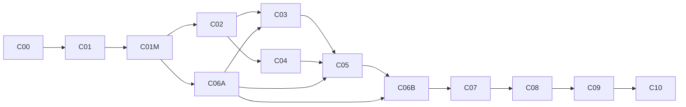

# Supabase and native PostgreSQL migration implementation plan

Status: planned; implementation has not started.
Prepared: 2026-09-18.
Repository baseline: `a2cead0d3ed6e6d8fe9a67b2e70e119ffec3e5fc`.
Requirements revised: 2026-09-18 at `ef0977cbf114ceb5b2c6303aaf6a233fe9068214`; the existing move from `docs/plan/` to `docs/plans/` is preserved.

Scope: repeatable application-data migration in either direction, including reviewed merges into populated destinations, with explicit checkpoints and a controlled production cutover.

## 1. Outcome and operating assumptions

Deliver an operator-run migration capability that moves the application's durable data from Supabase to native PostgreSQL, or from native PostgreSQL to Supabase, and merges it with existing destination users and records. Preserve record provenance and relationships; preserve values and permissions except for explicitly reviewed conflict resolutions. Retain the current runtime backends and unify application-facing identity behavior through their existing authentication interfaces.

The user confirmed planned switching, no requirement to preserve incoming passwords, and support for populated destinations with conflict-resolution options. Both deployments will run the same application release; verify the corresponding provider-specific schemas rather than requiring identical migration filenames. Preview may run read-only while systems operate, but final planning/apply occurs with both affected datasets fenced. Reconcile against the approved merged result before reopening writes. Existing version-1 work-data backup/merge behavior remains available and backward-compatible.

This plan creates no production authorization. Building and testing the tool is separate from executing a migration against a named production source and destination. C09 requires explicit authorization for that concrete transfer and its rollback window; ordinary implementation and disposable test work do not need repeated approval.

### Decisions and assumptions

| Item | Baseline for implementation | Status / checkpoint |
|---|---|---|
| Direction | Implement and test both directions; record the first production direction separately | Architecture recommendation; C00 records operational choice |
| Downtime | Planned cutover with source and destination writers fenced during final planning/apply | User confirmed planned switching; C00 records a measured downtime budget |
| Destination | Existing users and records are supported and protected; an empty destination remains supported | User requirement; C01M/C05 enforce reviewed merge semantics |
| Passwords | Preserve existing destination credentials; newly created incoming accounts use destination enrollment/reset and fresh login | User confirmed incoming password preservation is unnecessary; no hash/password transfer |
| Unified authentication | Extend existing application identity interfaces; retain native auth and Supabase Auth as compatible provider implementations | Recommended response to the user's request for a unified option; no new identity service |
| Versions | Same application release on both sides, with each provider's expected schema fingerprint | User supplied same-version constraint; actual deployed migrations still require verification |
| UUIDs | Keep existing destination IDs; preserve incoming IDs when safe, otherwise allocate and persist complete mappings | C01M defines mapping/provenance; C02 proves remapped references on both providers |
| Existing destination conflicts | Preview and resolve explicitly: retain destination, take allowed source fields, field-level merge, map/create separately, or exclude a source record with reason | User requirement; unresolved or invalid combinations block apply; no silent identity linking or privilege elevation |
| Database access | Direct PostgreSQL connection to each database for complete reads and transactional app-data import; Supabase Admin API for Auth provisioning | Execution prerequisite, not yet verified in a deployment |
| Rollback before publication | Restore the destination's verified pre-merge data/identity baseline if the merge committed; resume the original systems only after verification | Both databases require recoverable backups; do not discard an occupied destination |
| Rollback after target writes | Recover the entire current merged authority into a separate unused recovery destination of the original provider, retaining destination-original and post-cutover data | Conservative recovery strategy retained; C00 reserves capacity and C08 proves it, including reenrollment where credentials cannot carry across |
| Files outside PostgreSQL | Inventory first; separately transfer any required objects and validate URLs/ownership | Deployment-dependent; C00/C08 gate |
| Scale | Bounded-memory streaming and batched parameterized inserts in one app-data transaction | Benchmark against actual volume in C08 |

Do not reconfirm the settled planned-switch, incoming-password, populated-target, or same-release requirements. C00 still needs data volumes, actual schema states, external object scope, pending writes and numeric budgets. Preserving incoming passwords, near-zero downtime, or continuous synchronization would require a later design change. Do not collect plaintext passwords or rename incompatible hashes. Existing destination passwords must remain valid through the merge, even though source passwords are not transferred.

### Definition of done

- A supported source exports every declared durable record without silent truncation, normalization loss, deduplication, or omission.
- A read-only preview accounts for every source record and affected destination record as create, mapped/unchanged, reviewed update, or explicit exclusion with reason. Unresolved conflicts, unknown schemas and invalid merged state block apply.
- Both migration directions and round trips reconcile to the approved merged state, including destination-only records, ID/provenance mappings and declared field resolutions; source equality is required only for untransformed source records.
- Existing destination accounts keep their identities and passwords; new accounts enroll on the destination. All retain their approved active-state, permission-role, hierarchy-role and ownership behavior.
- Reapplying the same completed run is a no-op; a later bundle can be merged through a fresh reviewed plan without duplicating previously imported records. Stale or tampered plans fail before mutation.
- Previous sessions, reset tokens, stale retries, and offline queues cannot create unauthorized access or duplicate committed work after cutover.
- A rehearsal proves the recorded downtime/recovery limits and rollback procedure.
- The tool, operator guide, tests, and execution evidence are complete. Production migration itself is complete only after C09 and C10's observation gate.

## 2. Evidence and boundaries to preserve

The architecture assessment inspected source and ran four focused backup suites: **38 tests passed**. This is evidence for the existing backup behavior, not a migration round-trip result. No production database, actual deployment migration history, or live identity transfer was inspected.

| Current evidence | Consequence |
|---|---|
| [BackupPayload](../../app/types.ts) contains version-1 projects, activity types, timesheets, leaves, reminders, and global reminders | Introduce a separate migration format; do not describe the existing backup as full-system export |
| [parseBackup](../../lib/backup.ts) rejects over 5,000 timesheets and deduplicates using business values | Do not reuse it for lossless migration validation |
| [Supabase operations](../../lib/db/supabase/operations.ts) cap several export queries at 1,000 rows | Migration export needs complete iteration independent of those UI backup queries |
| [Native operations](../../lib/db/native/operations.ts) match emails/names and skip conflicts; [Supabase restore SQL](../../supabase/migrations/20260928000000_fix_restore_backup_tx_telegram_cast.sql) has corresponding merge semantics | Do not route migration import through `restoreBackup()` or `restore_backup_tx` |
| [Native profiles](../../db/migrations/0001_initial_schema.sql) store `password_hash`; [Supabase profiles](../../supabase/migrations/20260810160000_initial_schema.sql) reference `auth.users` and are created by an Auth trigger | Provision destination identity before applying complete profile/business state |
| [Native password recovery](../../db/migrations/0023_password_recovery.sql) owns session versions and reset tokens | Use destination recovery behavior; do not copy session credentials |
| [Auth facade](../../lib/auth/index.ts), [identity ports/capabilities](../../lib/auth/identity.ts) and [PeopleIdentity](../../lib/domain/people-port.ts) already separate application behavior from provider identity | Extend/reuse those semantics and pure helpers; the CLI must not import request-bound auth modules. Supabase recovery is provider-client handled, not absent |
| [Native idempotency migration](../../db/migrations/0031_idempotency_effects.sql) is deliberately a no-op; Supabase has provider-specific effect evidence | Do not bulk-copy internal idempotency state without a semantic mapping |
| [Application pool](../../lib/db/pool.ts) uses global `DATABASE_URL` and automatic migration guards | Migration connectors must be explicit and independent, especially for read-only source access |
| [Mobile queue](../../mobile/src/storage/offline-queue.ts) is scoped by server URL and actor ID; [sync engine](../../mobile/src/sync/sync-engine.ts) replays stable idempotency keys | Preserving users and URLs can preserve queued retries too; reauthentication alone is insufficient |

Keep ordinary feature work behind existing domain/repository boundaries. Direct SQL in the proposed migration modules is privileged operational infrastructure, not a new application data-access path. No migration module may be imported by browser/mobile bundles, shared client packages, or ordinary HTTP routes.

Preserve additive migration histories, RLS, grants, actor checks, both role axes, public action signatures, `/api/v1` contracts, existing backup semantics, and all current security tests. Do not modify an applied migration or the generated Next.js guidance block.

## 3. Target design

```text
Read-only source connector + account metadata reader
                         |
       Versioned manifest + ordered JSONL data files
                         |
       Offline validation + destination snapshot
                         |
       Record/account matching + conflict preview
                         |
       Reviewed, digest-bound resolution plan
                         |
       Destination Auth provisioning / enrollment
                         |
       Transactional merge + mappings + receipt
                         |
       Approved-result comparison + security checks
                         |
       Controlled application deployment / cutover
```

### Implementation shape

Use an operator CLI in `scripts/`, with small Node-compatible modules in `lib/migration/`. Reuse installed `pg`, `@supabase/supabase-js`, `zod`, `tsx`, and Node standard-library capabilities. Do not introduce a service, queue, package publication process, generic ETL framework, or web upload endpoint.

Keep source and destination clients separate. The CLI takes explicit provider identifiers and environment-variable names for connections. It never falls back to `DATABASE_URL`, the global `repo`, the build-time backend selector, or `lib/db/pool.ts`. Source operations use read-only transactions and must fail on a mutation attempt. Destination schema migration is an explicit preparation step using established workflows, never an implicit side effect of export/import.

Bind the destination Supabase Auth URL/key to the same approved project as its PostgreSQL connection before any Auth mutation. Validate this with the deployment's non-secret project identity and a read-only provider/database consistency check. Swapped source/destination credentials or an Auth endpoint for a different project must fail preflight. A read-only source SQL transaction cannot protect the source from an accidentally misdirected Auth API request.

Separate pure migration-format validation from adapters with credentials. Avoid importing `server-only` runtime sentinels or Next.js request-bound modules into a standalone CLI; ordinary server modules retain their existing protection. Use explicit public function boundaries and a boundary test to prevent accidental migration-code imports from application/client code.

### Unified identity behavior with Supabase compatibility

Use the existing auth facade, identity contracts and account-provisioning separation as the application boundary. Retain current Supabase SDK/session behavior, `profiles.id = auth.users.id`, RLS relationships, public auth routes and `/api/v1` responses; native remains independently deployable with its current authentication implementation. Reuse pure contracts/helpers in the CLI through explicit migration identity adapters; do not introduce a second login system or a new global application-user-ID layer for this task.

For a confirmed match, keep the destination profile/Auth ID, email ownership and password; map incoming references to it. Email normalization only produces match candidates. Linking requires unambiguous evidence and an explicit recorded decision; distinct people sharing a claimed email cannot be silently combined or automatically renamed. New incoming accounts enroll/reset credentials through the destination provider. Preserve verification facts and approved permissions; no default activation, fabricated verification, source session import or generic credential overwrite. Recovery UX may use the same application flow while dispatching to the provider's supported mechanism. Required changes must preserve existing Supabase clients and native contracts and receive focused regression tests.

### Matching and conflict-resolution contract

Use a stable verified source-instance namespace plus entity type and source record ID, not an endpoint URL or a random run ID, to identify provenance. Persist source-to-destination aliases and mapping decisions with the import receipt. Re-export the validated provenance needed for subsequent reverse/repeated migrations so a remapped record is not recreated on return. Do not copy another destination's execution receipts wholesale. Reject inconsistent, forged or ambiguous aliases; provenance is not authorization to link accounts.

Keep all destination-only rows by default. Absence from a source bundle never means delete. Distinct source rows remain distinct unless the operator explicitly confirms they represent the same logical record. Resolve user/reference mappings before dependent rows, using destination IDs in the expected merged state. Same-UUID/different-identity collisions require review and a mapped new ID or an explicit existing-record match; identical names or field values are insufficient.

| Conflict class | Safe proposed choice | Supported reviewed choices |
|---|---|---|
| Existing account candidate | Keep target ID, email and credentials; do not link automatically | Confirm identity mapping, leave unresolved, or exclude the source account and explicitly account for all dependents |
| New incoming account | Provision separately with destination enrollment | Preserve source ID when safe or allocate/map a new ID; unresolved email ownership blocks creation |
| Projects/activity types and other reference rows | Propose candidates without coalescing | Map to existing, take permitted source fields, merge permitted fields, or create separately with valid unique values |
| Previously mapped work record changed on either side | Retain destination pending review | Retain destination, take permitted source fields, field-level merge, or explicit source exclusion with reason |
| Separate timesheets with equal displayed values | Keep separate | Exclude only an explicitly confirmed duplicate; never sum hours or use visible-value deduplication automatically |
| Roles, active state, hierarchy and verification facts | Preserve destination; review separately | Explicit security-field decisions with permission, verification and hierarchy validation; bulk source-wins cannot change these fields |
| Settings/layouts and singleton rows | Preserve destination | Select source values or field-level resolutions; declare array/JSON semantics and provider-specific exclusions |
| Historical audit records | Preserve append-only history and actor provenance | Map actor references; exclude a proven duplicate explicitly; do not rewrite existing events to disguise a merge |

The preview must show create/update/retain/map/exclude/unresolved counts, affected relationships and aggregate consequences. Resolution files use a versioned schema, entity-specific field allowlists, operator identity/time and reasons for exclusions/security changes. They contain no SQL or arbitrary executable expressions. An operator CLI plus an inspectable report/resolution file is sufficient; a web conflict editor is outside the first pass.

Use two-way comparison unless a verified common baseline exists; timestamps alone do not establish the winning value. Compute the complete expected merged result, including untouched destination rows. Validate uniqueness, ownership, hierarchy cycles, both role axes, daily-hour caps, required fields and all FKs after resolutions. Invalid combinations stay unresolved; choosing both sides cannot bypass constraints. Existing destination defects affecting these invariants are reported, not silently repaired. Every excluded parent needs an explicit valid disposition for its dependent records.

Bind the saved plan to source/bundle digest and provenance, destination identity, same-release/schema fingerprints, relevant destination business/identity snapshot, matching rules, mapping decisions and resolution digest. The fingerprint includes negative match assumptions and aggregate inputs, so a new destination row can invalidate a plan too. Recheck under the final write fences/lock before Auth or SQL mutations. If relevant state changes, invalidate and regenerate/review the plan; never silently reuse stale decisions. C08 must include the final re-review time in the downtime budget.

### Bundle and compatibility contract

Use a directory containing `manifest.json` and allowlisted per-entity JSONL files. No ZIP extraction is required in the first version.

The manifest has a distinct format discriminator, for example `vsis-data-migration`, and its own `formatVersion: 1`. It is not the existing `BackupPayload.version: 1`. Include:

- Run/bundle ID, stable verified source-instance namespace, record provenance aliases, application release/revision, source provider, supported provider-specific schema fingerprint and applied migration identifiers, export timestamp and snapshot provenance.
- Entity file names, exact row/byte counts, checksum algorithm and digests, canonicalization version, dependency order, and explicitly excluded categories with reasons.
- Account metadata/enrollment policy and declared transformations. No connection strings, passwords, password hashes, tokens, signing keys, or provider secrets. The separate merge plan binds the destination baseline and approved resolutions without altering the source bundle.

Use fixed allowlisted filenames, reject symlinks/path traversal and unknown entity files, bound manifest/row sizes, and reject truncated JSONL or count/hash mismatches. Hashes detect corruption; they do not authenticate the exporter. Restrict artifact access and bind imports to an operator-selected bundle digest and verified source provenance. Encrypt retained/transferred bundles through approved existing infrastructure and record retention/deletion dates without putting keys in the bundle.

Canonicalize values without loss: UUIDs, booleans, null versus empty string, date-only values, timestamps at supported database precision, decimal quantities, JSON settings, and stable ordering. Do not pass PostgreSQL decimals/bigints through lossy JavaScript numbers or truncate microseconds through `Date` serialization. Define text/JSON encoding and Unicode handling in the contract. Distinct rows with distinct IDs remain distinct even when their visible business fields match.

### Initial data classification

C00 must turn this candidate list into a verified field-level matrix. Inspect current migrations and live catalog metadata; source files alone do not establish deployed state. Unknown persistent tables or columns block a completeness claim until classified.

| Category | Candidate contents | Policy |
|---|---|---|
| Account metadata | Profile IDs/emails, names, department/title, both role axes, active state, manager links, preferences/layouts, required identity verification metadata | Preserve target identities; apply reviewed mappings/field decisions; enroll only new credentials; do not elevate verification without evidence |
| Reference/workspace | Projects, activity types, titles, whitelisted domains, app settings, branding and default layouts | Preserve target-only state and approved values; map IDs explicitly; validate URLs and singleton/unique-key conflicts |
| Work data | Timesheets, leaves, reminders, global reminders, user dismissal records | Preserve distinct records, timestamps and mapped FKs except declared field resolutions/exclusions; verify merged constraints |
| History | Application audit events and actor references | Preserve according to agreed retention and deleted-actor rules |
| External objects | Deployment-specific logo/files/storage objects, if any | Separate inventory, transfer, ownership and checksum validation; record a blocker if tooling is required but unavailable |
| Auth credentials | Native password hashes; provider hashes, OAuth/MFA credentials; active sessions and recovery tokens | Excluded from the transfer bundle; existing target credentials remain in place, new accounts enroll, and session/recovery safety is handled separately |
| Migration provenance | Verified record-origin aliases and mapping lineage | Carry enough lineage for repeated/reverse merges; store destination mappings atomically; keep run/publication receipts destination-local |
| Operational state | Idempotency records/effects, rate-limit buckets, maintenance state | C06A fixes the contract before full export/import; C06B proves replay safety before anything is cleared |
| Provider implementation | `auth`, `storage` internals, private RPC/trigger machinery, grants/RLS, migration ledgers | Recreate through destination/provider workflows; never copy wholesale |

### Import transaction and recovery model

1. Offline-validate the complete bundle, inspect the populated destination and produce the read-only conflict preview. Resolve all blocking decisions and save the expected merged state/plan digests. Verify recoverable source and destination baselines before mutation.
2. Fence both datasets' writers, acquire a destination-wide migration lock and recheck the reviewed baseline/plan. Bind recoverable backups or verified point-in-time recovery positions to these final fenced baselines, including Auth and external objects; an earlier backup alone can lose legitimate pre-freeze changes on rollback. Reject source=destination, concurrent imports, unsupported connection/proxy modes or an unfenced target. If preview happened before the freeze, regenerate/review any stale decisions now.
3. Reuse approved existing identities without changing their credentials. Provision only planned new identities through supported APIs, preserving IDs when safe or using explicit mappings. Account for triggers/whitelisted-domain rules and verification facts. Record planned IDs and run-created identities in a protected journal so a lost API response can be reconciled unambiguously.
4. Start one destination application-data transaction. Verify that any baseline changes since preflight are exactly the journaled provisioning effects; all other drift aborts. Apply approved creates/updates and ID rewrites in FK order, with conditional writes guarding prior values. Preserve untouched target rows and role synchronization triggers. Validate hierarchy and links without disabling RLS, grants or all triggers globally.
5. Compare the entire expected merged result, mappings, counts, canonical values and invariants. Account for each source record, explicit exclusion and unaffected target record. Commit only if the gate passes; run post-commit authentication/security checks while user access stays fenced.
6. Record completion independently of terminal output. Retries distinguish planned, resolved, Auth-provisioned, data-committed, verified, publication-intent and writable states. A lost response after commit must not apply updates or duplicate records again.

Supabase Auth provisioning and SQL merge are not one transaction. If app-data merge fails, roll back that transaction and either resume verified journal-owned identities or clean up only identities proven to have been created by this run. Never remove a pre-existing identity. Never use a generic Auth update to implement field conflict choices; existing Auth emails, credentials and provider assurances are protected. Once app data commits, deleting Auth users can cascade into retained/imported data: prohibit automatic identity cleanup and use the verified pre-merge recovery procedure while still unpublished. Provider-appropriate protected recovery backups may include credentials; the portable bundle and logs may not.

Persist record mappings/provenance and a non-secret import receipt atomically with the merge commit, bound to run ID, bundle/plan/resolution digests, destination baseline identity and schema version. Reuse an existing durable facility if it provides these semantics; otherwise add narrowly scoped mapping/receipt tables through both additive migration tracks. Keep receipt state outside business-data equivalence and reconcile portable provenance separately. External journals alone cannot prove commit. The same completed run/digests returns a no-op receipt even if later legitimate edits exist; never replay it or overwrite those edits. Any new bundle or new resolution requires a fresh reviewed plan using persisted mappings. Suspected partial commit/receipt corruption blocks recovery; it is different from subsequent valid user changes.

Before publication, reversing a committed merge requires the destination's verified pre-merge data and identity baseline, including original users/settings/history; a code revert or deletion of newly inserted rows does not undo reviewed updates. Rehearse a provider-appropriate restore without revalidating stale sessions/reset tokens or deleting pre-existing users. Keep both original datasets recoverable. If publication was attempted or any retained post-merge business write may exist, recover the complete current merged authority, including destination-original records, into the reserved recovery environment; never overwrite it with a pre-merge snapshot.

Extend the protected receipt/state mechanism to record publication intent durably **before** any gate admits destination business writes. Only the migration operator may change that state; ordinary application roles cannot. Once intent is recorded or publication is attempted, recovery assumes target writes may exist unless their absence is independently proven. A crash must never make a writable target look safe for immediate source resumption. Controlled validation mutations count too if they can persist; prefer read-only or rolled-back checks before this boundary. Record the observed first write for audit, but do not use an after-the-fact log entry as the safety boundary.

## 4. Checkpoint map and status

All implementation checkpoints remain **NOT STARTED**. The user's scope answers are confirmed, not implementation evidence. A checkpoint becomes PASS only when its stated evidence is recorded. Missing deployment prerequisites are BLOCKED, not PASS or an unreported skip; independent discovery can proceed while those inputs are collected.



| Checkpoint | Deliverable | Depends on | Status |
|---|---|---|---|
| C00 | Verified scope, schema/data inventory, operational budgets | None | NOT STARTED |
| C01 | Format, validator, explicit connectors, CLI safety boundary | C00 | NOT STARTED |
| C01M | Matching, ID/provenance mapping, read-only conflict preview and saved resolutions | C01 | NOT STARTED |
| C02 | Small real merge in both directions, existing login and new-account enrollment | C01M | NOT STARTED |
| C03 | Complete and consistent exporter | C02, C06A | NOT STARTED |
| C04 | Complete identity/profile provisioning and recovery | C02 | NOT STARTED |
| C05 | Strict merge apply, expected-result reconciliation, mappings and durable receipts | C03, C04, C06A | NOT STARTED |
| C06A | Early retry, session and recovery policy/contract | C01M; C00 operational inputs | NOT STARTED |
| C06B | Writer fencing, retry implementation and publication proof | C05, C06A | NOT STARTED |
| C07 | Adversarial integration/security matrix and CI | C05, C06B | NOT STARTED |
| C08 | Volume benchmark and full rehearsal | C07 | NOT STARTED |
| C09 | Authorized production cutover | C08; concrete migration authorization | NOT STARTED |
| C10 | Observation, handoff, delayed source retirement | C09 | NOT STARTED |

C01M establishes merge semantics before the first database slice. C06A is an early design gate despite its identifier; execute it after C01M and before finalizing C03/C05. C03 and C04 can run in parallel once their dependencies pass, with separate file ownership. C06B verifies the integrated migration and cannot pass before C05. Coordinate shared manifest/plan changes centrally. There are 13 pass/fail gates, including C01M and the two dependent C06 gates. Each checkpoint should be a reviewable commit or PR; split a large checkpoint without weakening its gate.

## 5. Executable checkpoints

### C00 — Establish the migration contract's factual inputs

**Context:** existing work-data backups are incomplete and deployed migration versions are unknown. **Owner:** coordinator with a bounded schema/data scout and deployment operator. **Files:** execution notes, proposed operator runbook, field inventory; no runtime edits.

Tasks:

1. Record current HEAD, dirty tree, relevant versions, source/destination provider and non-secret instance identities. Preserve unrelated changes; never dump environment files, credentials, or sample personal records into reports.
2. Create `docs/plans/SUPABASE_NATIVE_MIGRATION_NOTES.md` beside this plan with baseline, checkpoint ledger, evidence references, confirmed requirements, deviations, blockers, and final outcome sections.
3. Produce a column matrix: source representation, canonical representation, destination representation, required/default/generated status, constraints, and handling. Include all persistent public/custom schemas and explicitly classify provider schemas without exporting their secrets.
4. Inventory both datasets: volumes, normalized-email and UUID collisions, reference-name conflicts, singleton settings, orphan references, legacy role inconsistencies, historical constraint violations, deleted actors, precision and hierarchy. Distinguish confirmed same-entity matches from candidates and existing defects. Report securely; no silent cleanup or arbitrary account linking.
5. Record the confirmed password/switching/merge requirements without asking again. Establish numeric downtime/recovery budgets, bundle retention, observation window, access, external object scope, pending mobile writes, SMTP/enrollment readiness and first direction. Reserve an isolated recovery destination for the entire merged authority after target writes; include provisioning/reenrollment cost and time.
6. Identify destination-owned rows/identities/configuration that must survive and define the schema-only bootstrap policy for empty-target tests. Verify both sides run the same application release and each has that release's expected migrations. Inventory recoverable source and destination data/Auth/object backups and who will review conflicts; existing data is never disposable seed data.

**Verification:** run V0 and V1 below; inspect current catalog/migration history through read-only access when an execution environment is available. Compare catalogs with the explicit supported schema matrix, not matching migration filenames across providers.

**PASS:** every durable category is mapped or explicitly excluded with an accepted consequence; no unresolved policy blocks the next checkpoint; source/destination prerequisites and numeric operational budgets are recorded.

**Stop/rollback:** unknown deployed schema or policy blocks its dependent work. Discovery is read-only and requires no data rollback. Record unanswered inputs instead of guessing.

### C01 — Define the bundle and safe operator interface

**Context:** the UI backup contract must remain unchanged. The ordinary pool can automatically migrate a database. **Owner:** routine backend implementer; coordinator reviews the security boundary. **Files:** proposed `scripts/migrate-backend.ts`, `lib/migration/format.ts`, `validation.ts`, `connections.ts`, and focused tests; additive `package.json` script.

Tasks:

1. Implement manifest/entity, provenance, merge-plan and resolution-file schemas/canonicalization for the first slice. Unknown format versions/fields, different application releases or unsupported provider-specific schema fingerprints fail closed; matching application versions alone is insufficient.
2. Implement explicit source/destination configuration with allowlisted provider names and protected environment inputs. No secret-valued command arguments, environment auto-selection, or global app pool imports.
3. Implement offline `validate` and database `inspect`/`preflight` commands. Dry-run must have zero database mutations, Auth provisioning, email sends, migrations, or secret-bearing output.
4. Verify distinct source/destination identity beyond a raw connection-string comparison: account for aliases/proxies and record a safe instance fingerprint. Bind target Auth API credentials to the target database/project. Reject uncertainty before import.
5. Implement run journals, exclusive artifact creation, digest verification, lock/error/time limits, redacted structured results, and unambiguous exit codes. Keep generated bundles/journals out of Git.
6. Add boundary coverage preventing ordinary app/client code from importing migration infrastructure. Reuse current dependencies; avoid a new framework.

**Verification:** V2 for format/CLI tests, V3 for type/lint/boundaries. Cases: malformed manifest, truncated data, duplicate IDs, precision round trip, unexpected files, symlink/path traversal, same target/source through aliases, mismatched Auth API/database projects, missing env, source write attempts, and dry-run attempts to call Auth or migration routines.

**PASS:** the CLI can validate a fixture and inspect supported disposable databases without changing either one; no existing backup/public contract changes.

**Rollback:** revert only the additive tool files/script and restore modified configuration from its backup. This checkpoint does not mutate either dataset; existing destination data remains untouched.

### C01M — Build reviewed matching and conflict planning

**Context:** the destination may already contain legitimate accounts and records. **Owner:** contract/merge implementer with identity/security review. **Dependency:** C01. **Files:** proposed `lib/migration/matching.ts`, `merge-plan.ts`, `resolutions.ts`, CLI report commands, `tests/migration-merge-plan.test.ts` and mapping fixtures. Consolidate helpers where small.

Tasks:

1. Implement candidate discovery separately from confirmed mapping. Prefer verified prior-run provenance; same UUID/email/name without sufficient evidence is a candidate or collision, not an identity assertion. Enforce mapping consistency across all dependent references and repeated/reverse runs.
2. Generate a read-only preview showing every proposed create, update, retain, map, source exclusion and unresolved conflict, plus affected users/relationships and totals. Preserve destination-only records. Different records with identical business values stay separate.
3. Implement the conflict table's permitted choices and explicit per-field resolution schema. Protect credentials, existing Auth email ownership, verification and role fields from generic/bulk overrides. Record operator identity/time and exclusion/security-change reasons. No database writes or email sends occur when preparing/reviewing plans.
4. Derive the expected complete merged result and validate all final constraints, including combined daily hours, unique reference names, hierarchy, deleted actors and the consequences of parent exclusions. Reject invalid or missing resolutions; do not auto-repair existing destination problems.
5. Bind preview and resolved plan to the bundle/provenance, target snapshot including negative-match/aggregate inputs, application/schema versions, policies and resolution digest. Model later target changes as stale-plan errors requiring regeneration and review. The source bundle remains immutable.
6. Define durable mapping/provenance/receipt semantics for C02/C05. A completed run never reapplies its changes; a new bundle/resolution requires a new reviewed plan. Retain enough verified aliases on re-export to avoid recreating remapped records on return. Do not infer deletions from missing source rows.

**Verification:** V2/V3. Cover each conflict choice, same-email/different-person, same-UUID/different-entity, ambiguous aliases, mapped users with different IDs, modified plan digests, target insertion after preview, invalid field overrides, role elevation, orphan/cyclic hierarchy, duplicate-looking timesheets and a merged daily total above 24 hours. Test a reviewed exclusion and prove every dependent row has a valid disposition. Pure planning/dry-run paths must have zero SQL/Auth mutations.

**PASS:** an operator can inspect the preview and submit resolutions; unresolved/stale/invalid plans fail closed; the expected result explicitly retains unaffected destination state. First-slice ID mapping and repeated-run behavior are executable before C02.

**Rollback:** revise only planning artifacts/code. No accounts or database rows have been changed by preview or resolution.

### C02 — Prove one complete slice across real boundaries

**Context:** prove account matching, conflict resolution and data transfer before expanding coverage. **Owner:** backend implementer with identity review. **Dependency:** C01M. **Files:** proposed provider modules and minimal export/merge/coordinator modules; `tests/migration-roundtrip.int.test.ts`.

Tasks:

1. Prepare disposable native and Supabase targets using their established schema workflows. Keep the test harness unable to select production databases accidentally.
2. Seed a populated target with an existing account/password, a destination-only user/project/entry, and a reviewed account/reference match whose source IDs differ. Add a new source account, a colliding UUID and two distinct timesheets with equal displayed values. Preview, resolve and merge; keep full timestamps and persist every required ID rewrite.
3. On Supabase, reuse confirmed target identities without touching credentials; create only unmatched planned identities through the supported Admin API. Prove safe preserve-ID or mapped-new-ID creation, provider-version support and expected trigger effects; then apply approved profile state.
4. On native, leave existing password hashes untouched. Create new profiles with no usable source credential and prove the destination reset/enrollment flow. Do not import hashes, reset matched accounts' passwords, or fabricate verification state.
5. Keep accounts isolated until permissions and active state have been applied. Preserve unverified email state; do not equate a native profile email with evidence of inbox verification.
6. Apply the reviewed merge transactionally; prove a failing final insert rolls back both new rows and changes to existing rows. Persist mappings and the receipt with that transaction; track Auth provisioning separately so retries never duplicate/delete unrelated users.
7. Exercise both directions, an empty-target case, fresh login using existing target passwords, and enrollment for new accounts. Reapply the completed run as a no-op, then preview a later source change against the same target and re-export/reverse with provenance. Record exact versions and mappings.

**Verification:** V4 with real databases/Auth. Include each first-slice resolution, existing-password continuity, destination-only data preservation, stale-plan rejection before Auth creation, inactive/other-user access denial, Auth-trigger/lost-response failures, mapped UUID collisions and late-transaction rollback. The current mocked restore suites are insufficient.

**PASS:** both directions match their approved merged result; destination identities/credentials survive, new enrollment works, every dependent FK uses the approved mapping, and retry/reverse provenance prevents duplicates. No credentials/tokens are transferred and no unreviewed privilege change occurs.

**Rollback:** discard only the dedicated test datasets/instances and journal-owned pre-commit identities. A failed production-like dry run cannot mutate the source.

### C03 — Export all declared durable state consistently

**Context:** current export has fixed limits and independent queries; migration needs a complete snapshot. **Owner:** export implementer. **Files:** proposed exporter, entity mappings/read adapters, export tests; does not own identity import files.

Tasks:

1. Add every C00-mapped entity/column and validated mapping provenance needed for repeated/reverse merges. Use explicit allowlists; never `SELECT *` from provider credential tables or export destination-local execution receipts as business data.
2. Export under a stable PostgreSQL snapshot using a dedicated read-only connection, stable primary-key ordering/keyset pagination, and bounded batches. Keep snapshot lifetime and statement limits visible in the result.
3. Read only approved Auth metadata such as ID, email verification state, and supported account status. Document how provider-side account changes are fenced during the final snapshot. The destination planner needs the same canonical durable-state coverage to fingerprint existing state and derive the merged result; reuse read helpers without granting write access.
4. Stream files and compute counts/checksums. Finalize the manifest only after every entity is complete; incomplete exports must not look importable. Handle disk-full, interrupted connection, and snapshot failure.
5. Preserve source values and duplicates exactly under canonicalization. Do not reuse legacy parser trimming, sanitization, field truncation, fallback descriptions, or name-based deduplication.
6. Include a diagnostic report for unmapped/deployed schema drift and values incompatible with the destination. Do not silently rewrite source records to fit.

**Verification:** V2/V3 and export integration tests: over 1,000 rows in formerly capped categories, over 5,000 timesheets, special characters, decimal/timestamp boundaries, null values, duplicate-looking rows, concurrent changes outside the held snapshot, and interrupted output.

**PASS:** independent source counts and canonical digests match a completed bundle; memory stays bounded by batches; every failure leaves an explicitly incomplete artifact.

**Rollback:** remove only this run's incomplete artifacts using verified paths; the source remains unchanged.

### C04 — Finish identity and profile migration

**Context:** provider identities, existing target credentials, profile merging and account verification are related but distinct. **Owner:** identity implementer. **Files:** proposed migration identity adapter and tests; inspect existing `lib/auth/index.ts`, `lib/auth/identity.ts`, `lib/domain/people-port.ts`, `lib/auth/password.ts`, `lib/db/password-recovery.ts` and `lib/email/password-reset.ts`. Reuse pure contracts and explicit provider adapters; request-bound modules stay outside the CLI.

Tasks:

1. Expand C02 to all imported identities, including inactive users, administrators, unverified accounts, and profile references required by historical data. Define explicit handling for deleted actors; do not create login-enabled placeholders.
2. Resolve normalized-email/UUID collisions through C01M's reviewed mapping. Confirm same-person matches before linking; retain the destination Auth/profile ID, email ownership, password and provider assurances. Provision new identities only for approved unmatched users; unresolved ownership blocks apply.
3. Preserve destination roles/active state/preferences unless individually reviewed field resolutions change them. For new profiles apply approved incoming state; never activate or elevate by default. Rewrite manager/ownership links through the complete ID map after referenced profiles exist; reject cycles and invalid role combinations.
4. Prove domain-whitelist and Auth-trigger behavior, including profile creation and legacy-role synchronization. Keep application roles separate from Supabase's database/JWT `role`; never create user accounts as `service_role`.
5. Make identity creation retries bounded and journal-aware, including an API response lost after creation. Preserve current target credentials throughout. Compare current identity metadata with the approved baseline; only journal-proven provisioning effects are permitted drift. Respect API limits and report partial provisioning separately from merge completion.
6. Record email enrollment status separately from data import. Do not automatically send bulk email during preflight, rehearsal, or import; actual user communications require explicit authorization. Validate enrollment with controlled test accounts.
7. Preserve Supabase compatibility while presenting the existing provider-neutral login/signup/recovery semantics. Supabase capability `passwordRecovery: false` means recovery occurs outside the server identity boundary, not that recovery is unavailable. Treat unsupported OAuth/MFA identities as a blocker or specifically reviewed reenrollment path; do not silently downgrade assurances or add a new auth engine.

**Verification:** V4/V5 plus existing identity-boundary/registration contracts, role/hierarchy fixtures, matched-account login with the original destination password, new-account enrollment, protected verification/credential fields, lost create response, expired/single-use recovery links, mail failure and access denial while fenced. Test existing Supabase auth/session and native flows for backward compatibility.

**PASS:** every source account is mapped, newly provisioned, intentionally historical/non-login, or explicitly excluded with all dependents resolved; remaining blockers prevent apply. Existing destination accounts/credentials survive, approved security fields are exact, no verification is fabricated, and partial provisioning recovery is demonstrated.

**Rollback:** before commit, clean only proven run-created identities or resume them. After commit while unpublished, restore the destination's verified pre-merge data/identity baseline without reviving stale sessions. Never cascade-delete existing users; after publication use current-merged-authority recovery.

### C05 — Complete strict import, reconciliation, and durable recovery

**Context:** existing restore silently skips some rows; this path must apply exactly the reviewed merge or fail before publication. **Owner:** import implementer. **Files:** proposed importer/reconciler/journal/mapping modules; additive mapping/receipt migrations if needed; failure/recovery tests.

Tasks:

1. Consume the validated C03 bundle, C01M resolved plan and C04 identity results. Recheck both write fences, destination/app/schema baseline, plan/bundle/resolution digests and lock before mutation. Only the recorded new-identity/trigger effects may differ from the reviewed preflight snapshot.
2. Apply approved creates and conditional updates in dependency order using parameterized batched writes and one app-data transaction. Rewrite all references via the reviewed map; keep destination-only records unchanged. Support hierarchy two-pass loading without weakening final constraints. Source absence never triggers deletion.
3. Define safe handling of generated columns/defaults, role-sync triggers, schema bootstrap rows, imported audit history, sequence/identity counters, and expected provider-generated fields. Declare each permissible difference in the contract.
4. Reject unresolved/new conflicts, unknown resolutions, unauthorized field overrides, stale target state, invalid merged aggregates/FKs, unsupported values or schema drift. Persist explicit exclusions with reasons and dependent-row dispositions; no broad catch-and-continue or generic skip count.
5. Compare target state against the expected union plus approved changes/exclusions, including exact mapped IDs, canonical values, relationships, historical provenance and per-user/per-day hours. Verify unaffected destination rows separately; raw source/target count equality is not the merge oracle.
6. Commit app data, mapping/provenance changes and the digest-bound receipt atomically. Use the receipt after a lost response to determine commit; local journals cannot establish success. Rollback must remove mapping/receipt changes with failed SQL changes.
7. Make rerunning the same completed run/digests a no-op without overwriting subsequent user edits. Reject reused run IDs with altered digests. Allow a different bundle only through a new reviewed plan using prior mappings and current destination state. Distinguish legitimate later edits from evidence of an incomplete/corrupt commit.
8. Keep target publication separate from import success. Post-commit login/security failures leave the target isolated and recorded as unverified.

**Verification:** V4 with populated and empty targets, all resolution types, destination-only records, same-email/UUID collisions, combined daily-cap and hierarchy failures, target changes/new matching rows after preview, forged resolutions/provenance, repeated completed and later-bundle runs. Inject failures across categories and commit boundaries; assert existing rows, mappings and credentials remain unchanged after rollback. Verify a repeated completed run does not overwrite later legitimate edits.

**PASS:** every category reconciles to its approved merged result with zero unexplained differences/exclusions, destination-only state survives, and transaction/uncertain-commit/repeated-run recovery works. Existing application and backup contracts/tests still pass.

**Rollback:** pre-commit SQL rollback plus controlled handling of run-created identities; after commit while still unpublished, restore the occupied destination's verified pre-merge data/identity baseline and check original users/passwords/history. Never recreate an occupied target as empty. After possible user writes use current-merged-authority recovery. Reversing code or deleting receipts is not a data rollback.

### C06A — Fix the retry/session/recovery policy before full data mapping

**Context:** mobile queues retain stable IDs across logins, and native/Supabase idempotency internals differ. Merging can also change actor/resource IDs and combine two existing retry histories. The chosen policy can add portable operational records to the bundle and therefore precedes C03/C05. **Owner:** architecture/security reviewer with mobile/operator input. **Dependency:** C01M and C00's operational inventory. **Files:** contract decisions, field matrix and runbook; no speculative client rewrite.

Tasks:

1. Enumerate writers and retry sources in both deployments: web/server actions, APIs, direct Supabase requests, Admin clients, signup/profile triggers, jobs, integrations, and mobile sync. Describe how each will be fenced, including direct provider endpoints and existing destination users.
2. Select one concrete retry strategy supported by the actual client population: portable committed idempotency outcomes with a defined semantic mapping, or enforced queue reconciliation/client compatibility gating before replay. Specify the retry horizon, absolute expiry semantics, operations already committed with lost responses, and devices reconnecting beyond that horizon. Unknown late retries must not become fresh mutations automatically.
3. Update the format/entity matrix with every operational record needed by that strategy, or explicitly show why none are needed. Define how actor/resource remapping changes routes, request hashes, results and effects. Preserve the original request meaning and identify each history by its verified deployment namespace; equal keys from independent deployments do not prove a duplicate operation. Reconcile overlapping committed operations against the approved merge decisions, and reject automatic replay when the mapping is ambiguous. Exclude credential/token-bearing responses. Do not treat provider-specific effect tables as interchangeable.
4. Define fresh-session requirements and old-token rejection for both user populations while preserving matched destination credentials. Define temporary isolation of both deployments during apply and the durable publication-intent/write-gate state machine. A password reset alone is not proof every old token is rejected; neither is a database restore that could revive an old session/version.
5. Define rate-limit/maintenance state disposition and in-flight-operation handling. Preserve offline work requiring manual review rather than silently deleting it.
6. Fix both recovery paths. Before publication, restoring verified pre-merge destination data/Auth/object state permits resumption of the two original deployments with appropriate session invalidation. After publication or possible retained writes, export the full current merged authority into a reserved unused recovery destination of the original provider, then verify and route. Include destination-original records and accounts as well as imported data, later updates/deletions, external objects, retries and any repeat enrollment. If current-authority data is unreadable, recover it first; the retained source cannot prove preservation of merged destination data or later writes.

**Verification:** review the state machine and field matrix against the identified writers/clients, then define the executable V6 cases and exact affected files. Account for an offline device outside the chosen horizon and a process crash at each publication transition.

**PASS:** one implementable strategy and its contract are selected; publication/rollback transitions are explicit; all C03/C05 inputs are stable. A drain-only runbook cannot pass if every relevant client/retry cannot be accounted for.

**Rollback:** revise the policy/contract before dependent implementation; no runtime or source data changes are necessary for this design gate.

### C06B — Implement and verify fencing, retry handling and publication

**Context:** C05 now provides complete import and durable receipts; C06A specifies the safety contract. **Owner:** operations/security implementer with mobile support. **Dependencies:** C05, C06A and any required client/guard changes owned by this checkpoint. **Files:** runbook plus only the identified guards, receipt-state/idempotency adapters or mobile compatibility changes.

Tasks:

1. Implement and exercise each C06A writer fence. A web maintenance page is insufficient. Before the freeze, each original deployment remains authoritative for its own dataset. Fence both during final planning/apply/verification, and admit clients to the merged destination only after its publication gates pass.
2. Implement the selected session/retry strategy for both populations, including mapped actor/resource IDs, late device reconnection and retained manual-review queues. Keep the old source endpoints fenced after routing changes; require fresh sessions without changing matched destination passwords.
3. Persist publication intent on the destination's protected durable receipt/state before any gate admits business writes. All gating mechanisms must obey that state and the recorded operator transition; ordinary users cannot set it. Record observed enablement/first write as supplementary audit evidence.
4. On restart after publication intent or an uncertain enablement, assume writes may exist and use the post-write recovery path unless their absence is independently established. Never infer safe source resumption from an absent final log line.
5. Use read-only or rolled-back validation before publication where possible. If controlled validation can retain business/account metadata mutations, move the conservative boundary ahead of those calls too.
6. Finalize operator procedures and exact gate/rollback commands. If runtime code changes, consult installed Next.js guidance and run the relevant regression/build checks.

**Verification:** V6 after complete migration. Attempt writes through every surface of both deployments during freeze; replay committed and uncertain mutations after fresh login with remapped IDs and colliding retry keys; test unchanged destination passwords, old tokens and late offline devices. Inject crashes immediately before publication intent, before enablement, immediately after enablement, and after an acknowledged or lost-response write. Verify recovery preserves destination-original data and later writes and never exposes the merged dataset through two writable authorities.

**PASS:** no unfenced writer, unauthorized old session or unsafe retry remains; publication and uncertain-transition recovery are durable; full reverse migration preserves the merged dataset, including destination-original data and post-cutover changes in the recovery fixture.

**Rollback:** keep affected deployments fenced and the unverified merged destination isolated. Follow the recorded pre-publication restoration of the occupied destination or conservative post-publication recovery path; a failed fence test alone never justifies replacing either original dataset.

### C07 — Establish the integration and security release gate

**Context:** unit tests do not prove Auth provisioning, RLS, transactional recovery, or cross-provider equivalence. **Owner:** test/security implementer. **Files:** migration suites and a scoped CI integration job; preserve existing required checks.

Tasks:

1. Build deterministic fixtures across all mapped categories, role combinations, active states, hierarchy relationships, audit/deleted-actor cases, field precision and provider bootstrap behavior. Include overlapping identities, distinct users with similar emails, UUID/name collisions, destination-only records and equal-looking but distinct time entries.
2. Test each direct migration and both round trips using actual disposable native and Supabase services, with populated and empty destinations. Re-export durable mapping provenance and verify reverse/repeated merges against the approved expected result, including exclusions and field choices. Verify existing destination password continuity, new-user enrollment, fresh login and positive/negative authorization cases.
3. Include C01/C01M/C03/C05 corruption, capacity, every supported conflict choice, constraint validation, snapshot, stale-plan and crash scenarios and C06B stale-retry/session/publication cases. Prove reapplying a completed run does not overwrite subsequent legitimate edits. Confirm absence of secrets in bundles, error output, journals and CI artifacts.
4. Add explicit test prerequisites so the migration CI job fails setup when its databases/keys are absent; it must not go green by skipping its real database suite. Never use production credentials in CI.
5. Run the existing native restore/recovery and live Supabase RLS/registration checks applicable to the changes. Retain all current CI checks and thresholds; no path-filter optimization in this work.

**Verification:** V1–V6 and both-backend build checks V7 as applicable. If mobile code changes, run mobile lint/typecheck/tests and the focused queue/sync cases.

**PASS:** all required matrix legs pass on a fresh schema installation and a supported deployed-schema upgrade path. Every source record has its approved disposition, the merged result matches the expected result in each direction, destination-only records remain intact, and the security cases pass. Raw source/target equality is not a valid oracle for a merge with deliberate field choices or exclusions.

**Rollback:** remove only a faulty new CI/test change; do not lower thresholds or disable existing checks. Any uncovered application defect becomes a scoped fix with regression evidence before this gate passes.

### C08 — Benchmark and rehearse the complete operation

**Context:** a maintenance-window promise requires measured export, enrollment/provisioning, import, verification, build/deployment and recovery time. **Owner:** operator with performance/test support. **Files:** runbook and evidence ledger; implementation adjustments only for measured failures.

Tasks:

1. Run a full rehearsal against disposable environments using sanitized representative source and populated-destination data at C00's expected volumes and an agreed growth margin. Include realistic overlap/conflicts, high-row-count categories and largest allowed rows/settings.
2. Measure preview creation, operator conflict resolution, stale-plan regeneration, both backups, final freeze, provisioning/enrollment, snapshot/transaction duration, Auth rate-limit retries, locks, verification, peak memory/disk and recovery. Separate pre-window work from work that must fit within the freeze; do not benchmark only raw inserts.
3. Build target application artifacts before the production freeze where possible; test the exact target-backend build/configuration and web/mobile endpoints.
4. Complete separate object transfer and URL/ownership verification if C00 identified external storage. Include destination object/path conflicts, reviewed mappings and recoverable pre-merge object state; never overwrite an existing object without a recorded decision. A database-only rehearsal cannot clear that gate.
5. Rehearse interruption/recovery on both sides of publication intent. Include legitimate destination changes between the preliminary backup/preview and final freeze. Before publication, prove restoration of the exact final pre-merge records, identities, passwords and objects, then safe resumption of both original deployments without reviving invalidated sessions. For the post-write case, add real records/updates/deletions and an account to the merged target, reverse-migrate its full current dataset into the reserved empty recovery destination, and prove preservation of destination-original data and later changes without resurrecting excluded/deleted records. Include any repeat enrollment and environment provisioning in recovery timing. Test operator commands from the runbook without relying on undocumented chat context.
6. If single-transaction import cannot meet the budget, revise the design for staging/publication and re-review crash consistency. Do not silently switch to partially committed batches.

**Verification:** V8; retain redacted timings, resource maxima, reconciliation digests, failures/retries, and rollback evidence.

**PASS:** all recorded numeric limits are met, the complete runbook is executable, and no unresolved correctness/security issue remains. A budget miss stays BLOCKED until the design or an explicitly accepted budget changes.

**Rollback:** dispose only of rehearsal targets/artifacts within their approved scope. No production connection is required for this checkpoint.

### C09 — Execute an authorized production cutover

**Context:** this is the first production mutation checkpoint. **Owner:** named migration operator with an available reviewer/support contact. **Dependency:** C08 PASS and authorization naming source, populated destination, datasets, reviewed merge-plan digest, credential/enrollment policy, window and rollback conditions. Planning authorization does not authorize a production transfer.

Tasks in order:

1. Verify the same application release, each provider's expected migration fingerprints, explicit source/destination identities, prepared fences, bundle storage, enrollment configuration and operator access. Take and verify recoverable provider-appropriate backups of both deployments, including occupied-destination Auth state and separate files/configuration where necessary.
2. Activate the rehearsed fences on both deployments, including identity changes, and confirm no active/in-flight writers remain. Reconcile pending retries/queues according to C06A/C06B. Abort before the final snapshots if this cannot be established.
3. Export the final source snapshot and capture the final destination baseline; validate manifests, counts, digests, account inventories and compatibility. Finalize and verify backups or recovery positions covering those exact fenced data/Auth/object baselines, including changes since preliminary backups. Recreate/review the merge plan and any conflict decisions invalidated by drift. Under the operation lock, require the authorized final plan digest and unchanged final baseline before any identity mutation. A pre-freeze rehearsal bundle or preview is not the final production plan.
4. Apply the reviewed plan: reuse explicitly matched destination identities, provision/enroll new identities, translate references, and commit app-data changes plus mappings/receipt. Permit only the declared provisioning effects on the baseline. Keep both deployments fenced if any step fails or commit status is uncertain.
5. Verify the complete approved merged result, preservation of destination-only records and existing credentials, all source dispositions, role/ownership behavior, critical reporting totals, enrollment/recovery, external objects and application health using controlled accounts. Prefer read-only/rolled-back business checks. Before any retained validation mutation, persist publication intent and apply the conservative recovery classification. Do not send bulk notifications without the separately authorized communication step.
6. Deploy the correct target-backend build/configuration behind the write gate. Keep the old source fenced. Confirm all gates pass and stale tokens/retries remain handled; persist publication intent durably before changing routing or enabling any destination business writer. If the process fails after that transition, treat destination writes as possible.
7. Enable writes through the recorded gate, record observed routing/first write and target authority for audit, and start observation. No missing post-enable log record can authorize immediate return to the retained source. Follow the concrete rollback triggers from C00/C08.

**PASS:** the intended destination is the sole writable authority for the merged dataset; no unexplained data differences, unreviewed exclusions or security failures exist; the exact applied plan, mappings, checkpoints and operator evidence are recorded.

**Rollback:** before publication intent, and only with proven absence of post-merge retained validation/user mutations, keep both deployments fenced, restore and verify the destination's pre-merge data/Auth/object baseline as needed, then safely resume the two original deployments. Once publication is attempted or later writes may exist, freeze the current merged authority, export its complete state, and execute the rehearsed full reverse migration into the reserved empty recovery destination of the original provider. Include destination-original data and later changes; reconcile and verify authentication/enrollment before routing traffic there. An empty environment is a conservative recovery choice, not a constraint on normal imports. Do not automatically merge into or resume the retained source as rollback. If current-authority data is unavailable, restore its recoverability first instead of silently losing merged data or later writes.

### C10 — Observe, hand off, and retire deliberately

**Context:** retaining the source and pre-merge destination backups supports recovery; the current merged authority is required to preserve later writes. **Owner:** operator and repository maintainer. **Files:** runbook, execution notes, relevant architecture context.

Tasks:

1. Monitor both former user populations during the agreed observation window for authentication/enrollment failures, permission mismatches, missing records, duplicate writes, queue failures, reporting discrepancies and unexpected source traffic.
2. Perform scheduled reconciliation against the approved merged result and recorded dispositions using the defined authority/cutover timestamps; account for legitimate later writes rather than comparing blindly to the original source snapshot.
3. Confirm backup/restore of the new destination and revoke temporary migration credentials/access. Retain journals/bundles only for their approved period; delete them through verified exact paths when authorized.
4. Update `docs/ai-context/DATA_MODEL.md`, `AUTH_SECURITY.md`, `CONSTRAINTS.md`, `API_CONTRACTS.md` only where affected, and `ARCHITECTURE_DELTA.md` with actual implemented boundaries and evidence. Document tested same-application-version provider/schema pairs, merge policies, identity compatibility and limitations.
5. Retire/delete the source only after the observation and retention windows and explicit authorization for that irreversible action. Completion of the transfer does not itself authorize source deletion.

**PASS:** observation and new-destination recovery checks pass; handoff is complete; source retirement is either authorized/completed or explicitly retained as a separate decision.

**Rollback:** use the rehearsed full reverse-migration path for the current merged authority into an unused recovery destination. Once source deletion or pre-merge backup retention expiry occurs, those original-state recovery options are gone; recovery relies on the current authority and its tested backups. Record that change in reversibility.

## 6. Proposed files and editing ownership

These are proposed implementation locations, not files created by this planning task. Consolidate small helpers when practical; do not turn this list into a requirement for unnecessary modules.

| Scope | Proposed/current paths | Ownership |
|---|---|---|
| CLI composition | `scripts/migrate-backend.ts`; additive `package.json` script | Coordinator/CLI implementer |
| Pure format and validation | `lib/migration/format.ts`, `validation.ts` | Contract owner |
| Matching, merge preview and conflict decisions | `lib/migration/matching.ts`, `merge-plan.ts`, `resolutions.ts` | Merge implementer; contract owner integrates shared schema changes |
| Explicit connections/provider access | `lib/migration/connections.ts`, `providers/native.ts`, `providers/supabase.ts` | Backend owner; reviewed source-read boundary |
| Export | `lib/migration/export.ts` | Export implementer |
| Identity mapping/provisioning and facade compatibility | `lib/migration/identity.ts`; existing identity contracts only where required | Identity implementer; preserve current provider capabilities |
| Import/reconcile/recovery and mapping ledger | `lib/migration/import.ts`, `reconcile.ts`, `journal.ts` | Import implementer; mapping and receipt persistence share one transaction |
| Receipt/mapping/guard schema, if needed | New additive files in `db/migrations/` and `supabase/migrations/` | Import/security owner; select unused sequence values at implementation time |
| Unit/integration tests | New `tests/migration-*.test.ts` and `tests/migration-*.int.test.ts` | Test owner |
| Boundary and workflow gates | `tests/boundary-enforcement.test.ts`, `vitest.config.mts`, `.github/workflows/ci.yml` only as required | Coordinator integrates shared edits |
| Operator documentation | New `docs/guides/BACKEND_MIGRATION.md`; execution notes beside this plan | Coordinator/operator |
| Conditional cutover/client changes | Relevant auth/HTTP/idempotency guards; `mobile/src/storage/offline-queue.ts`, `mobile/src/sync/sync-engine.ts` only if C06A proves necessary | Explicitly assigned owner before editing |

Use inexpensive scouts for bounded inventory and source-reference questions, routine implementation agents for established patterns, and an architecture/security review for identity, receipt atomicity, fencing and retry-policy decisions. Supply each agent its checkpoint, source paths, dependencies, acceptance criteria and file ownership; avoid repeated whole-repository discovery.

## 7. Verification commands and evidence rules

All commands run from the repository root unless indicated. Follow `RTK.md`; use normal RTK filtering when available. In the current sandbox, filtered `rtk git` failed because its home/config directory was unavailable, while `rtk proxy` succeeded. Proxy forms below preserve the required prefix and must preserve the underlying exit code.

### V0 — Baseline and task scope

```powershell
rtk proxy git rev-parse HEAD
rtk proxy git status --short
rtk proxy git diff --stat
rtk proxy git diff --check
```

Expected: recorded baseline; only intended edits; no introduced whitespace problems. Inspect untracked new files explicitly because ordinary Git diff omits them.

### V1 — Existing behavior baseline

```powershell
rtk proxy npm test -- tests/backup.test.ts tests/operations-domain.test.ts tests/supabase-restore.test.ts tests/backup-restore-route.test.ts
```

Expected: all selected tests pass. The architecture assessment observed 38 passes at the recorded revision; rerun at implementation start and attribute any existing failure separately.

### V2 — Proposed migration unit suites

Create these tests in their owning checkpoints before invoking them:

```powershell
rtk proxy npm test -- tests/migration-format.test.ts tests/migration-cli.test.ts tests/migration-merge-plan.test.ts tests/migration-export.test.ts tests/migration-import.test.ts tests/migration-identity.test.ts
```

Expected: relevant success/failure cases pass, including conflict decisions, complete ID/reference mapping, merged constraints, stale-plan rejection and repeat-run safety. Invoke only tests already introduced by the current checkpoint, then the full selection when all exist. A missing test file is not evidence of a passing checkpoint.

### V3 — Static checks and boundaries

```powershell
rtk proxy npm run typecheck
rtk proxy npm run lint
rtk proxy npm test -- tests/boundary-enforcement.test.ts tests/domain-adapter-contracts.test.ts
rtk proxy npm run test:coverage
```

Expected: no new type/lint/boundary violations; existing coverage thresholds remain intact, and migration modules receive meaningful coverage. Adapter export checks do not prove database behavior.

### V4 — Proposed migration database matrix

```powershell
rtk proxy npm test -- tests/migration-roundtrip.int.test.ts tests/migration-recovery.int.test.ts --no-file-parallelism
```

Expected: both directions and round trips run against dedicated real services with the entire mapped dataset, populated and empty destinations, approved conflict choices, mapped identities/references, destination-only records, repeated/reverse provenance, and same-release compatibility checks. Compare against the approved merged result. The harness must require its explicitly configured disposable connections and Supabase Auth credentials, verify allowlisted target identities, and fail rather than silently skip when this gate is requested. Do not use `TEST_DATABASE_URL` as an implicit migration source or destination.

### V5 — Existing database/auth regressions

```powershell
rtk proxy npm test -- tests/restore.int.test.ts tests/operations-restore.int.test.ts --no-file-parallelism
rtk proxy npm test -- tests/identity-boundary.test.ts tests/registration-contract-parity.test.ts
rtk proxy npm run db:password-recovery-test
rtk proxy npm run db:concurrency-test
rtk proxy npm test -- tests/supabase-live-rls.int.test.ts tests/supabase-live-registration.int.test.ts --no-file-parallelism
```

Run each selection in the environment its existing workflow defines: native tests need a migrated native `TEST_DATABASE_URL`; Supabase tests need the explicit local/live-test stack variables from CI. Never point native migration/bootstrap helpers at a Supabase source. Missing infrastructure is BLOCKED for the relevant gate; record skips honestly.

### V6 — Retry/session cutover proof

```powershell
rtk proxy npm test -- tests/migration-cutover.int.test.ts --no-file-parallelism
```

This is a proposed test specified in C06A and implemented in C06B. Include real token/access checks, unchanged matched destination credentials, actor/resource remapping, colliding retry keys and pending writes from both deployments, persisted retry effects and publication crash windows, not only mocked gate responses. If mobile code changes, run its existing workflows from `mobile/`:

```powershell
rtk proxy npm run lint
rtk proxy npm run typecheck
rtk proxy npm test
```

### V7 — Builds and user-flow verification

Run `rtk proxy npm run build` once for each backend in separately configured native and Supabase test environments, following `.github/workflows/ci.yml` and the prebuild Auth configuration verifier. Restore environment configuration after each run; do not repurpose `HOME` or persist source credentials in the build.

Run the relevant existing Playwright production-build flow with migrated fixtures and seeded `E2E_EMAIL` / `E2E_PASSWORD`. If UI flows change, include the existing accessibility workflow. Exact fixture selection and commands go in the checkpoint notes; a build without runtime tests does not prove account enrollment or authorization.

### V8 — Rehearsal and operator interface

Add the proposed package script `migration` using the installed `tsx` runner. The following is the intended interface, **not an existing executable capability**:

```powershell
rtk proxy npm run migration -- inspect --source native --source-env MIGRATION_SOURCE_DATABASE_URL
rtk proxy npm run migration -- export --source native --source-env MIGRATION_SOURCE_DATABASE_URL --out <protected-bundle-directory>
rtk proxy npm run migration -- validate --bundle <protected-bundle-directory>
rtk proxy npm run migration -- preflight --target supabase --target-env MIGRATION_TARGET_DATABASE_URL --bundle <protected-bundle-directory>
rtk proxy npm run migration -- plan --target supabase --target-env MIGRATION_TARGET_DATABASE_URL --bundle <protected-bundle-directory> --out <protected-preview-plan.json>
rtk proxy npm run migration -- resolve --plan <protected-preview-plan.json> --decisions <protected-conflict-decisions.json> --out <protected-resolved-plan.json>
rtk proxy npm run migration -- apply --target supabase --target-env MIGRATION_TARGET_DATABASE_URL --bundle <protected-bundle-directory> --plan <protected-resolved-plan.json> --expect-plan-digest <reviewed-plan-digest> --run-id <recorded-run-id>
rtk proxy npm run migration -- verify --target supabase --target-env MIGRATION_TARGET_DATABASE_URL --bundle <protected-bundle-directory> --plan <protected-resolved-plan.json> --run-id <recorded-run-id>
```

Replace placeholders only with approved paths/identifiers; provider-specific Auth access uses separately named protected environment inputs. Reverse the provider identifiers for the reverse direction. Export/inspect/preflight/validate/plan cannot change schemas or accounts; `resolve` writes only a reviewed plan artifact and fails for unresolved or invalid decisions. The operator edits the structured decisions file from the preview; a web conflict-resolution UI is deferred. `apply` requires the plan digest, both fences and the unchanged destination baseline, and cannot enable user traffic, send bulk email, delete the source, or weaken guards. The runbook records the deployment-specific fence/backup/publication commands established by C06A/C06B. Logs identify phase/provider and non-secret run IDs without credentials or record bodies; protect previews and decisions as sensitive data artifacts.

## 8. Stop conditions and plan changes

Stop the affected checkpoint for any of these conditions, continue independent work where safe, and record the concrete evidence:

- Required preservation of incoming source passwords, continuous synchronization or near-zero downtime would change the confirmed first-release scope. Keeping matched destination credentials is already required.
- The deployments run different application releases, a provider schema fingerprint is unsupported, or either category inventory, existing data constraints or identity mapping cannot be represented without a declared transformation.
- Direct source read/destination transactional access or necessary Auth provisioning privileges are unavailable.
- An identity link is ambiguous or unreviewed, a conflict lacks a valid resolution, or the mapping/provenance cannot account for every affected relationship and client reference. A UUID collision with a complete reviewed mapping is supported.
- Either deployment cannot be fenced, old endpoints stay writable, or offline retry safety cannot be established.
- A bundle fails integrity checks, the destination has drifted from the reviewed baseline, a completed run's receipt is inconsistent, or an import's commit outcome cannot be proven by its receipt. Existing destination data is expected and must be included in the plan.
- The rehearsal exceeds the accepted downtime/recovery/resource budget.
- Finishing requires unrelated runtime changes, lowering security protections, exporting credentials in the portable bundle, rewriting applied migrations, or deleting pre-existing destination records as a merge shortcut. Reviewed field updates and rehearsed recovery of the pre-merge baseline are governed by their explicit plan/recovery contracts.

Ordinary implementation adjustments do not require reopening the architecture decision. Log each deviation as: planned behavior, source evidence, chosen adjustment, affected checkpoints, and additional verification. Contract/security/cutover changes require re-review of dependent gates. Do not mark a gate passed because its implementation exists or a weaker test passed.

## 9. Execution ledger template

The executor creates `docs/plans/SUPABASE_NATIVE_MIGRATION_NOTES.md` at C00 and updates it after every checkpoint:

| Field | Required content |
|---|---|
| Checkpoint/status | NOT STARTED, IN PROGRESS, PASS, BLOCKED or FAILED |
| Revision/change | Commit/PR or task-only diff; changed paths |
| Environment | Non-secret verified source/target instance identities, common application release, provider versions and migration fingerprints |
| Verification | Exact commands, exit codes, pass/fail/skip counts; redacted artifact locations |
| Data evidence | Run/bundle/plan IDs and digests; protected source/target baseline references, resolution and mapping/provenance artifacts; expected/actual merged counts/digests and every source disposition; no record bodies in logs |
| Security evidence | Account-link decisions, matched destination credential continuity, new-user enrollment, explicit role/ownership choices, session and replay results |
| Recovery | Both original backups, failure injection, receipt outcome, verified pre-merge destination restoration and full merged-authority recovery including later writes |
| Decisions/deviations | Inputs confirmed, changes made, and why |
| Remaining work | Named blockers and the next eligible checkpoint |

End the notes with a truthful outcome: tooling complete, rehearsal complete, production migrated/observing, blocked, or partial. Record source retention/deletion separately from successful cutover.

## 10. Plan review and validation

This plan follows the recommendation to retain the two backend implementations and add explicit data portability through the existing identity boundaries. It incorporates the verified backup limits, Auth differences, automatic native migration risk and persistent mobile queues. The current revision makes planned merging into a populated destination a first-release requirement. All execution checkpoints remain unrun.

The review criteria include complete durable-data coverage; distinct identity/SQL transaction recovery; source read-only enforcement; fencing both deployments; identity-link evidence and UUID/email collisions; explicit conflict decisions and merged constraints; stale-plan rejection; generated fields and role triggers; mapped idempotency replay after reauthentication; uncertain-commit receipts; and recovery of both destination-original records and later writes. Any new critical finding during implementation must be resolved or recorded as a blocking checkpoint.

### Earlier adversarial review resolutions — 2026-09-18

| Finding | Resolution in this plan |
|---|---|
| The earlier empty-target design had no viable post-write rollback | Retain the reserved unused original-provider recovery destination as a conservative recovery strategy; this revision expands its recovery dataset to include destination-original data as well as imported data, later updates/deletions/accounts, objects and retries |
| Retry-policy decisions could arrive after exporter/importer completion | Split C06A policy/contract from C06B implementation/proof; C03/C05 depend on C06A, C06B depends on C05, C07 depends on C06B |
| Writes could be enabled before the authority transition was recorded | Persist protected publication intent before any potentially retained validation/user mutation; crash recovery conservatively assumes target writes may exist |
| Auth API credentials could target a different project than SQL | Bind and verify destination Auth/database project identity before mutation and test mismatched credentials |

The first three were blocking findings from the earlier independent read-only architecture review; the fourth was a coordinator self-review finding. A follow-up independent review reported the three original blockers resolved for that earlier scope. That historical result does not certify the populated-destination design added here. Provider support, operational choices and runtime evidence remain explicit checkpoint requirements, not completed results.

### Confirmed-requirements revision — 2026-09-18

| Confirmed input | Plan change and acceptance evidence |
|---|---|
| Planned switching | Fence both deployments for the final snapshots/apply; C06A/C06B and C08 establish a measured, rehearsed maintenance window |
| Source password preservation is unnecessary | Preserve existing matched destination credentials; provision/enroll new users through the destination provider; C04/C07 prove both behaviors |
| Merge into existing users and records with conflict options | Add C01M for a read-only preview, explicit allowlisted decisions and expected merged result; C02/C05/C07 prove remapping, all choices, destination-only preservation and stale/repeated-run safety |
| Both deployments run the same version | Require the same application release and validate each provider's own schema fingerprint; equal release strings alone do not prove schema compatibility |
| Unified authentication with Supabase compatibility | Extend the existing facade/identity contracts only where needed; retain provider implementations, current Supabase flows and capability distinctions; C04/C07 include regression evidence |

This document revision checks the confirmed requirements against the checkpoint dependencies, operator interface, stop conditions and recovery rules. It adds no runtime implementation or new independent architecture-review result. Dataset volumes, external integrations/files and pending writes remain operational inventory work in C00; equal application versions do not answer those questions.

Planning validation is limited to document consistency, source/path references, checkpoint dependencies, command provenance and changed-file scope. It does not certify a live database migration. No production database mutation, account provisioning, data export, notification, or deployment is performed by writing this plan.
