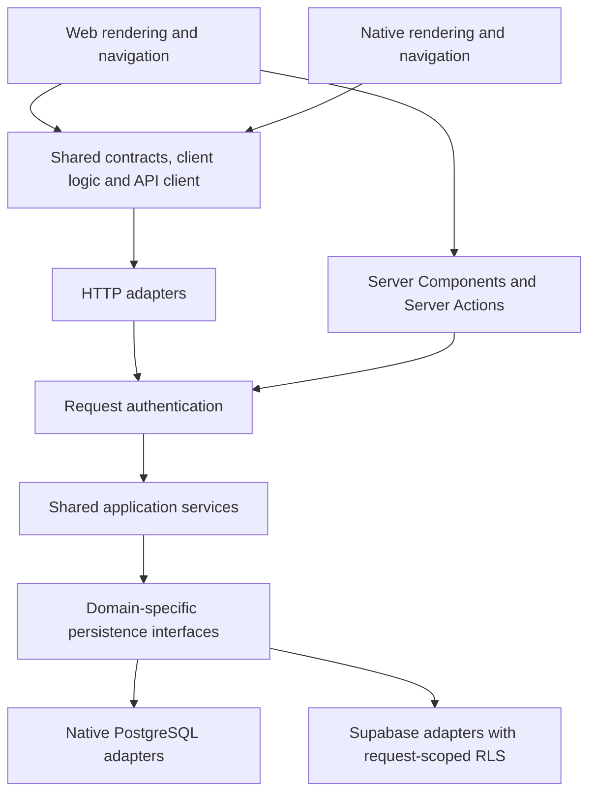

# Simplify dual-backend and cross-platform maintenance

## Summary

Build a **modular server with shared client packages**, retaining the existing Next.js deployment, Supabase/native backends, authentication providers, schemas, RLS policies, and application locations.

Share contracts, business rules, validation, calculations, API abstractions, and platform-neutral state logic. Keep web/native rendering, navigation, storage, and platform integrations independent. Where equivalent operations differ, align mobile behavior to web behavior.

The current code supports this direction:

- `lib/data/client.ts` implements separate Supabase and native clients, duplicating data-access decisions in the browser.
- Commit `430e0d3` introduced a shared timesheet domain service in `lib/domain/timesheets.ts`. Extend this existing boundary.
- `mobile/src/api/contracts.ts` is maintained separately from server contracts.
- Backend adapters combine many domains in large files. Some mobile administration routes still contain validation and orchestration directly.
- Date utilities, smart-hours calculations, and other client logic have parallel implementations.

## Target architecture



### Shared packages

Create three packages with explicit public exports:

| Package | Responsibility |
|---|---|
| `@vsis/core` | Domain types, role/capability calculations, date arithmetic, validation helpers, smart-hours and hierarchy calculations |
| `@vsis/contracts` | Canonical request schemas, inferred input types, response DTOs, API errors and capability contracts |
| `@vsis/client` | Typed HTTP operations and platform-neutral controllers, reducers, filtering and form-state logic |

Dependency direction: `core → contracts → client`, where each later package may depend on earlier packages. None may import Next.js, database clients, native modules, application files, or server secrets.

Keep database-row mapping on the server. Keep HTTP status mapping in transport adapters. Client validation improves feedback; the server remains authoritative.

### Server modules

Extend the existing domain-service approach into these modules:

- **Timesheets:** entry operations, duplication, batches and import validation.
- **Reference data:** projects, activities and titles.
- **People:** profiles, hierarchy and account administration.
- **Leave and reminders:** personal and administrative operations.
- **Reporting:** scoped aggregates, dashboard queries and CSV export.
- **Workspace:** settings, branding and layouts.
- **Operations:** backup/restore, audit and maintenance.
- **Identity infrastructure:** authentication providers, session lifecycle and credential operations.

Each module exposes application operations and narrow persistence interfaces. Services receive authenticated context, persistence dependencies and a clock explicitly; they do not resolve cookies or import a globally selected repository.

Compose these dependencies at the server entry boundary. Retain the existing `Repository` facade as a compatibility layer while callers migrate.

## Implementation sequence

### 1. Establish the baseline and prove package sharing

- Record the implementation-start commit and characterize web behavior by operation. Reuse existing tests; add missing cases for web/mobile differences.
- Keep root and mobile installations and lockfiles separate initially. Use root npm workspaces for shared packages and local `file:` dependencies from mobile, preserving mobile's native dependency layout.
- Extract smart-hours calculations and the timesheet contract first. Import them from both applications and remove the corresponding copies.
- Configure Metro to include shared package sources and symlink targets; retain mobile-local React resolution. Ensure Jest, TypeScript, Docker and cloud-build archives include the packages. Metro requires external sources to be visible through `projectRoot` or `watchFolders`. [Metro configuration](https://metrobundler.dev/docs/configuration/)
- Verify web builds and Android/iOS/Windows packaging before expanding package adoption. Avoid framework upgrades or a package-manager migration.

**Exit:** one shared calculation and contract work in both applications without changing their locations or native dependency assumptions.

### 2. Complete the timesheet vertical slice

- Extend the existing timesheet service; replace its default global repository dependency with a required, narrow timesheet persistence interface.
- Route Server Actions, mobile endpoints and legacy data endpoints through the same application operations.
- Validate inputs once inside the application boundary using shared schemas. Keep JSON/FormData parsing and response formatting in adapters.
- Consolidate write-budget reservation and release into one application wrapper: one charge decision per operation or batch, including partial-success semantics.
- Keep DTO mapping and existing idempotency response handling outside pure business rules. Preserve database enforcement of concurrent daily-hour limits.
- Align equivalent mobile operations to the implementation-start web behavior. Preserve mobile-only capabilities and transport differences; document deliberate behavior changes.

**Exit:** timesheet policy changes require one application implementation, with web and mobile transport tests proving the same outcomes.

### 3. Consolidate application data access

- Expand existing versioned resource endpoints to accept authenticated browser-cookie requests alongside mobile bearer requests.
- Explicit bearer credentials select bearer authentication; invalid bearer credentials never fall back to cookies. Preserve the mobile bearer feature gate. Apply origin protection to cookie-authenticated mutations.
- Bind the Supabase client to the validated request identity through explicit dependency construction. Preserve user-scoped RLS; privileged clients remain limited to existing privileged operations. Service-role access bypasses RLS and cannot replace ordinary user-scoped access. [Supabase RLS documentation](https://supabase.com/docs/guides/database/postgres/row-level-security)
- Extract the mobile HTTP client into `@vsis/client`, injecting fetch, base URL and authentication behavior. Retain native token storage and refresh coordination in mobile.
- Make web `dataClient` a compatibility facade over the shared API client. Preserve its existing return shapes while migrating consumers.
- Remove direct browser Supabase access for application data. Retain provider-specific authentication behind the existing auth abstraction.
- Keep Server Components and Server Actions calling application services directly, without an HTTP call back into the same server.
- Preserve `/api/v1` URLs and wire shapes. Keep `/api/data` and existing Server Action signatures as thin compatibility adapters.

**Exit:** application data queries no longer select a backend in frontend code.

### 4. Migrate remaining domains and split persistence adapters

Migrate reference data, people, leave/reminders, reporting, workspace settings, then operational functions.

For each module:

- Extract orchestration from actions and route handlers into one application service.
- Split native and Supabase implementations behind the same domain-specific interface.
- Keep SQL authorization, Supabase RLS, transaction boundaries, provider error handling and database constraints within persistence adapters.
- Replace multi-step create-and-look-up flows with existing atomic repository operations where available.
- Centralize policy calculations without removing database enforcement.
- Preserve both migration histories and existing schemas. This phase does not introduce an ORM or generate one provider's migrations from the other.

Keep reporting queries explicit and scoped; avoid a generic repository framework. Backup/restore remains an application-level coordinator across affected modules.

### 5. Consolidate client logic and enforce boundaries

- Move remaining equivalent date, hierarchy, capability and validation logic into shared packages.
- Extract reusable controllers with callback interfaces instead of dependencies on React setters, navigation, browser storage or native storage.
- Keep device-local time presentation separate from server-authoritative business-date decisions.
- Preserve mobile offline queue formats, workspace/user isolation, retry handling and secure storage.
- Share design constants where useful. Do not introduce a shared component framework; only extract a primitive when both applications can use it without platform-specific branching.
- Add lint/import checks preventing frontend database imports, shared-package server imports, and cross-module access to private implementations.
- Replace duplicate contract declarations with compatibility re-exports. Extend coverage configuration to include shared packages and relocated services.

## Verification and rollout

**Verification during analysis:** four targeted test files passed, totaling **65 tests**. These cover contracts, authentication binding, actions and mobile timesheets; they do not establish live database parity or native packaging compatibility.

```sh
npx vitest run tests/mobile-contract-parity.test.ts tests/parity-tracer.test.ts tests/actions.test.ts tests/mobile-timesheets-route.test.ts --reporter=dot
```

Required implementation checks:

- **Domain tests:** web-canonical backfill rules, ownership, both role axes, inactive users, daily-hour limits, validation, duplicate/batch operations, partial success and failed-write budget release.
- **Transport tests:** identical domain outcomes through actions and HTTP; preserved error envelopes, pagination, CSV downloads and action signatures.
- **Database contract tests:** run the same allow/deny and persistence scenarios against migrated native PostgreSQL and local Supabase, including actual authenticated RLS requests and concurrent writes.
- **Authentication tests:** cookie/bearer isolation, revoked sessions, disabled bearer access, origin rejection and concurrent requests from different users.
- **Client tests:** contract fixtures, server validation errors, refresh coordination, offline replay and compatibility with previously released mobile response shapes.
- **Build gates:** root lint/typecheck/coverage, both backend builds, production Playwright tests, Docker build, mobile Jest/typecheck/lint, and platform packaging smoke checks.

Deliver each numbered stage as reviewable increments; stage 4 proceeds one domain at a time. Keep adapters during migration and remove duplicated implementations only after their replacement passes parity tests.

Roll back through the previous application artifact; avoid schema changes that would prevent rollback. Record baseline and post-migration error rates and latency for migrated endpoints. Do not duplicate production writes for comparison.

## Assumptions and completion criteria

- One server deployment and one database per installation remain sufficient; independent service scaling is outside this migration.
- Existing provider authentication, RLS policies, schemas and deployment topology remain intact. If a required behavior cannot be preserved without changing them, stop that slice and document the conflict.
- Rebase implementation decisions on the latest code: the repository changed during this analysis.
- Record deviations and verification results in `docs/plans/dual-backend-modular-architecture-notes.md`. Under `## Deviations`, record what the plan specified, what the code required, and the chosen resolution.

The migration is complete when shared contracts have one definition, equivalent business operations have one application implementation, frontend data access is backend-neutral, persistence adapters are organized by domain, and both backend/platform verification gates pass.

Future service extraction requires a concrete independent scaling, ownership or release need. The module interfaces created here provide that boundary without introducing network calls, queues or distributed transactions now.
